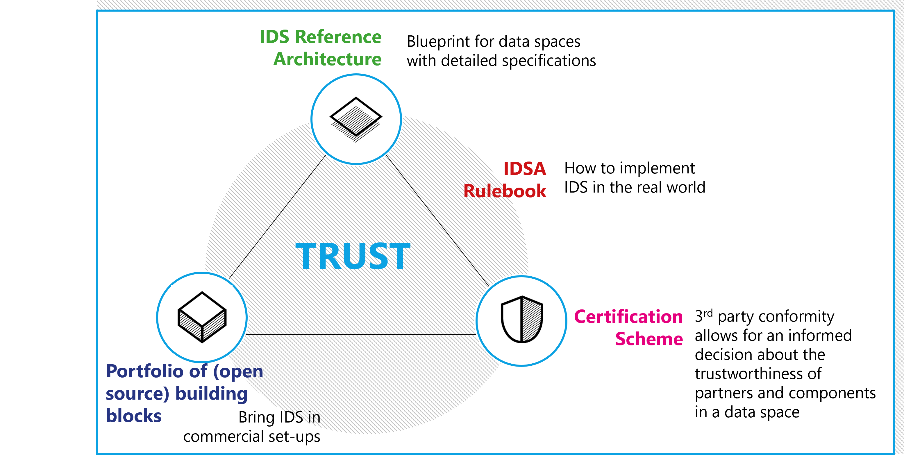

## Relation to other IDSA assets ##

Based on this Reference Architecture Model a Certification Scheme is derived that validates the compliance of [participants](../3_Layers_of_the_Reference_Architecture_Model/3_1_Business_Layer/3_1_1_Roles_in_the_IDS.md) and [components](../3_Layers_of_the_Reference_Architecture_Model/3_5_System_Layer/3_5_0_System_Layer.md) to this Reference Architecture Model. Such components can be provided as Free and Open Source Software or proprietary software. The operation of a data space instance is described in the [IDSA Rulebook](../4_Perspectives_of_the_Reference_Architecture_Model/4_3_Governance_Perspective/4_3_10_IDS_RuleBook.md) based on the BLOFT (**B**usiness, **L**egal, **O**perational, **F**unctional, **T**echnical) aspects of a data space.

The [Role of IDSA](../3_Layers_of_the_Reference_Architecture_Model/3_1_Business_Layer/3_1_1_Roles_in_the_IDS.md#category-4-governance-body) as an association and governance body is to keep those artifacts consitent while contiuously updating them based on the technological developments and user requirements. This is the IDSA magic triangle as depicted in figure [1.3.1](#figure-131-idsa-magic-triangle).

### Figure 1.3.1: IDSA Magic Triangle
