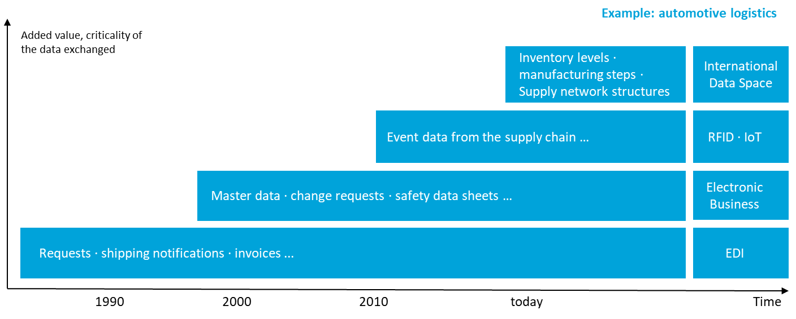
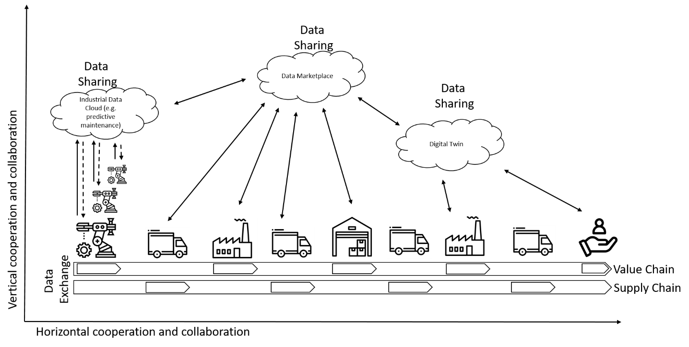

## Data Exchange and Data Sharing ##

Cross-company data exchange with the help of inter-organizational
information systems is not a new topic; it has been around for decades.
With the proliferation of Electronic Data Interchange (EDI) in the
1980s, many different data exchange scenarios have emerged over time,
which were accompanied by the development of certain technical
standards.

##### Figure 2.4.1: Evolution of technical standards for data exchange

The Figure above shows the evolution of
technical standards for data exchange since the 1980s, using the example
of automotive logistics. Data sovereignty, which is one of the main
goals of the International Data Spaces, materializes in  'terms and
conditions' that are linked to data before it is exchanged and shared.
However, these terms and conditions (such as time to live, forwarding
rights, pricing information etc.) have not been standardized yet. In
order to foster the establishment of data sovereignty in the exchange of
data within business ecosystems, more standardization activities are
needed.

This does not mean that existing standards will become obsolete.
Instead, the overall set of standards companies need to comply with when
exchanging and sharing data needs to be extended. It is therefore
necessary to distinguish between data exchange and data sharing (see
also the Figure below:

- Data exchange takes place in the *vertical cooperation* between
    companies to support, enable or optimize value chains and supply
    chains (e.g. EDI messages in logistics or HL7 in medical scenarios).

- Data sharing takes place in the *vertical and horizontal
    collaboration* between companies to achieve a common goal (e.g.
    predictive maintenance scenarios in manufacturing) or to enable new
    business models by generating additional value out of data (e.g. in
    data marketplaces). Furthermore, data sharing implies a mode of
    collaboration towards coopetition.

 
##### Figure 2.4.2 : Data Exchange and Data Sharing
