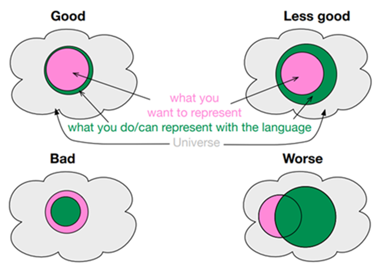

## From Data To Information: Do You Understand? 

<!-- Alt title: Towards semantic interoperability: the role of open standardization -->

For data exchange or data sharing to add value, the meaning assigned to the data by sender and receiver needs to be aligned. Only then does data become information that can be used to do work, i.e. generate additional value out of data. 

This alignment of meaning is also called semantic agreement. Semantic agreement between users is an essential requirement for semantic interoperability. Without the latter, no effective data exchange or data sharing is possible in data-driven business ecosystems.

Many business ecosystems have turned to open standardization as a means to achieve semantic agreement between its members. A key aspect of open standardization is that said members collaboratively maintaining and develop these semantic standards. This is supposed to maximize the standard's *fitness for purpose*. 

##### Figure 2.5.1 an illustration of the meaning of 'fit for purpose' as applied to semantic standards, copied from [1]  

If data sovereignty adresses the first fundamental conflict of data sharing in business ecosystems, then semantic disagreement poses the second. **Open semantic standardization in business ecosystems is about finding a balance between the need for uniform semantics in the ecosystem as a whole, and the need for flexibility to accomodate legitimate differences between individual members**

Every member in a business ecosystem operates with a different world view. These differences arise from operating in different jurisdictions, in different domains, carrying out different business processes, serving different markts, offering different services, and so on. High variety between members in business ecosystems require semantic standards with lots of flexibility, which limit semantically interoperabile data sharing. Low variety allow for stricter semantic standards that bring more uniformity, but often at the cost of added value.

[1]: Keet, C. M. (2020). *An Introduction to Ontology Engineering* (1.5). https://people.cs.uct.ac.za/~mkeet/OEbook/

