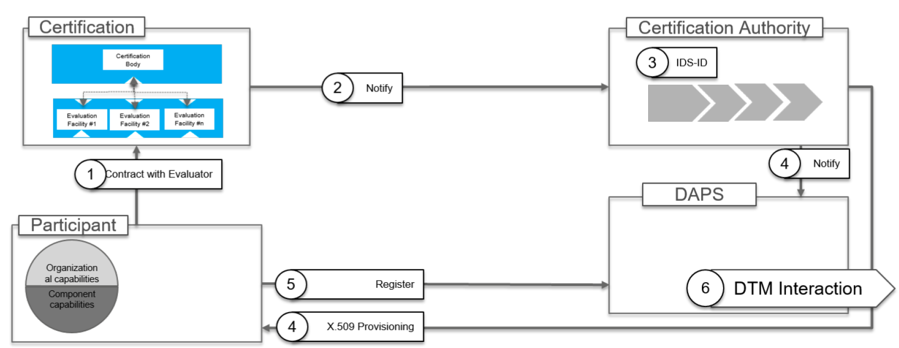

### Digital Identities ###

Establishing trust for data sharing and data exchange is a fundamental
requirement. The IDS-RAM defines two basic types of trust: 1) Static
Trust, based on the certification of operational environment and core technical
components, and 2) Dynamic Trust, based on active monitoring of
operational environment and core technical components. For data sharing and data
exchange in the IDS, some preliminary actions and interactions are
required. These are necessary for every participant, and involve the
Certification Body, Evaluation Facilities, the Dynamic Attribute
Provisioning Service (DAPS), and the Participant Information Service (ParIS).
The figure below illustrates the roles and interactions required for issuing a digital
identity in the IDS.

##### Figure 3.1.3: Interactions required for issuing a digital identity in the IDS

#### Participant ####

Certification is required for every participant and the majority of
roles in the IDS, as defined above. Certification refers both to the
organizational capabilities of the participant and the technical
capabilities of the core technical components.

#### Certification ####

Certification of a operational environment or core component involves the
[Certification Body](../../4_Perspectives_of_the_Reference_Architecture_Model/4_2_Certification_Perspective/4_2_2_Roles.md) and an [Evaluation Facility](../../4_Perspectives_of_the_Reference_Architecture_Model/4_2_Certification_Perspective/4_2_2_Roles.md).
Evaluation of a operational environment or a core component is executed upon request
of the participant and relies on the contract between the participant
and the Evaluation Facility. In the same way, a Service Provider can
request evaluation of a component. In this process, the Certification
Body is responsible for supervision of the Evaluation Facility involved.

#### Certificate Authority ####

The Certificate Authority is responsible for issuing, validating and
revoking [digital certificates](../../4_Perspectives_of_the_Reference_Architecture_Model/4_1_Security_Perspective/4_1_2_Identity_and_Trust_Management.md). A digital certificate
is provided for a participant if both a valid certification for the
operational environment and a valid certification for the core component is
available. This means that the Certificate Authority provides an
IDS-ID for a combination of operational environment and core component. The digital
certificate is valid not exceeding the validity of both certifications,
operational environment certification and the certification of core component used
by the participant. The Certification Authority provides the digital
certificate to the participant upon request.

#### Dynamic Attribute Provisioning Service (DAPS) ####

The information resulting from the certification process is passed on to
the Dynamic Attribute Provisioning Service (DAPS). This includes master
data and information on [security profiles](../../4_Perspectives_of_the_Reference_Architecture_Model/4_2_Certification_Perspective/4_2_4_Component_Certification.md#connector-trust-levels). The CA provides the details on the digital certificate
(public key and IDS-ID). The participant registers at the DAPS after
successfully deploying the digital certificate inside the component.

#### Participant Information Service (ParIS) ####

One of the most important value propositions of the IDS is the enablement of business interactions between previously unrelated Participants. That aims in particular at companies that have not met before in the digital or non-digital world but now start business agreements solely relying on the IDS. The therefore necessary trust in the opposite party is technically achieved by a verifiable identity management process through the Certification Authority and the DAPS. Both components equip each Participant with the necessary attributes and cryptographic proofs for the IDS handshakes. The establishment of a secure and uncompromised communication channel is however only the necessary requirement for a business interaction. In addition, the respective Participants need to understand their opposite’s state in regards of business workflows. For instance, every business actor needs to know its customers tax identification or VAT number to create correct invoices. Furthermore, the registered address is critical to understand the responsible jurisdiction for the unfortunate cases when only courts can solve conflicts.

Such information is provided and maintained by a support organization in an IDS, a legal entity that administers the ecosystem (see [IDSA Rule Book section 4.2.1.1.1](https://internationaldataspaces.org/download/19008/)). This organization introduces a new Participant by creating its digital identity and at the same time registers security-critical at the DAPS and business-relevant attributes at another technical component. This component is the Participant Information Service. The ParIS provides access to these attributes to the other IDS Participants and components and connects the unique Participant identifier – a URI – with additional metadata. Usually, each IDS ecosystem operates only a small number of ParIS instances, usually only one. IDS Participants therefore know the location where to ask for more information about a potential business partner and can decide whether to start a data exchange.

Different to other IDS components, the trustworthiness of ParIS' provisioned information is not grounded on technical measures, like for instance signatures or certificates, but on the administrative process controlled by the Support Organization. A direct consequence of this process is the necessity that each change request is manually verified before added to the ParIS database.

#### Dynamic Trust Monitoring (DTM) ####

Continuous monitoring of participants is necessary for classification of
the trustworthiness of all participants in the ecosystem. Dynamic Trust
Monitoring (DTM) implements a monitoring function for every IDS
Component. The DTM shares information with the DAPS to notify each of
the two participant in a data exchange transaction of the current level
of trustworthiness of the other participant.

#### Interactions ####

The roles described above interact with each other in a structured way.
In the following, a brief description of these interactions is given
(they are described in more detail in the remaining layers and perspectives of the RAM):

1. **Certification request:** This is a direct interaction between a
    participant and an evaluation facility to trigger an evaluation
    process based on IDS certification criteria.

2. **Notification of successful certification:** The Certification Body
    notifies the Certificate Authority of the successful certification
    of the Operational Environment and the Core Component. Validity of both
    certifications must be provided.

3. **Generating the IDS-ID:** The CA generates a unique ID for the pair
    (operational environment and component) and issues a digital certificate.

4. **Provisioning of X.509 Certificate:** The Certification Authority
    sends a digital certificate (X.509) to the participant in a secure
    and trustworthy way and notifies the DAPS.

5. **Register:** After the digital certificate (X.509) is deployed
    inside the component, the component registers at the DAPS.

6. **DTM Interaction**: The DTM and the DAPS exchange information on
    the behavior of the component, e.g. about security issues
    (vulnerabilities) or attempted attacks.
