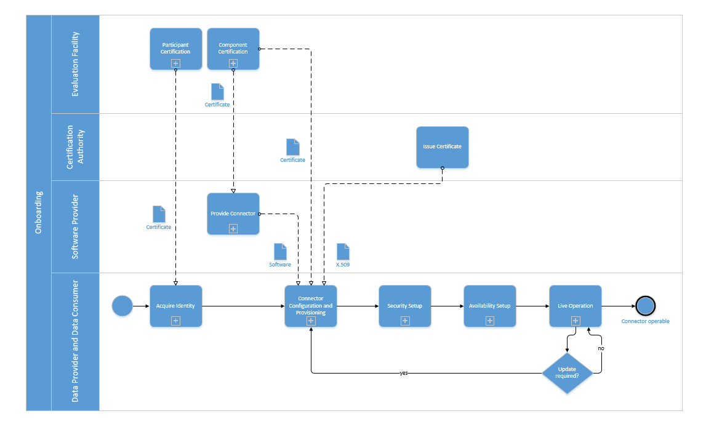

## ONBOARDING

The overall “Onboarding” process consists of several sub processes. The first step for an organization to join the International Data Spaces as a Data Provider or Data Consumer is to acquire an identity to be used in the IDS. This identity, which forms the basis for establishing trusted communication in the IDS, is provided by the Certification Body and an Evaluation Facility in the form of a certificate issued by an Identity Provider. In a second step, the organization needs to request a Connector from a Software Provider. The Connector, being the core technical component for becoming part of the IDS, must then be installed. After that, it receives a digital certificate (X.509 certificate) to make sure it complies with IDS specifications and requirements. The digital certificate is based on the certification of the participant and the certification of the Connector (see section 3.1 and section 4.2). (**//TODO** insert link to  Business Layer and Certification Perspective) In a third step, the Connector needs to be configured for internal use and prepared for secure communication ([Security Setup](#security-setup)). In the final step, the Connector needs to be made available for other participants in the IDS so that it can finally enter live operation.

The overall “Onboarding” process is illustrated in the following figure.

The following paragraphs describe each step of the onboarding process in more detail.

### ACQUIRE IDENTITY
Any organization that wants to operate a connector in order to exchange data in the International Data Spaces as a Data provider or Data Consumer needs to acquire a unique identity in the form of a certificate. This certificate enables them to establish secure and trusted connections to other IDS participants (see section 3.1).
**//TODO** insert link to  Business Layer

### CONNECTOR CONFIGURATION AND PROVISIONING
Each Connector that participates in the IDS ecosystem must provide a self-description for other IDS participants to read. The respective organization needs to create this description at the beginning of the connector configuration and provisioning sub process. The Connector self-description must contain information about the respective organization, about who maintains the Connector (i.e. the Service Provider), and about the content and type of the data offered or requested.

Another mandatory step for the organization to take is to orchestrate data flows for (future) data retrieval and data provisioning, respectively, and to set up system adapters and communication interfaces (“endpoints”). (Details on the configuration of the IDS Connector are described in section 3.5.1.1). **//TODO** insert link to  System Layer/Connector Configuration Model

If needed, the organization can install and configure Data Apps acquired from the App Store Provider.

### SECURITY SETUP
To enable secure communication, a Certification Authority issues a certificate to the Data Provider or Data Consumer. This certificate is deployed locally to enable Transport Layer Security (TLS) and identification of the respective IDS participant. On top of that, the Connector self-description must be correct and valid, which is ensured by requesting a Dynamic Attribute Token from the Identity Provider (section 4.1). The token is a signed attestation that the information the Connector states about itself has been verified and is actually true. The token is presented by each subsequent outgoing communication message of the Connector, so that also the communicating Connectors have a means to verify the trustfulness of their communication partners at any time.
Furthermore, any organization that wants to assume the role of Data Provider or Data Consumer has the option to configure custom access restrictions for bilateral communications. For instance, a Data Provider may want to block certain Connectors or participants from accessing their services, or it may require specific access credentials. These configurations may be set up in the last step of the Security Setup sub process (see section 4.1). **//TODO** insert link to  Business Layer

### AVAILABILITY SETUP
After local Connector deployment and Security Setup, a Connector must be made available for other participants in the International Data Spaces. This is done by the provisioning of an “External Connector”, which runs in a so-called “Demilitarized Zone (DMZ)” and forwards or filters requests to the “Internal Connector”. Alternatively, proper adjustment of firewall rules may be sufficient (in less sensitive environments). Each Data Provider and Data Consumer can decide whether or not they want to announce their Connector (or the data resources accessible through their Connector) publicly on the IDS. If they do so, they can select a Broker from a
set of available Broker services (i.e., a registry for Connector self-descriptions) to publish the self-description of their Connector (see above). The Broker provides functions for searching for and retrieving registered Connector self-descriptions (see section 3.5.2), including data sources, interfaces, security profiles, and current levels of trustworthiness.
