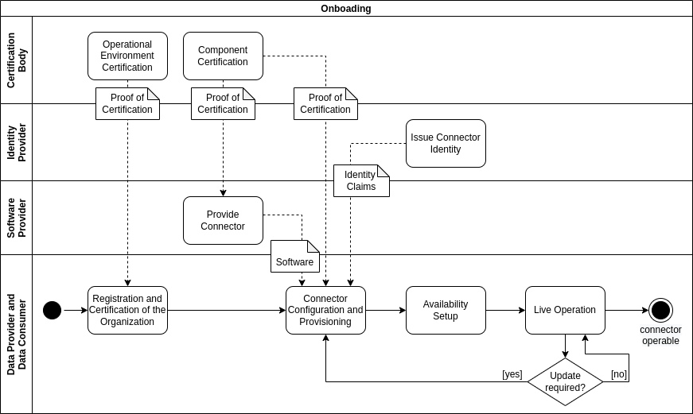

## Onboarding of an IDS Connector and its Operator

The overall 'Onboarding' process requires of two preparational steps required for an organization to act as Data Provider or Data Consumer in the International Data Spaces:
1. Registration and certification of the organization.
2. Acquiring a certified IDS connector.

Based on those prerequisites, an organization can instantiate an arbitrary number of IDS connector instances with the following steps:
1. Provisioning and configuring the connector.
2. Availability setup.

All necessary steps are illustrated in the following figure.

#### _Fig. 3.3.1.1: Onboarding process_

### Preparation: Registration and Certification of the Organization

Any organization that wants to operate an IDS Connector (in order to exchange data in the International Data Spaces) as a Data provider, Data Consumer or provide an additional IDS component needs to pass the Operational Environment Certification (see [Section 4.2.3](../../4_Perspectives_of_the_Reference_Architecture_Model/4_2_Certification_Perspective/4_2_3_Operational_Environment_Certification.md)). The Identity Provider is informed that this organization is allowed to operate components in the IDS and request component identity certificates. Additionally, the organization is registered in the Participant Information Service (ParIS). The initial population of a Participant entry is conducted directly after the certification. The Support Organization is informed about the successful steps and provided with the corresponding metadata about the new IDS entity. The provisioning of this information is not part of the IDS interactions and must be managed through communication measures. The Support Organization checks the correctness of the claims, verifies the information, and equips the dedicated ParIS with the new IDS Participant instance. It is further recommended that each Participant also hosts its Self-Description on a publicly accessible endpoint of its choice. Preferably the locator of its Self-Description document, an HTTP URL, is identical with the used Participant URI. This best practice enables the lookup or referencing of the Participant Identifier through every HTTP client and thereby eases the discovery of relevant information. Nevertheless, in case the own supplied Participant Self-Description and the metadata at the ParIS deviate, the latter is more trusted as its claims have been verified through the Support Organization beforehand.

### Preparation: Acquiring a Certified IDS Connector
The organization needs to either request an IDS Connector from a Software Provider, or implement its own one. The IDS Connector is the core technical component for becoming part of the IDS. It must pass the IDS Component Certification (see [Section 4.2.4](../../4_Perspectives_of_the_Reference_Architecture_Model/4_2_Certification_Perspective/4_2_4_Component_Certification.md)) to ensure an adequate level of security and interoperability before it can be instantiated and used in the IDS.

### Connector Configuration and Provisioning
Each IDS Connector that participates in an IDS ecosystem must have a unique identity in the IDS which is issued or confirmed by the IDS Identity Provider.
The required trust anchors for the Identity Provider (e.g. root certificate for CA) must be provisioned onto the connector to enable verification of identity information provided by communication partners.

Additionally, each connector shall provide a Self-Description for other IDS Participants to read. The respective organization needs to create this description at the beginning of the IDS Connector configuration and provisioning process.
It also requires proof of the certification levels for the organization and the technical component provided in form of signed metadata.

Another mandatory step for the organization is to configure and connect their own existing systems to the IDS Connector. Therefore it is important that the appropriate IDS metadata (Usage Policies, etc.) is created and that data exchange is enabled (for details see section [3.3.4](../3_3_4_Exchanging_Data.md)). IDS Apps can be used for this purpose, see section [3.3.5](../3_3_5_Publishing_and_using_Data_Apps.md). 

If needed, the organization can install and configure Data Apps acquired from an IDS App Store.

###  Availability Setup

An IDS Connector must be made available for other IDS Participants in the data ecosystem. Each Data Provider and Data Consumer can decide whether they want to announce their IDS Connector and their data resources publicly in the data ecosystem. This is described in the next section [3.3.2](../3_3_2_Data_Offering.md).
