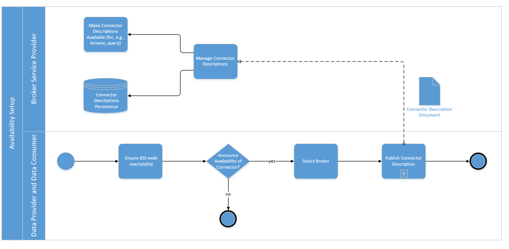

# Data Offering
A Participant who wants to offer data artifacts in a data space needs to conduct several steps to make it available to potential Data Consumers. In the most simplistic way, the Data Provider knows the Consumer at the beginning and directly provides information about available data assets, the selected endpoints, and the access mechanisms. This bidirectional data exchange bypasses most of the IDS infrastructure components and keeps the additional efforts to a minimum.

However, in typical data spaces use cases, a Data Provider does not know which other Participant is interested in the provided data offering, or even does not know about the existence of the later Data Consumer at the time when the data set is published. In such cases, the proper description and advertisement at the right locations is critical to enable a business transaction.

The IDS defines manners to tackle these challenges by specifying a technology-agnostic language for data Self-Descriptions as well as the necessary infrastructure components to host and search through these Self-Descriptions. In all cases, the original Data Provider stays the sovereign origin of any information, and any involved component acts on behalf of it. Therefore, it is in general not allowed for any intermediate player to change or manipulate the content of the received Self-Descriptions, apart from obviously wrong data or to protect the operability of the data space as a whole. Examples might be phishing attempts or other malicious content, the duty to follow legislative regulations like copyright protections, or less severe issues like unintentional syntactic or semantic errors.
**//TODO** Respective explanations in the Governance Section, then link to it here

Apart from such edge cases, the Data Provider has the interest to correctly and comprehensively describe its data assets to maximize the amount of interested Data Consumers. It further wants to stick to commonly accepted and understood standards to simplify its discovery for potential business partners. The [IDS Information Model](../3_4_Information_Layer) provides the schema for the Self-Descriptions themselves and their basic building blocks, like for instance Usage Contracts, endpoint descriptions, or the internal structure of data assets.

The first step in a typical data publication process is therefore the proper creation of a data asset Self-Description in JSON-LD. Usually, IDS Connectors provide the technical manners to create and maintain them through suitable GUIs. In any way, the created Self-Descriptions are then deployed at the IDS Connector that also hosts the related data assets. This IDS Connector is the only applicable source of truth for metadata about the data assets. Copied or otherwise differently located Self-Descriptions might be outdated or misleading. Therefore, a potential Data Consumer may want to double-check the correctness of a found Self-Description by also requesting a version directly from the original IDS Connector.

After reaching a syntactically and semantically correct Self-Description, the Data Provider may want to announce it in a data space. To do so, it sends the Self-Description to the responsible IDS infrastructure component, an IDS Metadata Broker. The location of available Metadata Broker instances as well as the selection of the appropriate ones is in the responsibility of each data space Participant and not - for now - generally specified. The Metadata Broker then stores the received Self-Descriptions and makes them available for search requests of other IDS Connectors. Potential Data Consumers can search through the stored Self-Descriptions, filter for relevant offers, and then, in the third step of the process, negotiate and request a data asset directly at the hosting IDS Connector.

## Crawling Self-Descriptions
Another possible approach to find relevant offers in a data ecosystem, without a central service as the IDS Metadata Broker, is a federated catalog. This approach is based on a crawler architecture implementing a federated cache node (FCN) and a federated cache crawler (FCC). The FCN of an IDS Connector makes data offers public to other Participants, as part of its Self-Description. In addition, further information describing the contents can be requested directly. This way, another IDS Connector can cache all available data offerings by crawling known Data Providers via its FCC. 

After that, the Data Consumer can search for available offers by querying its cache, that is updated by the FCC periodically or event-driven. Both the FCN and the FCC can be deployed as part of the IDS Connector or as a separate service. Having multiple 'snapshots' of available data offers in one ecosystem, the federated architecture allows implementing distributed queries, and the data space becomes fault tolerant and resilient. Depending on the size of the data space, a Data Consumer may use multiple crawlers. This would allow the partitioning of large data spaces into crawler-regions. Furthermore, it can be part of a hybrid setup covering the peer-to-peer crawling of IDS Connectors, completed by the crawling of IDS Metadata Brokers. 

For each of these approaches, an overview of all Participants in the data ecosystem would be required for the FCC to get into exchange with running IDS Connectors. Such an initial overview of other Participants can be obtained by querying central IDS entities about their known Participants. For example, a Metadata Broker can be queried for other IDS Connectors that have published offered resources. If other IDS components provide interfaces to query their active participants, an overview can also be derived from this. For example, an existing DAPS instance could provide an interface on which IDS Connectors have been issued tokens for within a certain period of last days, which would allow determining active Participants. An FCC could then prioritize crawling active Participants.   

## Data Provider updating a Self-Description

As mentioned already, the IDS Connector hosting the data asset is the solely applicable source of truth regarding the data asset's IDS Self-Description. This implies in particular, that the hosting IDS Connector, more precisely the Participant controlling the IDS Connector, can change the data asset as well as its Self-Description at any time. Even though it might be in its interest to establish a reputation as a reliable and trustworthy business partner, it might need to deploy updates without further notice. The Data Provider might want to inform certain other IDS Connectors about changes but is not obliged to do so. It is also not necessary to supply older or outdated data assets or Self-Descriptions. Consequently, the existence of a suitable Self-Description document is not a sufficient proof of the existence of the related data asset. A Data Consumer may want to request the latest version of the Self-Description also at the original IDS Connector, to be sure.

Nevertheless, the Data Provider has the interest to also maintain the distributed Self-Descriptions at the IDS Metadata Brokers to avoid misunderstandings and to protect its reputation. It can do so by sending update requests to the respective Metadata Broker instances, which already host the previous versions. This can be done by sending the new Self-Description document, which uses the same identifier as the previously sent document. The IDS Metadata Brokers then overwrite their stored instances. Please note that Metadata Brokers may also store previous versions of Self-Descriptions, for instance for documentation purposes. Furthermore, only certain IDS Connectors are allowed to update individual Self-Descriptions. By default, the creating IDS Connector has this right, however, also explicitly named different IDS Connectors may be allowed to execute update requests. One use case might be that one Data Provider operates several IDS Connectors, and the originally creating IDS Connector is not active anymore. In such cases, the Participant must, of course, still be able to control its related Self-Descriptions.

## Interactions with IDS Metadata Brokers

The IDS Metadata Broker is the component in an IDS that allows the publication of Self-Descriptions for IDS Resources and IDS Connectors. It thereby solves the Search&Discovery problem in decentralized networks. Data Consumers want to find suitable data offers while not knowing the existence or the location of their Data Providers. They therefore need an intermediate service that stores Self-Descriptions and makes them searchable in effective manners. This task is solved through the IDS Metadata Brokers.

However, no Data Provider is obliged to publish any or all of their data assets at any Metadata Broker. Neither is a Data Consumer forced to start its integration process at a Metadata Broker, if it has other options to find and locate its data exchange partners. Still, both have the opportunity to interact with an IDS Metadata Broker using the following main interaction patterns.

### Data Provider IDS Connector registers Metadata

As shown in Figure [AA](#PublishSelf-Description), the Data Provider can send Self-Description documents to a Metadata Broker. The Self-Description must be self-containing and compliant to the specifications of the IDS Information Model. Usually, JSON-LD representations of the RDF classes [ids:Connector](https://w3id.org/idsa/core/Connector) and [ids:Resource](https://w3id.org/idsa/core/Resource) are used. The Metadata Broker then checks the Self-Description document syntactic correctness and persists it in its local database. It explicitly does not check the semantic correctness or the plausibility of the supplied information.

#### _Fig. 3.3.2.1: Process to Register a Self-Description at an IDS Metadata Broker_

Different to other ecosystems, the Metadata Broker in an IDS does not actively crawl for Self-Descriptions or searches for updates. In contrast to for instance common search engines for the Web, the Metadata Broker relies on notifications from the original providers. In case the Data Provider misses an update, the Metadata Broker can therefore not be made responsible for outdated or wrong information.

Data Providers may be offered to restrict the publication of their Self-Descriptions based on certain Usage Control patterns. A Data Provider may for instance prohibit the presentation of its Self-Descriptions to its competitors by delivering a black list in a Usage Contract together with its Self-Descriptions. Specialized Metadata Brokers might provide respective control features for domains where the pure existence of metadata already uncovers critical business information.

### Data Consumer searching for Self-Descriptions

To find a Data Provider, the Data Consumer may search in the catalogs of a Metadata Broker Service Provider. Before that, however, the Data Consumer needs to select a suitable Metadata Broker (e.g. based on thematic coverage) and determine the query capabilities (e.g. a graphical search interface or a domain-specific query language). The Metadata Broker then returns the query result to the Data Consumer, who needs to interpret the result to find out about the different data sources available in the International Data Spaces for providing the data specified in the query. Each query result must provide information about each IDS Connector capable of providing the desired data, so that the Data Consumer can retrieve each IDS Connector’s Self-Description
to learn more about how to receive the desired dataset from a technical point of view (e.g., endpoint addresses, protocol). The Data Provider may serve the same data using different representations or pricing options, so the Data Consumer may select a suitable offer from the Data Provider’s IDS Connector description.

## Getting Self-Description from Data Provider

Alternatively, the Data Consumer may already know a suitable Data Provider. In this case, the Data Consumer can contact the Data Provider directly (i.e. without invoking a Metadata Broker or any other IDS infrastructure component). As the IDS is designed in a completely self-sovereign manner and preventing gate keepers wherever possible, the right to establish bidirectional business - and data exchange - relations independent of any other third party is at the heart of the overall architecture.
