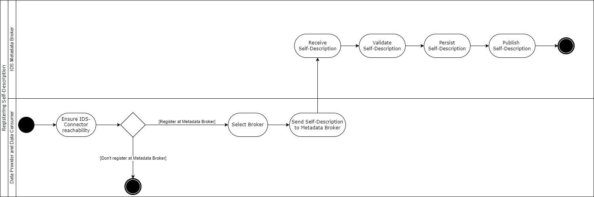

# Data Offering
A Participant who wants to offer data artifacts in a data space needs to conduct several steps to make it available to potential Data Consumers. In the most simplistic way, the Data Provider knows the Data Consumer at the beginning and directly provides information about available data assets, the selected endpoints, and the access mechanisms. This bidirectional data exchange bypasses most of the IDS infrastructure components and keeps the additional efforts to a minimum.

However, in typical data spaces use cases, a Data Provider does not know which other Participant is interested in the provided data offering, or even does not know about the existence of the later Data Consumer at the time when the data set is published. In such cases, the proper description and advertisement at the right locations is critical to enable a business transaction.

The IDS define manners to tackle these challenges by specifying a technology-agnostic language for data Self-Descriptions as well as the necessary infrastructure components to host and search through these Self-Descriptions. In all cases, the original Data Provider stays the sovereign origin of any information, and any involved component acts on behalf of it. Therefore, it is in general not allowed for any intermediate player to change or manipulate the content of the received Self-Descriptions, apart from obviously wrong data or to protect the operability of the data space. Examples might be phishing attempts or other malicious content, the duty to follow legislative regulations like copyright protections, or less severe issues like unintentional syntactic or semantic errors.

Apart from such edge cases, the Data Provider has the interest to correctly and comprehensively describe its data assets to maximize the amount of interested Data Consumers. It further wants to stick to commonly accepted and understood standards to simplify its discovery for potential business partners. The IDS Information Model provides the schema for Self-Descriptions and their basic building blocks, like for instance Usage Contracts, endpoint descriptions, or the internal structure of data assets.

## Self-Description at Data Provider

The first step in a typical data publication process is therefore the proper creation of a data asset Self-Description. Usually, IDS Connectors provide the technical manners to create and maintain them, e.g. through suitable GUIs. After reaching a syntactically and semantically correct Self-Description, they are then deployed at the Data Providers IDS Connector and can be accessed by other IDS Connectors via its endpoints.

Depending on the requesting IDS Connector, the returned Self-Description may differ. Thus, the offering IDS Connector could offer different data at different conditions for different Participants of an IDS ecosystem. Self-Descriptions may also include elements of domain specific ontologies or generic key/values depending on the domain of the ecosystem.

## IDS Metadata Broker

The Data Provider may want to announce the created Self-Descriptions at a central component in a data space instead of just offering it in its own IDS Connector instance. Therefore, the Data Provider can send the Self-Descriptions to a responsible central IDS infrastructure component, the IDS Metadata Broker. The IDS Metadata Broker is a component in a data space that allows the publication of Self-Descriptions for IDS Resources and IDS Connectors, besides the original IDS Connector itself. Data Consumers can find suitable data offers while not knowing the existence or the location of the Data Providers.

The selection of the appropriate IDS Metadata Broker is in the responsibility of each data space Participant. The IDS Metadata Broker then stores the received Self-Descriptions and makes them available for search requests of other IDS Connectors. Potential Data Consumers can search through the stored Self-Descriptions, filter for relevant offers, negotiate with the Data Provider and request the data asset at the hosting IDS Connector.

The IDS Connector hosting the data asset is the solely applicable source of truth regarding the data asset's Self-Description. This implies, that the hosting IDS Connector, more precisely the Participant controlling the IDS Connector, can change the data asset as well as its Self-Description at any time. Even though it might be in its interest to establish a reputation as a reliable and trustworthy business partner, it might need to deploy updates without further notice. The Data Provider might want to inform certain other IDS Connectors about changes but is not obliged to do so. It is also not necessary to supply older or outdated data assets or Self-Descriptions. Consequently, the existence of a suitable Self-Description document is not a sufficient proof of the existence of the related data asset. For reinsurance, a Data Consumer may want to request the latest version of the Self-Description at the original IDS Connector.

Nevertheless, the Data Provider has the interest to also maintain the distributed Self-Descriptions at the IDS Metadata Brokers to avoid misunderstandings and to protect its reputation. It can do so by sending update requests to the respective IDS Metadata Brokers, which already host the previous versions. This can be done by sending the new Self-Description, which uses the same identifier as the previously sent. The IDS Metadata Brokers then update their stored instances. Please note that IDS Metadata Brokers may also store previous versions of Self-Descriptions, for instance for documentation purposes. The creating IDS Connector has the right to update its Self-Descriptions at the IDS Metadata Brokers, but can also explicitly name other IDS Connectors that are allowed to execute update requests regarding his Self-Descriptions. One use case might be that one Data Provider operates several IDS Connectors, and the originally creating IDS Connector is not active anymore. In such cases, the Participant is still able to control its Self-Descriptions.

However, no Data Provider is obliged to publish any data assets at any IDS Metadata Broker. Neither is a Data Consumer forced to start its integration process at an IDS Metadata Broker, if it has other options to find and locate its data exchange partners. Still, both have the opportunity to interact with an IDS Metadata Broker using the following main interaction patterns.

### Data Provider registering Self-Descriptions

As shown in Figure [3.3.2.1](#PublishSelf-Description), the Data Provider can send Self-Description documents to an IDS Metadata Broker. The Self-Description must be self-containing and compliant to the specifications of the IDS Information Model. Usually representations of the RDF classes [ids:Connector](https://w3id.org/idsa/core/Connector) and [ids:Resource](https://w3id.org/idsa/core/Resource) are used. The IDS Metadata Broker then checks the Self-Description syntactic correctness and persists it in its local database. It does not check the semantic correctness, or the plausibility of the supplied information.

#### _Fig. 3.3.2.1: Register Self-Description at IDS Metadata Broker_

Different to other ecosystems, an IDS Metadata Broker does not actively crawl for Self-Descriptions or searches for updates. The IDS Metadata Broker relies on notifications from the original Data Providers. In case the Data Provider misses an update, the IDS Metadata Broker can therefore not be made responsible for outdated or wrong information.

Data Providers may be offered to restrict the publication of their Self-Descriptions based on certain Usage Control patterns. A Data Provider may for instance prohibit the presentation of its Self-Descriptions to its competitors IDS Connectors by delivering a list in a Usage Contract together with its Self-Descriptions. IDS Metadata Brokers might provide respective control features for domains, where publishing the metadata already uncovers critical business information.

### Data Consumer searching for Self-Descriptions

To find a Data Provider, the Data Consumer may search in the catalogs of an IDS Metadata Broker. Therefore, the Data Consumer needs to select a suitable IDS Metadata Broker and determine the query capabilities. They can e.g. differ by thematic coverage of the published metadata, or their query capabilities including graphical search interfaces or domain-specific query languages.

The IDS Metadata Broker then returns the query result to the Data Consumer. The query result may differ depending on the requesting IDS Connector due to filtering of the displayed data according to usage policies defined by the Data Provider. The Data Consumer needs to interpret the result to find out about the different data sources available. Each query result must provide information about each IDS Connector capable of providing the desired data, so the Data Consumer can access each IDS Connector’s Self-Description to learn more about how to receive the desired dataset. The Data Provider may serve the same data using different representations or pricing options, so the Data Consumer may select a suitable offer from the Data Provider.

#### _Fig. 3.3.2.2: Query IDS Metadata Broker_

## Crawling Self-Descriptions
Another possible approach to find relevant data offers in a data ecosystem is a federated catalog. This approach is based on a crawler architecture implementing a federated cache node (FCN) and a federated cache crawler (FCC). The FCN of an IDS Connector makes data offers public to other Participants, as part of its Self-Description. In addition, further information describing the contents can be requested directly. This way, another IDS Connector can cache all available data offerings by crawling known Data Providers via its FCC.

After that, the Data Consumer can search for available offers by querying its cache, that is updated by the FCC periodically or event-driven. Both the FCN and the FCC can be deployed as part of the IDS Connector or as a separate service. Having multiple 'snapshots' of available data offers in one ecosystem, the federated architecture allows implementing distributed queries. Depending on the size of the data space, a Data Consumer may use multiple crawlers. This would allow the partitioning of large data spaces into crawler-regions. Furthermore, it can be part of a hybrid setup covering the peer-to-peer crawling of IDS Connectors, completed by the crawling of IDS Metadata Brokers.

For each of these approaches, an overview of all Participants in the data ecosystem would be required for the FCC to get into exchange with running IDS Connectors. Such an initial overview of other Participants can be obtained by querying central IDS entities about their known Participants. For example, an IDS Metadata Broker can be queried for other IDS Connectors that have published offered resources. If other IDS components provide interfaces to query their active participants, an overview can also be derived from this. For example, an IDS component could provide an interface on which IDS Connectors have been actively communicating with it for within a certain period of last days. An FCC could then prioritize crawling active Participants.
