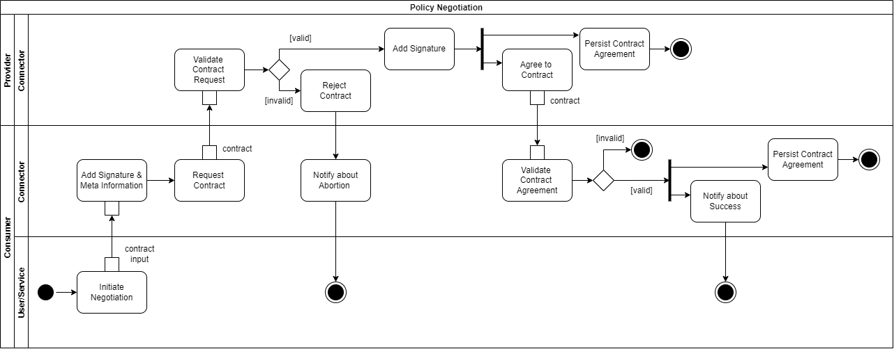
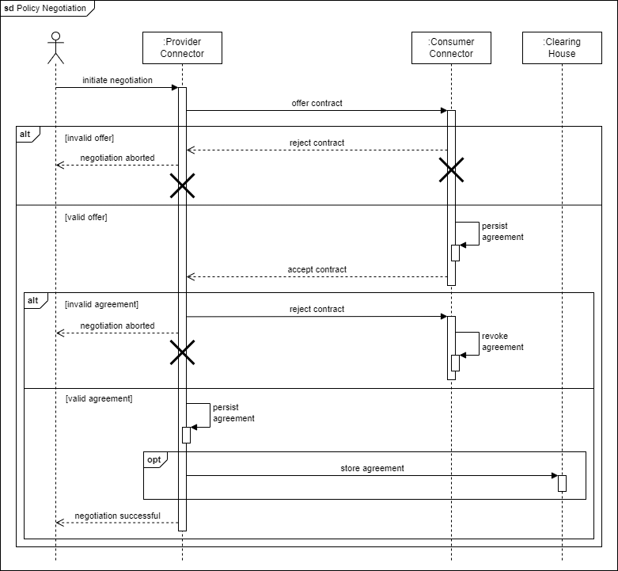
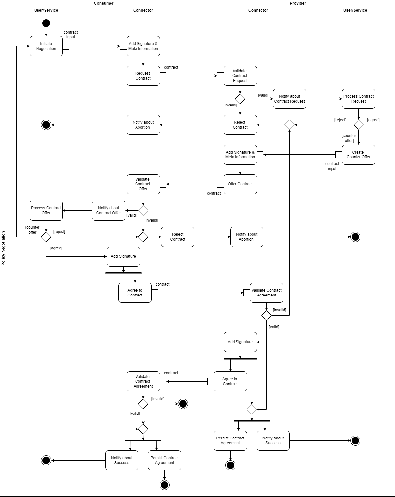

# Contract Negotiation

While a Connector Self-Description basically contains descriptive information about available 
datasets, these also include Usage Control information in form of a Contract Offer. A Contract Offer
describes under what conditions the Data Provider is willing to make its data available to the Data 
Consumer. This can range from simple access restrictions to complex pre- and post-duties. See more
details in Section x. // TODO Link to information layer explaining a contract offer.
<!-- Source: https://github.com/International-Data-Spaces-Association/IDS-G-pre/tree/usage-control-terms/UsageControl/contract -->

In a (semi-)automated negotiation process performed by the Usage Control frameworks of the 
participating IDS Connectors, the Data Consumer and the Data Provider need to agree on a Data Usage
Contract, respectively Contract Agreement. The following sequence diagrams visualize this process in 
more detail.

_Please note, as this is a technology-independent message flow, appropriate responses were not
considered. The illustrated processes can run synchronously as well as asynchronously, and can be
cancelled at any time._

#### _Fig. AA: Contract Negotiation - The Happy Flow_

<!-- Sequence diagram -->
<!-- Integrate Clearing House workflow during Contract Negotiation -->
<!-- Source: https://github.com/International-Data-Spaces-Association/IDS-G-pre/tree/main/Communication/sequence-diagrams/data-connector-to-data-connector -->

Figure AA shows the "happy flow". This covers the easiest sequence which is at least necessary to 
reach a contract agreement. In advance, the Data Provider has attached a Contract Offer to a data 
offer. As described in Section 3.3.2, this is returned to the Data Consumer as part of the IDS 
Connector's Self-Description. However, the Data Consumer can submit a Contract Request at any time, 
even if no Contract Offer exists yet.

In this sequence diagram, as well as in the following ones, the person next to the IDS Connectors 
represents a user or a connected system that interacts with it - accordingly initiates or influences 
the sequence. In Figure AA, the negotiation sequence is initiated by the Data Consumer's IDS 
Connector sending a Contract Request to the Data Provider. The content of this Contract Request can 
differ from the Contract Offer, or it can adopt it as it is. The meta-information in the contract is 
modified accordingly (e.g., the date, the term, or the signature). As soon as the Data Provider's 
IDS Connector receives the Contract Request, its validity is checked by means of syntax and content. 
As Figure AA concentrates on the simple flow, it covers no counter Contract Offers. Thus, the 
Contract Request is either rejected or accepted.

In the case of a Contract Agreement, this is also signed by the Data Provider's IDS Connector and, 
for confirmation, the Data Consumer is informed about the Contract Agreement. As soon as a Contract 
Agreement has been reached, this is instantiated and deployed inside both IDS Connectors. This means 
it needs to be persisted in an immutable way on both sides. This way, both IDS Connectors have all 
necessary information for later Policy Enforcement. How this Policy Enforcement will be ensured is 
explained in Section 3.3.6. // TODO Link to Policy Enforcement Section. 
In addition, the Data Provider's IDS Connector sends the Contract Agreement to the Clearing House.

As with previous Contract Requests or Contract Offers, the Contract Agreement is checked for 
validity. If at any time a participant does not agree with the shared content, the Contract can be 
rejected. In the case of a Contract Rejection, the sequence is aborted. Connected systems or users 
are notified and previously saved Contract Agreements are revoked (internally and externally, e.g. 
from the Clearing House). A negotiation sequence is never reactivated, but can be restarted at 
any time.

#### _Fig. BB: Contract Negotiation - Initiation by Data Provider_

Figure BB depicts a simple negotiation flow as Figure AA. In this case, the sequence is reversed so 
that the Data Provider initiates the negotiation. Nevertheless, it should be noted that, since the 
Data Provider is the one who makes the data offer, it is always the one who signs the Contract 
Agreement last and sends it to the Clearing House.

_In general, all sequences are not fixed and can take place in any conceivable way. The IDS solely 
defines the roles of Data Consumer and Data Provider and how to deal with messages of a certain 
type._

#### _Fig. CC: Contract Negotiation - Counter Offers_

Figure CC illustrates a more complex negotiation flow that covers counter Contract Offers and 
external input. As soon as the Data Provider's IDS Connector receives a valid Contract Request, it
notifies interested users or systems and provides an interface for input. Thus, the IDS Connector, 
if it does not already do so by default, can be extended by the functionality to automatically 
negotiate contracts within a certain framework (e.g. using an AI service). Alternatively, a service 
or a user can interact and directly affect the negotiation by rejecting or agreeing to Contract
Offers or Requests. In addition, counter Contract Offers can be made. Further steps take place as 
already described above: Incoming Contracts are validated and as soon as a Contract Agreement has 
been reached, it is persisted and enforced by both IDS Connectors.
