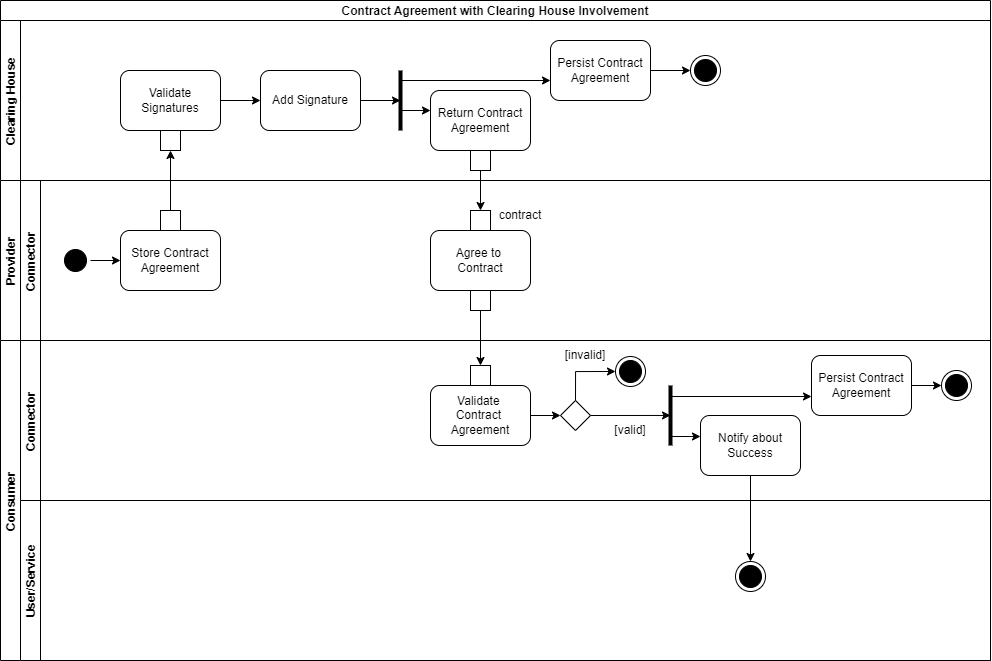

# Contract Negotiation

While a Connector Self-Description basically contains descriptive information about available 
data assets, these also include Usage Control information in form of a Contract Offer. A Contract 
Offer describes under what conditions the Data Provider is willing to make its data available to the 
Data Consumer. This can range from simple access restrictions to complex pre- and post-duties. See 
more details in Section [3.4](../3_4_Information_Layer). <!TODO Deep-Link to information layer explaining a contract offer.!>

In a (semi-)automated negotiation process performed by the Usage Control frameworks of the 
participating IDS Connectors, the Data Consumer and the Data Provider need to agree on a Data Usage
Contract, respectively Contract Agreement. The following sequence diagrams visualize this process in 
more detail.

## Basic Flow

Figure [3.3.3.1](#_fig-3331-simple-contract-negotiation_) shows the most simple version of the sequence 
that is at least necessary to reach a Contract Agreement. In advance, the Data Provider has attached 
a Contract Offer to a data offer. As described in Section [3.3.2](3_3_2_Data_Offering.md), this is 
returned to the Data Consumer as part of the IDS Connector's Self-Description. However, the Data 
Consumer can submit a Contract Request at any time, even if no Contract Offer exists yet.

_Please note, as this is a technology-independent message flow, appropriate responses were not
considered. The illustrated processes can run synchronously as well as asynchronously, and can be
cancelled at any time._

#### _Fig. 3.3.3.1: Simple Contract Negotiation_

In Figure [3.3.3.1](#_fig-3331-simple-contract-negotiation_), the negotiation sequence is initiated by the 
Data Consumer's IDS Connector sending a Contract Request to the Data Provider. The content of this 
Contract Request can differ from the Contract Offer, or it can adopt it as it is. The 
meta-information in the contract is modified accordingly (e.g., the date, the term, or the 
signature). As soon as the Data Provider's IDS Connector receives the Contract Request, its validity 
is checked by means of syntax, content, and signature. As Figure [3.3.3.1](#_fig-3331-simple-contract-negotiation_) 
concentrates on the simple flow, it covers no counter Contract Offers. Thus, the Contract Request is 
either rejected or accepted.

In the case of a Contract Agreement, this is also signed by the Data Provider's IDS Connector and, 
for confirmation, the Data Consumer is informed about the Contract Agreement. Again, content and
signature are validated. If this fails, the Data Consumer simply does not invoke any subsequent 
Data Operations referring to this Contract Agreement (see Section [3.3.4](3_3_4_Exchanging_Data.md)).

As soon as a Contract Agreement has been reached, this is instantiated and deployed inside both IDS 
Connectors. This means it needs to be persisted on both sides. This way, both IDS Connectors have 
all necessary information for later Policy Enforcement.

If, at any time during the sequence, a participant does not agree with the shared content, the 
Contract can be rejected. In the case of a Contract Rejection, the sequence is aborted. Connected 
systems or users are notified and previously saved Contract Agreements are revoked. A negotiation 
sequence is never reactivated, but a new one can be started at any time.

## Clearing House

In addition, for separate trust or for regulation in some data spaces, the approval of a Contract Request or Offer may be extended by
involving the Clearing House. After a successful Contract Request validation, the Data Provider 
signed and stored the Contract Agreement locally. Next, this is additionally sent to the Clearing
House (as shown in Figure [3.3.3.2](#_fig-3332-contract-agreement-with-clearing-house-involvement_)).

After receiving the Contract Agreement from the Data Provider, the Clearing House first checks the 
signature of both involved Connectors and then signs the Contract Agreement itself. The Provider 
Connector returns the triple signed Contract Agreement to the Data Consumer, that can finally check 
all signatures to be sure that the Contract Agreement contains the requested content.

#### _Fig. 3.3.3.2: Contract Agreement with Clearing House Involvement_

## Reversed Sequence

Figure [3.3.3.3](#_fig-cc-contract-negotiation---initiation-by-data-provider_) depicts the simple 
negotiation flow of Figure [3.3.3.1](#_fig-3331-contract-negotiation---initiation-by-data-provider_). 
In this case, however, the sequence is reversed and the Data Provider initiates the negotiation. 
Nevertheless, it should be noted that, since the Data Provider is the one who makes the data offer, 
it is always the one who signs the Contract Agreement last, and sends it to the Clearing House if 
this is involved (as described in the previous subsection).

#### _Fig. 3.3.3.3: Contract Negotiation - Initiation by Data Provider_

## Counter Offers

Figure [3.3.3.4](#_fig-3334-contract-negotiation---counter-offers_) illustrates a more complex negotiation 
flow that covers counter Contract Offers and external input. As soon as the Data Provider's IDS 
Connector receives a valid Contract Request, it may notify interested users or systems and provide 
an interface for input. Thus, the IDS Connector, if it does not already do so by default, can be 
extended by the functionality to automatically negotiate contracts within a certain range (e.g., 
using an AI service). Alternatively, a service or a user can interact and directly affect the 
negotiation by rejecting or agreeing to the received Contracts as well as proposing counter 
Contract Offers or Requests. Further steps take place as already described above: Incoming Contracts 
are validated and as soon as a Contract Agreement has been reached, it is persisted and enforced by 
both IDS Connectors. How this Policy Enforcement will be ensured is explained in Section 
[3.3.6](3_3_6_Policy_Enforcement.md).

#### _Fig. 3.3.3.4: Contract Negotiation - Counter Offers_
