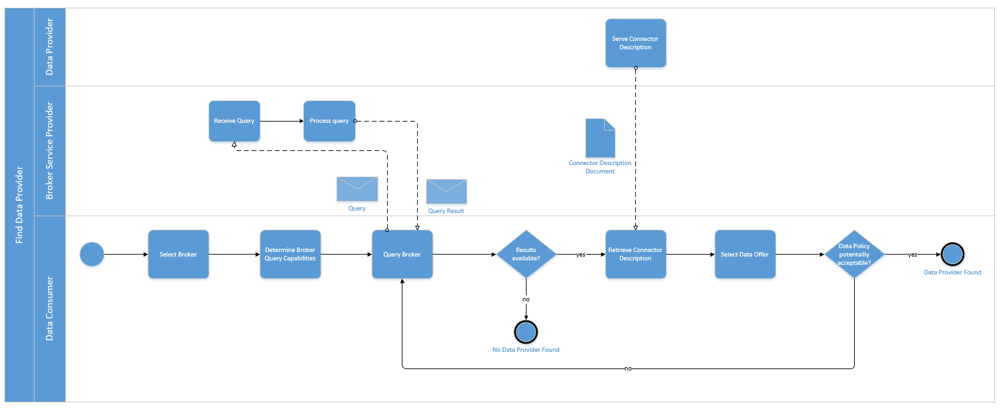

## EXCHANGING DATA

- Exchanging data via the same protocol
- Exchanging data via another infrastructure / protocol

In both, the following patterns must be considered: Push, Pull, Pub/Sub
Additionally we have to consider async and sync Connections

https://github.com/International-Data-Spaces-Association/IDS-G-pre/tree/connector-interaction/Communication/sequence-diagrams/data-connector-to-data-connector#requesting-data

<!-- from LaTex file section3_1_process_layer -->
### Exchanging Data
The overall process of exchanging data consists of two sub processes, as illustrated in Figure [XX](#Exchanging-Data)). The first sub process is about a Data Consumer searching for a suitable Data Provider. If the search was successful, the Data Consumer and the Data Provider can start to exchange data with one another. This is done after Connector configuration, either starting 'from scratch' (see IDS onboarding process described above) or by reconfiguring an existing Connector. The second sub process is the invocation of the actual data operation (e.g. data upload or download, data transformation, or data query).

#### _Fig. XX: Exchanging Data overall process_

### Find Data Provider

To find a Data Provider, the Data Consumer must send a query to a Broker Service Provider. Before that, however, the Data Consumer needs to select a suitable Broker (e.g. based on thematic coverage) and determine the query capabilities (e.g. a graphical search interface or a domain-specific query language). The Broker then returns the query result to the Data Consumer, who needs to interpret the result to find out about the different data sources available in the International Data Spaces for providing the data specified in the query. Each query result must provide information about each IDS Connector capable of providing the desired data, so that the Data Consumer can retrieve each Connector's self-description to learn more about how to receive the desired dataset from a technical point of view (e.g., endpoint addresses, protocol). The Data Provider may serve the same data using different representations or pricing options, so the Data Consumer may select a suitable offer from the Data Provider's Connector description.

Alternatively, the Data Consumer may already know a suitable Data Provider. In this case, the Data Consumer can contact the Data Provider directly (i.e. without invoking a broker).

#### _Fig. XX: Find Data Provider sub-process_

### Invoke Data Operation

Data usage policy information is an important element of legal agreements and is therefore modeled as first-class objects on the Information Layer (see Section 3.4). The handling of data usage policy information is shown in detail in the 'Invoke Data Operation'  sub process (Figure [YY](#FindData)). While a Connector self-description basically contains information about the datasets available, also usage policy information can be extracted from this description. In a (semi-)automated negotiation process performed by the usage control frameworks of the participating Connectors, the Data Consumer and the Data Provider need to agree on a data usage policy. If an agreement has been reached, this policy is instantiated and deployed inside both Connectors. The policy both parties agree upon needs to be persisted in an immutable way by both sides. After the data usage policy has been established, the consuming Connector can be configured to deal with further data coming in from the Data Provider in the future as specified by the policy. The retrieval of the self-description and the negotiation of policies must make use of HTTPS or MQTT protocols. If this has been done, the Data Operation call can be invoked – this is usually done by a request using a common protocol (e.g., HTTP) to retrieve a data artifact from the Data Provider.

The Data Provider then sends the result of the data operation to the Data Consumer. Usage control on both sides signals the data operation to the data provenance tracking infrastructure (accessible via the Clearing House), so that provenance information about the data transferred is kept up to date. Usage control on the Data Consumer side also signals receipt of the data operation result to the data provenance tracking infrastructure, in order to confirm that the transaction has been completed successfully (see sections 4.1.3.6 and 4.1.3.7).

#### _Fig. ZZ: Invoke Data Operation sub-process_

Communication between the Connectors can be asynchronous (i.e., the Data Consumer does not have to wait in idle mode for the result to arrive, but will be notified by the Data Provider as soon as the result is available). Instead of a pull-request, a push-request can be sent, which means that the Data Consumer asks for updates regarding the requested data. The updated data can be provided either after certain events (e.g., after the data has been updated by the Data Provider) or within certain time intervals (e.g., every five minutes). If a push-request is made, the Data Consumer repeatedly receives updated query results from the Data Provider. In case of a pull-request, the Data Consumer can repeat the last part of the process to query data again (using the same or a different query). The description of the communication pattern itself is not part of this document, as this is covered by existing standards (e.g. DIN SPEC 16593-1:2018-04, see chapter 8 'Characterizations of Interactions' ) or as best practices in industry.
