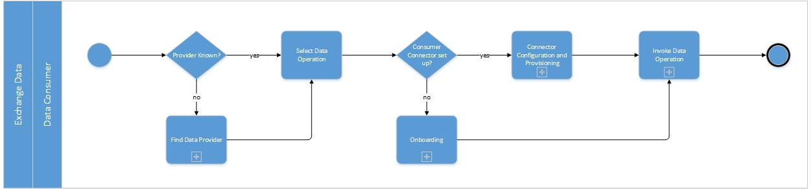
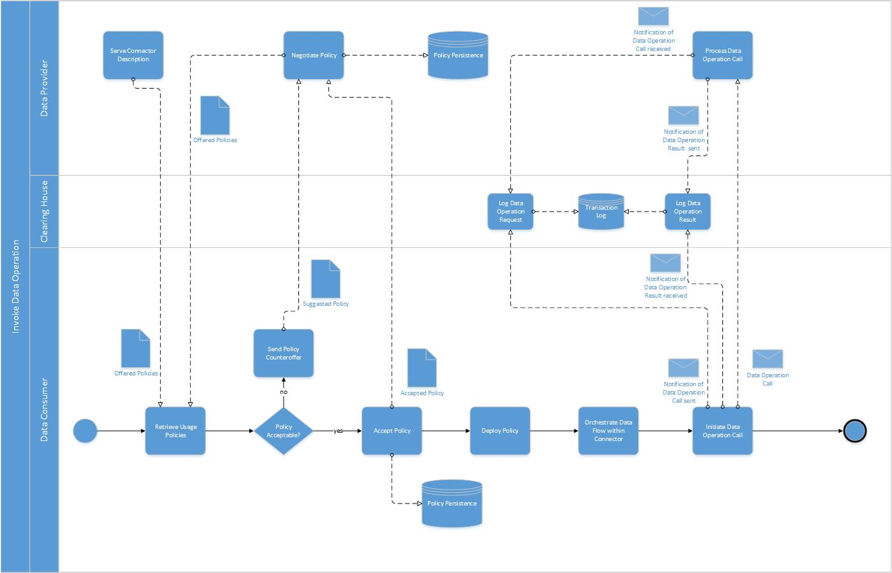

# Data Exchange

<!-- Exchanging data via the same protocol -->
<!-- Exchanging data via another infrastructure / protocol -->

<!-- In both, the following patterns must be considered: Push, Pull, Pub/Sub -->
<!-- Additionally we have to consider async and sync Connections -->

<!-- https://github.com/International-Data-Spaces-Association/IDS-G-pre/tree/connector-interaction/Communication/sequence-diagrams/data-connector-to-data-connector#requesting-data -->

<!-- from LaTex file section3_1_process_layer -->

The overall process of exchanging data consists of two sub-processes, as illustrated in 
Figure [XX](#_fig-xx-overall-data-exchange-process_)). 

#### _Fig. XX: Overall Data Exchange Process_

The first sub-process is about a Data Consumer searching for a
suitable Data Provider. If the search was successful, the Data Consumer and the Data Provider can
start to exchange data. This is done after the IDS Connector configuration, either starting
'from scratch' (see IDS Onboarding process described in Section [3.3.1](3_3_1_Onboarding.md)) or by
reconfiguring an existing IDS Connector. The second sub-process is the invocation of the actual
data operation (e.g. data upload or download, data transformation, or data query).

## Find a Data Provider

To find a suitable Data Provider, the Data Consumer can send a query to an IDS Metadata Broker as
described in Section [3.3.2](3_3_2_Data_Offering.md). Alternatively, the Data Consumer may already 
know a suitable Data Provider. In this case, the Data Consumer can contact it directly (i.e., 
without invoking an IDS Metadata Broker).

## Invoke a Data Operation

Data Usage Contract information is an important element of legal agreements and is therefore 
modeled as first-class objects on the Information Layer (see Section [3.4](../3_4_Information_Layer)). 
The handling of Data Usage Contract information is shown in detail in Figure 
[ZZ](#_fig-zz-invoke-data-operation-sub-process_)). The retrieval of the Self-Description and the 
negotiation of policies can make use of HTTPS or MQTT protocols. The respective protocol bindings 
are specified in the IDS-G. If this has been done, the Data Operation call can be invoked – this is 
usually done by a request using a common protocol (e.g., HTTP) to retrieve a data artifact from the 
Data Provider.

The Data Provider then sends the result of the data operation to the Data Consumer. Usage control 
on both sides signals the data operation to the data provenance tracking infrastructure (accessible 
via the Clearing House), so that provenance information about the data transferred is kept up to 
date. Usage Control on the Data Consumer side also signals receipt of the data operation result to 
the data provenance tracking infrastructure, in order to confirm that the transaction has been 
completed successfully (see sections 4.1.3.6 and 4.1.3.7).

#### _Fig. ZZ: Invoke Data Operation sub-process_

Communication between the Connectors can be asynchronous (i.e., the Data Consumer does not have to 
wait in idle mode for the result to arrive, but will be notified by the Data Provider as soon as the 
result is available). Instead of a pull-request, a push-request can be sent, which means that the 
Data Consumer asks for updates regarding the requested data. The updated data can be provided either 
after certain events (e.g., after the data has been updated by the Data Provider) or within certain 
time intervals (e.g., every five minutes). If a push-request is made, the Data Consumer repeatedly 
receives updated query results from the Data Provider. In case of a pull-request, the Data Consumer 
can repeat the last part of the process to query data again (using the same or a different query). 
The description of the communication pattern itself is not part of this document, as this is covered 
by existing standards (e.g. DIN SPEC 16593-1:2018-04, see chapter 8 'Characterizations of 
Interactions' ) or as best practices in industry.
