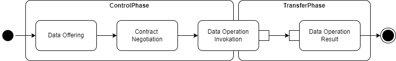
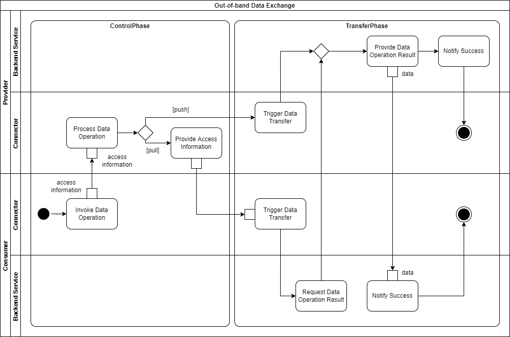

# Data Exchange

<!-- https://github.com/International-Data-Spaces-Association/IDS-G-pre/tree/main/Communication/sequence-diagrams/data-connector-to-data-connector#requesting-data -->
<!-- from LaTex file section3_1_process_layer -->

After a successful Onboarding (see Section [3.3.1](3_3_1_Onboarding.md)), the operations of a Data 
Consumer or Data Provider can be assigned to two phases: the Control Phase and the Transfer Phase. 
In the Control Phase, both Participants pass multiple processes (Data Offering 
(see Section [3.3.2](3_3_2_Data_Offering.md)) and Contract Negotiation (see Section 
[3.3.3](3_3_3_Contract_Negotiation.md))) to prepare the data transfer, using an IDS-specific 
communication protocol. The respective protocol bindings are defined in the 
[IDS-G](https://github.com/International-Data-Spaces-Association/IDS-G). 

In the Transfer Phase, if all aforementioned processes were successfully finished, the Data Consumer 
and the Data Provider can start to actually exchange data by invoking a Data Operation (e.g., data 
upload or download, data transformation, or data query) via their IDS Connectors. How this can be 
done is described in the following.

#### _Fig. 3.3.4.1: Communication Phases_

The invocation of a Data Operation is part of the Control Phase, as shown in Figure [3.3.4.1](#_fig-3341-communication-phases_), and 
initiated by a Connector that refers to a Contract Agreement. As the subsequent sequence should not 
be bound to neither a communication protocol nor to a communication pattern, this can be implemented 
differently, as stated in the following. For this to work, a Data Operation request requires 
information that enables technical automation (e.g., authentication information, or protocol details).

## Communication Pattern

Communication between the Connectors can be synchronous or asynchronous (i.e., the Data Consumer 
does not have to wait for the result to arrive, but will be notified by the Data Provider as soon as 
the result is available). On top of that, instead of a pull-request, a push-request can be sent. 

In case of a subscription, the Data Consumer may ask for updates regarding the requested data. The 
updated data can be provided either after certain events (e.g., after the data has been updated by 
the Data Provider) or within certain time intervals (e.g., every five minutes). If a push-request 
is made, the Data Consumer repeatedly receives updated query results from the Data Provider. In case 
of a pull-request, the Data Consumer can repeat the last part of the process to query data again 
(using the same or a different query).

The description of the communication pattern itself is not part of this document, as this is covered
by existing standards (e.g. DIN SPEC 16593-1:2018-04) or as best practices in industry.

## Communication Protocol

To meet various requirements regarding data volume and transfer in real time, the Transfer Process
is not restricted to a specific protocol. This way, technical limitations are bound to those of the 
applied systems and not to the Connector component.

### Data Transfer via the Same Infrastructure and Protocol

Either synchronously or asynchronously, the Data Provider's Connector may respond with the Data 
Operation result without using a proprietary system or protocol. In the course of this, all 
information flows that are shown in Figure [3.3.4.1](#_fig-3341-communication-phases_) 
would run directly between the two Connectors using an IDS protocol.

### Data Transfer via Another Infrastructure or Protocol

Alternatively to the previously described process, after the Data Operation invocation, the Data 
Consumer's Connector can take the provided information and establish a connection directly between 
the Data Provider’s system acting as a data source, and a system on the consumer-side acting as the 
data sink. This offers the possibility to establish and leave connections open, or to switch from 
data pulling to data pushing easily. The sequence is depicted in Figure [3.3.4.2](#_fig-3.3.4.2-out-of-band-data-exchange_).

#### _Fig. 3.3.4.2: Out-of-band Data Exchange_

## Usage Control

All communication patterns and protocols must ensure that usage control, covering the contents of 
the negotiated Contract Agreement, is enforced, and that the involved Connectors are included in the 
data transfer, at least by event-based notifications. More details about Policy Enforcement are
described in Section [3.3.6](3_3_6_Policy_Enforcement.md).
