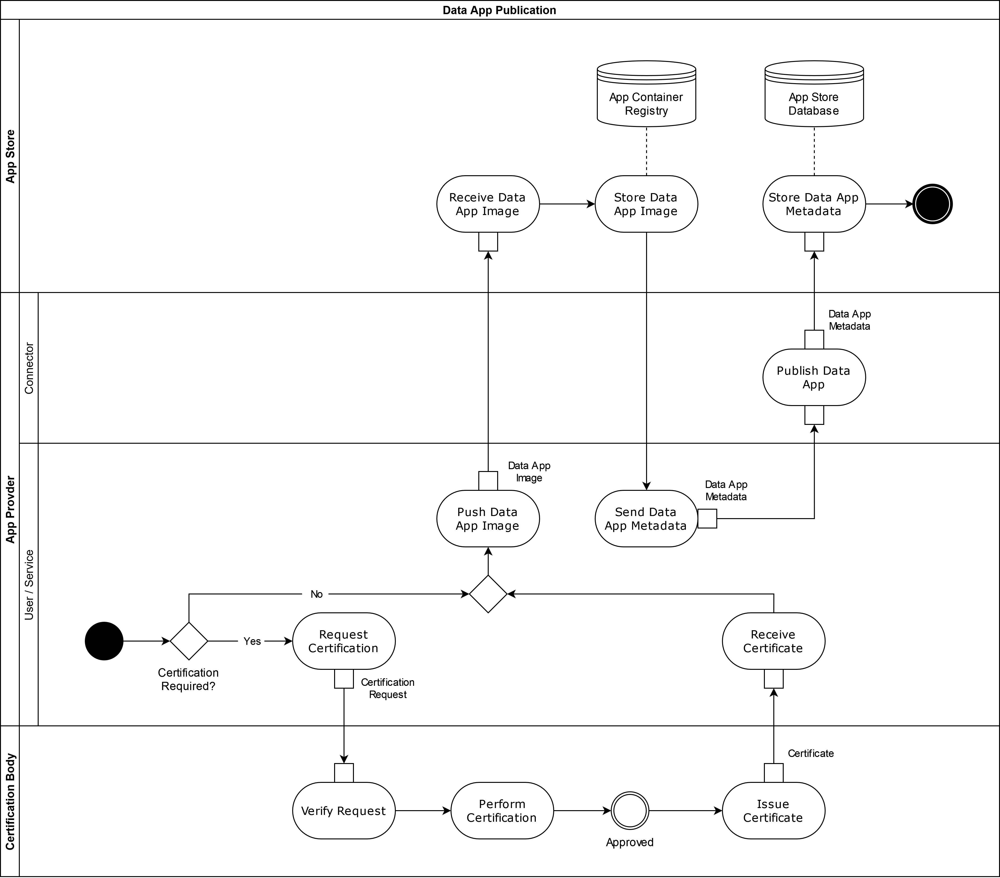
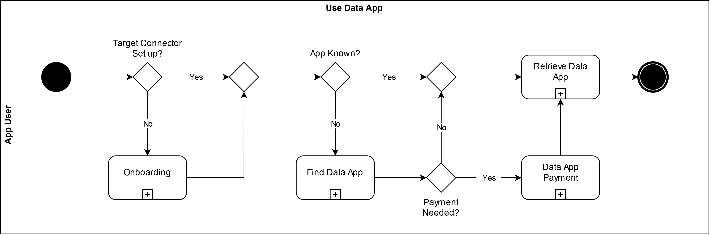
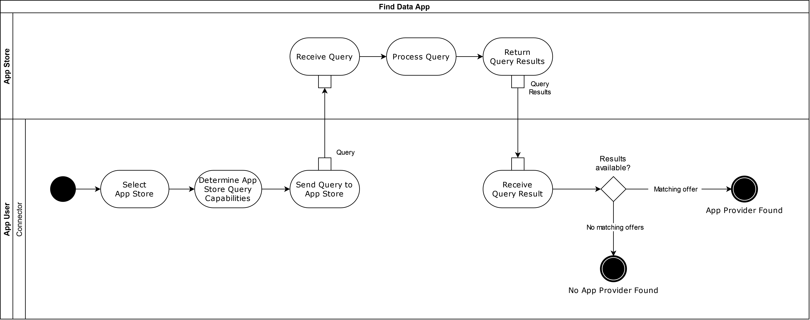

## Publishing and using Data Apps

Data Apps can be used by IDS Connectors for specific data processing or transformation tasks. They can perform tasks of different complexity, ranging from simple data transformation to complex data analytics. An example of data transformation may be a Data App parsing a single string field with address information and producing a data structure consisting of street name and number, zip code, name of the city, and name of the country.

On a conceptual level, Data Apps can be treated the same way as Data Offerings in the International Data Spaces (see Section [3.3.2](3_3_2_Data_Offering.md)). Therefore, just as a Data Offering is provided by a Data Provider using an IDS Connector registered at an IDS Metadata Broker, Data Apps are created by an App Provider and registered at an IDS App Store using the App Provider's IDS Connector as a means to communicate with the IDS App Store. As a consequence, App Providers also need to undergo the Onboarding Process explained in Section [3.3.1](3_3_1_Onboarding.md). Instead of registering their IDS Connector at an IDS Metadata Broker, App Providers register their Data Apps at an IDS App Store.

After a successful Onboarding Process, App Providers can use their IDS Connector to communicate with an IDS App Store and publish a Data App. The "Data App Publication Process" is depicted in Figure [3.3.5.1](#PublishingDataApp) below. In order to be published, certain Data Apps require certification from the Certification Body (see [Section 4.2](../../4_Perspectives_of_the_Reference_Architecture_Model/4_2_Certification_Perspective)), as depicted in the first step of the "Data App Publication Process". For each Data App that was successfully certified, the corresponding metadata is stored in the IDS App Store and can be retrieved by IDS Participants via a search interface offered by the App Store.

#### _Fig. 3.3.5.1: "Data App Publication" Process_

When it comes to using a Data App that is offered by an IDS App Store, IDS Participants need to execute a process that is very similar to the 'Exchange Data' process, as depicted in Figure [3.3.5.2](#UseDataApp). An IDS Participant, here called "App User", can use the search interface of the IDS App Store to look for a suitable Data App, as depicted by the "Find Data App" subprocess in Figure [3.3.5.3](#FindDataApp)). The last step of the "Find Data App" process is the contract negotiation with the App Provider as detailed in Section [3.3.3](3_3_3_Contract_Negotiation.md). If the participant finds a suitable Data App in an IDS App Store, e.g. matching in functionality and compatible with the App User's IDS Connector technical requirements, the Data App can then be requested through the "Retrieve App" subprocess, which is conceptually identical with the “Invoke Data Operation” process outlined in Section [3.3.4](3_3_4_Exchanging_Data.md).

#### _Fig. 3.3.5.2: "Use Data App" Process_

#### _Fig. 3.3.5.3: "Find Data App" Process_
