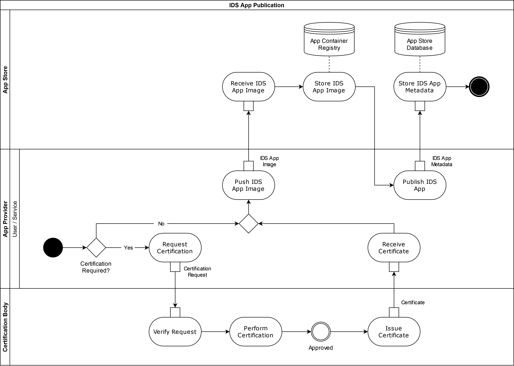

## Publishing and using IDS Apps

IDS Apps can be used by IDS Connectors for specific data processing or transformation tasks. They can perform tasks of different complexity, ranging from simple data transformation to complex data analytics. An example of data transformation may be a IDS App parsing a single string field with address information and producing a data structure consisting of street name and number, zip code, name of the city, and name of the country.

IDS Apps are created by an App Provider and then published at an IDS App Store, as depicted by the "IDS App Publication Process" in Figure [3.3.5.1](#PublishingIDSApp). In order to be published, certain IDS Apps require certification from the Certification Body (see [Section 4.2](../../4_Perspectives_of_the_Reference_Architecture_Model/4_2_Certification_Perspective)), as depicted in the first step of the "IDS App Publication Process". Whether a certification is needed or not, publishing an IDS App requires the App Provider to push the app image to the app store's App Container Registry and then publish the app metadata. For each IDS App that was successfully published, the corresponding metadata and app image are stored in the IDS App Store and can be retrieved by IDS Participants via a search interface offered by the App Store.

#### _Fig. 3.3.5.1: "IDS App Publication" Process_

When it comes to using a IDS App that is offered by an IDS App Store, IDS Participants need to execute the process that is depicted in Figure [3.3.5.2](#UseIDSApp). An IDS Participant, here called "App User", can use the search interface of the IDS App Store to look for a suitable IDS App through its IDS Connector, as depicted by the "Find IDS App" subprocess in Figure [3.3.5.3](#FindIDSApp). After the "Find IDS App" process is finished, the App User might need to pay for the selected IDS App. This is indicated by the "IDS App Payment" subprocess, which is conceptually similar to the Contract Negotiation detailed in Section [3.3.3](3_3_3_Contract_Negotiation.md) and can be done directly between the App User and App Provider or through a Clearing House if necessary.

#### _Fig. 3.3.5.2: "Use IDS App" Process_

#### _Fig. 3.3.5.3: "Find IDS App" Process_

If the participant finds a suitable IDS App in an IDS App Store, e.g. matching in functionality and compatible with the App User's IDS Connector technical requirements, the IDS App can then be requested through the "Retrieve IDS App" subprocess depicted in Figure [3.3.5.4](#RetrieveIDSApp). This subprocess consists of two main interactions of the App User with the App Store, first to retrieve the IDS App's metadata and then to pull its image before deploying it in the App User's IDS Connector. 

#### _Fig. 3.3.5.4: "Retrieve IDS App" Process_
