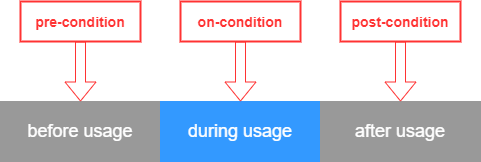

# Policy Enforcement

Enforcement of data usage restrictions can be characterized and implemented in different forms. Organizational rules or legal contracts can be substituted, or at least accompanied, by technical solutions, which introduce a new level of security. Vice versa, technical solutions can be accompanied by organizational rules or legal contracts (e.g., to compensate missing capabilities of the technical solution).

Although it is a commonly used solution to address data usage control restrictions by organizational rules, the IDS-RAM focuses on technical enforcement.
To enforce data usage restrictions, a system’s actions need to be monitored and potentially intercepted by control points (i.e., Policy Enforcement Points, PEPs). These actions must be judged by a decision engine (i.e., a Policy Decision Point, PDP) for requesting permission or denial. In addition to just allowing or denying an action, the decision engine may also require modification of the action. A PEP component encapsulates the enforcement.

Enforcement relies on a decision. The PDP has the responsibility to answer incoming requests (e.g., system actions) from a PEP in the form of a decision (see Figure ~~4.14)~~. Decision-making based on usage restriction is also called (policy) evaluation. There are several types of evaluation, such as event-based or flow-based approaches.

_Figure 4.14: Communication Policy Enforcement Point and Policy Decision Point_

For event-based systems, data usage transactions are represented as events including attributes to characterize the data usage. Event processing can be differentiated into simple processing (e.g., event-condition-action paradigm) and stream processing (e.g., sliding window) of events. The terms ”event stream processing” and “complex event processing” are often used interchangeably.

For example: It is possible to model the transition of data as an event with attributes about the data itself and the recipient. The attributes contain metadata and information on the target system (e.g., supplier management system). The decision engine makes a deny decision if the target system does not correspond to the expected supplier management system.

The policy decision may also depend on additional information that is not present in the intercepted system action itself. This includes information about the context, such as data flows or the geographical location of an entity. It is also possible to specify pre- or post-conditions that have to hold before (e.g., integrity check of the environment) and after (e.g., data item is deleted after usage) decision-making. In addition, it is possible to define on-conditions that have to hold during usage (e.g., only during business hours). These conditions usually specify constraints and permissions that have to be fulfilled before, during, and after using data (~~see Figure 4.15)~~.

_Figure 4.15: Usage Control Pre-, On-, and Post-Conditions_

A Policy Information Point (PIP) provides missing information for decision-making. In addition, such a component can be used to get contextual information for or about the system action intercepted (e.g., data flow information, geolocation of the requesting device).

Another important aspect of data usage control is the specification and management of usage restrictions. Data Providers have to express data usage restrictions in a more or less formal way. For technical enforcement, the specification must produce a machine-readable output. The Policy Administration Point (PAP) is the entry point for specification of usage policies, often via a user-friendly graphical interface.
