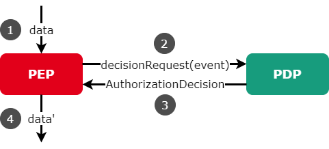

# Policy Enforcement
Enforcement of data usage restrictions (Policy Enforcement) can be characterized and implemented in different forms. Organizational rules or legal contracts can be substituted, or at least accompanied, by technical solutions, which introduce a new level of security. Vice versa, technical solutions can be accompanied by organizational rules or legal contracts (e.g., to compensate missing capabilities of the technical solution).

Although it is a commonly used solution to address data usage control restrictions by organizational rules, the IDS focuses on technical enforcement.
To enforce data usage restrictions, a system’s actions need to be monitored and potentially intercepted by control points (i.e., Policy Enforcement Points). These actions must be judged by a decision engine (i.e., a Policy Decision Point) for requesting permission or denial. In addition to just allowing or denying an action, the decision engine may also require modification of the action. A PEP component encapsulates the enforcement.

## The Policy Enforcement Point (PEP)
**The Policy Enforcement Point (PEP)** has two main tasks. First, it is the entry point for enforcement, meaning it is the point where data or metadata is stopped and transferred to the PDP, the PDP makes a decision and returns it to the PEP. Secondly, the PEP will subsequently manipulate or lock the data according to the decision.

_Figure 3.3.6.1: Communication Policy Enforcement Point and Policy Decision Point_

## Policy Decision Point (PDP)
As mentioned before, the **Policy Decision Point (PDP)** makes the decision based on the data sent by the PEP and the deposited policies. The policies specifies the conditions and obligations. The result of the evaluation is send to the PEP for enforcement (see Figure 3.3.6.1). The PDP also interprets the policies in terms of context information and instructions. This means the policy decision may also depend on additional information that is not present in the intercepted system action itself. This includes information about the context, such as data flows or the geographical location of an entity. It is also possible to specify pre- or post-conditions that have to hold before (e.g., integrity check of the environment) and after (e.g., data item is deleted after usage) decision-making. In addition, it is possible to define on-conditions that have to hold during usage (e.g., only during business hours). These conditions usually specify constraints and permissions that have to be fulfilled before, during, and after using data (see Figure 3.3.6.2). This is linked to the other components presented in this section.

_Figure 3.3.6.2: Usage Control Pre-, On-, and Post-Conditions_

## The Policy Information Point (PIP)
**The Policy Information Point (PIP)** is the component to determine information such as context information during policy evaluation. This information can then be used in the PDP for decision making. (More about context information in Section 4.1.6)

## The Policy Execution Point (PXP)
**The Policy Execution Point (PXP)** is the components for implementing instructions or requirements these can be before a decision and their successful execution can be included as a condition, or they can be executed after a decision has been made. (More about the execution of instructions in Section 4.1.6)

## The Policy Management Point (PMP) and the Policy Administration Point (PAP)
**The Policy Management Point (PMP)** and **the Policy Administration Point (PAP)** are not components that are directly needed for enforcement, but should be briefly mentioned here. These components are important for specification and management of usage policies. The PMP, as the name implies, is responsible for the management or handling of the policies, it makes the policies available to the PDP, activates, deactivates and deletes these. The PAP is used to support the creation and spezification of usage policies often via a user-friendly graphical interface.

## The Interaction in the IDS Connector
**An example process** in the IDS Connector. Let's assume there is a policy describing that data can only be used when the connector is in the EU and the usage is sent to the clearing house after the data has been used. We assume that such a policy is deposited (negotiated) for the PDP and the components to implement it are available. Now a process may exist to enforce access control, on the data provider side. It basically does not matter if it is a send or fetch of the data. To implement data usage control, there must also be a process on the data consumer side. We want to focus here on the case of Usage Control on the consumer side, which can be used very similarly also for access control, since the data provider, has a high interest to enforce this as early as possible. In Figure 3.3.6.3 is an IDS Connector that receives data, the connector core is of central importance it knows the routes of the data and can thus integrate the PEPs at appropriate points. This can be done when the data leaves the IDS Connector Core or e.g. via Interceptor Pattern for completely controlled data flows. If data is to flow to a data sink (app, storage), the IDS Connector Core knows the destination, it knows the identifications of the data, which are transferred in the form of metadata. Before the data flows directly, the PEP acts in front of it and sends all the required information to the PDP. The implementation of the solution can be implemented in the core or as a standalone application (runs as an IDS Connector App), but the principle remains the same. The PDP analyzes the policy and must be connected via the IDS Connector Core to a system that can provide a statement about the IDS Connector location, IDS ParIS is used here as an example. If the connector is located in the EU, the data is released, or the PEP does not have to change anything, the PDP informs the PEP of this. Now there is the instruction to log the data delivery in the clearinghouse. This is now done via PXP which is connected to the IDS Clearing House via the IDS Connector Core in the same way as the PIP. The PDP can now log important information and parameters provided by the PEP and PIP to the Clearing House via PXP. More details about different types of context information and the execution of instructions can be found in Section 4.1.6.
