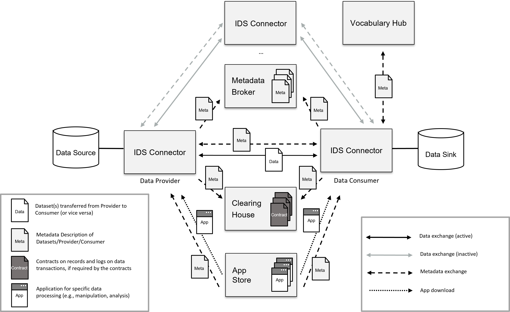

## System Layer ##

The processes defined in the [Process Layer](../3_4_Process_Layer/3_4_Process_Layer.md) are summarized in [Figure 3.5.0.1](#figure-3501-interaction-of-technical-components) as interactions between the IDS Components. Please note that the Identity Provider is not shown in the figure in order to maintain readability.

#### Figure 3.5.0.1: Interaction of technical components

A distributed network like the International Data Spaces relies on the connection of different participants where IDS Connectors or other core components are hosted (an IDS Connector comprising one or more Data Endpoints). The IDS Connector is responsible initiating a data exchange (see [Section 3.4.4](../3_4_Process_Layer/3_4_4_Exchanging_Data.md#data-exchange)) from and to the internal data resources and enterprise systems of the participating organizations and the International Data Spaces. It provides metadata to the Metadata Broker as specified in the IDS Connector self-description, e.g. technical interface description, authentication mechanism, and associated data usage policies. Usage Contracts can be transferred via the IDS Connector to the Clearing House to ensure trust. Also, the data transfer can be logged at the Clearing House for trust reasons, or for clearing reasons. Vocabularies can be interpreted by getting more details from the Vocabulary Hub. Additional IDS Apps can be downloaded to the IDS Connector to run operations on the data.

On the System Layer, the roles specified on the Business Layer and the processes defined in the Process Layer are mapped onto a concrete data and service architecture, resulting in what can be considered the technical core of the International Data Spaces.

The IDS consists of the following core components:

- the [Identity Provider](./3_5_1_Identity_Provider.md#identity-provider) (consisting of [CA](./3_5_1_Identity_Provider.md#certificate-authorities-cas), [DAPS](./3_5_1_Identity_Provider.md#dynamic-attribute-provisioning-service-daps) and [ParIS](./3_5_1_Identity_Provider.md#participant-information-service-paris)),
- the [IDS Connector](./3_5_2_IDS_Connector.md#ids-connector),
- the [App Store and Data Apps](./3_5_3_App_Store_and_Data_Apps.md#app-store-and-ids-apps),
- the [Metadata Broker](./3_5_4_Metadata_Broker.md#metadata-broker),
- the [Clearing House](./3_5_5_Clearing_House.md#clearing-house), and
- the [Vocabulary Hub](./3_5_6_Vocabulary_Hub.md#vocabulary-hub).
