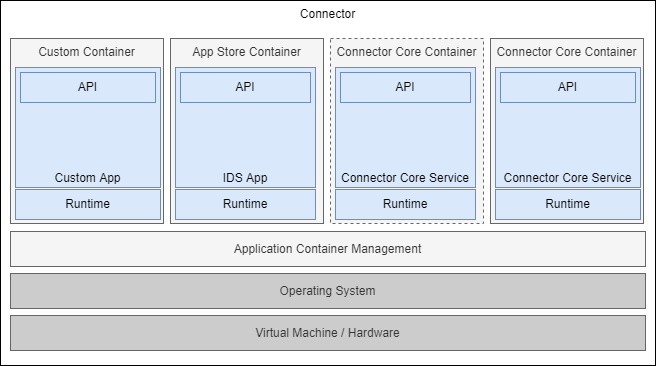
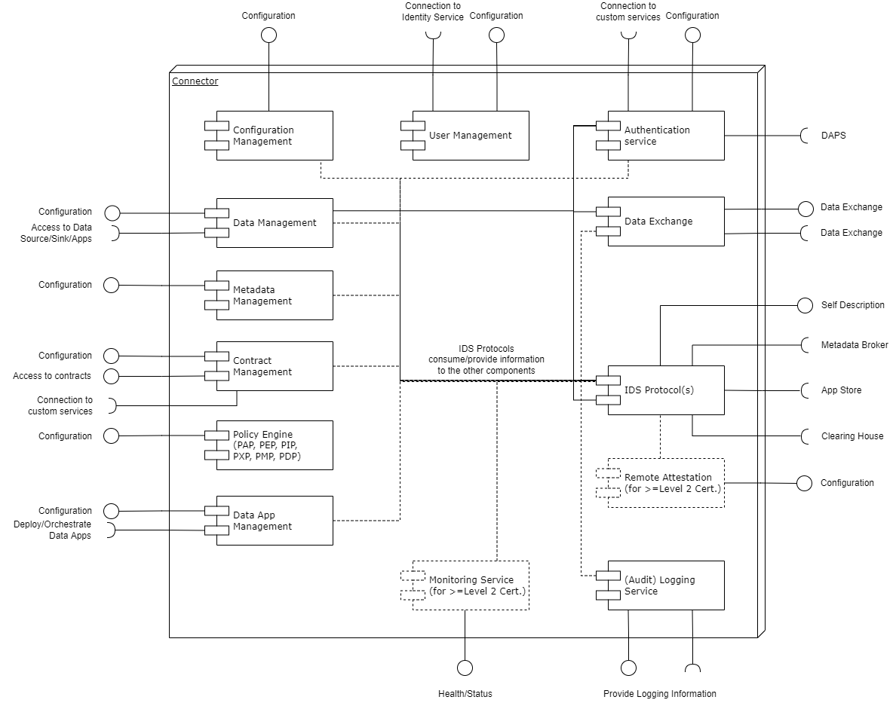

# IDS Connector

The Connector Architecture uses application container management technology to ensure an isolated and secure environment for individual data services. A data service matches a system which offers an API to store, access or process data. To ensure privacy of sensitive data, data processing should take place as close to the data source as possible. Any data preprocessing (e.g., filtering, anonymization, or analysis) should be performed by the backend or IDS Apps. Only data intended for being made available to other participants should be made visible through Connectors.

IDS Apps are services for realizing business logic inside the IDS Connector. IDS Apps can be used to process data, connect to external systems or control the IDS Connector. IDS Apps can be downloaded via the IDS App Store and deployed at the IDS Connector.

Using an integrated index service, the Metadata Broker manages the data sources available in the International Data Spaces and supports publication and maintenance of associated metadata. Furthermore, the Metadata Broker supports the search for data resources. 

The Clearing House is used to optionally store transaction metadata or data usage between Connectors and thus to log the data exchange. In addition, contracts concluded between participants can be stored. Furthermore, payment for data consumption can be processed via the Clearing House if required.

The App Store, Metadata Broker and Clearing House are based on the IDS Connector architecture (which is described in detail in the following paragraphs) in order to support secure and trusted data exchange with these services.

## IDS Connector Architecture

The Connector consists of one or more computers/virtual machines, operating systems running on them, an Application Container Management and the Connector Core Service(s) built on top of it. 

#### _Fig. 3.5.2.0.1: Connector Architecture_

The individual elements of the deployment are shown in Figure 3.5.2.0.1 and described below:
- _Application Container Management_: In most cases, the deployment of the Connector Core Service(s) and selected IDS Apps is based on application containers. IDS Apps are isolated from each other by containers in order to prevent unintended interdependencies. Using Application Container Management, extended control of IDS Apps and containers can be enforced. During development, and in case of systems with limited resources, Application Container Management can be omitted.  
- _Connector Core Service(s)_ provides components for Data Management, Metadata Management, Contract and Policy Management, IDS App Management, IDS Protocols Authentication any many more. A detailed explanation is given in the following section [IDS Connector Functions](#ids-connector-functions).
- An _App Store Container_ is a certified container downloaded from the App Store, providing a specific IDS App to the Connector.
- A _Custom Container_ provides a self-developed Custom App. Custom containers usually require no certification. 
- An _IDS App_ defines a public API, which is invoked from the IDS Connector. This API is formally specified in a meta-description that is imported during the deployment phase of an IDS App. The tasks to be executed by IDS Apps may vary. IDS Apps can be implemented in any programming language and target different runtime environments. Existing components can be reused to simplify migration from other integration platforms. A detailed description of how to use IDS Apps can be found in section [3.3.5](../../3_3_Process_Layer/3_3_5_Publishing_and_using_Data_Apps.md), the deployment of IDS Apps is explained in section [3.5.3](3_5_3_App_Store_and_Data_Apps.md).
- The _Runtime_ of a Custom/App Store/Connector Core Container depends on the selected technology and programming language. The Runtime together with application constitutes the main part of a container. Different containers may use different runtimes. What runtimes are available depends only on the base operating system of the host computer. From the runtimes available, a service architect may select the one deemed most suitable.

## IDS Connector Functions

The IDS Connector must include some essential functionality in its Connector Core Service(s). The functionalities can be implemented in individual mirco services or as a single comprehensive software block. In addition, the services do not have to be provided over the same infrastructure. For example, it is possible to distinguish between the Data Plane and the Control Plane. The Control Plane covers all aspects from identity management, over the creation and discovery of data offers, to the negotiation of contracts. Lastly, the Control Plane also triggers the Data Plane after negotiating used technologies first. The Data Plane is treated separately from the Control Plane, as it can use a different transfer protocol. While the data offers and contracts are negotiated using e.g., an IDS protocol, the data transfer and storage of huge amounts of data can performed “out-of-band” with low latency using an appropriate technology. The modularity allows this to be substituted or augmented. Moreover, multiple transfer mechanisms to support diverse data types can be used in parallel. With this, the IDS Connector solves key aspects of how to handle streaming, large data transfer, and hyper scaling.

#### _Fig. 3.5.2.0.2: Connector Functional View_

The individual functionalities of the Connector Core Service(s) are shown in Figure 3.5.2.0.2 and described below:

- The _Authentication Service_ holds the necessary information to authenticate the IDS Connector from/to other backend systems and/or the system access from/to the IDS Connector from other IDS participants. For security reasons, we recommend a clear separation of the internal and external access credentials. However, from a functionality perspective it is one function
. The _Authentication Service_ provides a Configuration interface and can offer an interface to connect custom authentication services. In order to authenticate incoming and outgoing connections it holds
	- the Key/Trust Store for the _IDS Protocol(s)_, 
	- the Authentication Credentials for the access of the _Data Management_ and _Data Exchange to external systems, and 
	- the Information for the Access Control of the _Data Exchange_ and _Data Management_ to the IDS.
- The _Data Exchange_ component provides or requires interfaces to exchange Data with other IDS Participants (Providers/Consumers). The Component can be deployed also on another infrastructure then the IDS Protocol(s) component and it is possible to have more then one Data Exchange component. The _Data Exchange_ component does not support IDS specific interfaces and does not understand the IDS information model.
- _IDS Protocol(s)_
- _Remote Attestation_
- _(Audit) Logging Service_
- _Monitoring Service_
- _Data App Management_
- _Policy Engine_
- _Contract Management_
- _Metadata Management_
- _Data Management_
- _Configuration Management_
- _User Management_