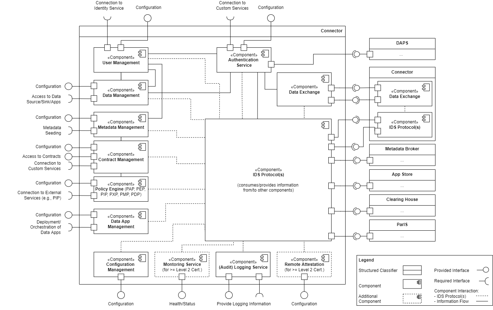

# IDS Connector

The International Data Spaces network is constituted by the total of its  IDS Connectors. Each IDS Connector allows the exchange of data via the Data Endpoints it exposes. Applying this principle, there is no need for a central instance for data storage. An IDS Connector is typically operated behind a firewall in a specially secured network segment of a participant (so-called “Demilitarized Zone”, DMZ). It should be possible to reach an IDS Connector using the standard Internet Protocol (IP), and to operate it in any appropriate environment. A participant may operate multiple IDS Connectors (e.g., to meet load balancing or data partitioning requirements). IDS Connectors can be operated on-premises or in a cloud environment. 

The IDS Connector Architecture use application container management technology to ensure an isolated and secure environment for individual IDS Apps and IDS Connector functionalities. An IDS App matches an application which offers an API to store, access or process data. To ensure privacy of sensitive data, data processing should take place as close to the data source as possible. Any data preprocessing (e.g., filtering, anonymization, or analysis) should be performed by the backend or IDS Apps. Only data intended for being made available to other participants should be made visible through Connectors.

IDS Apps are services for realizing business logic inside the IDS Connector. IDS Apps can be used to process data, connect to external systems or control the IDS Connector. IDS Apps can be downloaded via the IDS App Store and deployed by the IDS Connector.

The [IDS App Store](3_5_3_App_Store_and_Data_Apps.md), [Metadata Broker](3_5_4_Broker.md) and [Clearing House](3_5_5_Clearing_House.md) are based on the IDS Connector architecture (which is described in detail in the following Section) in order to support secure and trusted data exchange with these services.

## IDS Connector Architecture

The Connector consists of one or more computers/virtual machines, operating systems running on them, an Application Container Management and the Connector Core Service(s) built on top of it. 

#### _Fig. 3.5.2.1: Connector Architecture_

The individual elements of the deployment are shown in Figure 3.5.2.1 and described below:
- _Application Container Management_: In most cases, the deployment of the Connector Core Service(s) and selected IDS Apps is based on application containers. See Section [3.5.2.3](#special-connectors) for specialized IDS Connectors. IDS Apps are isolated from each other by containers in order to prevent unintended interdependencies. Using Application Container Management, extended control of IDS Apps and containers can be enforced. During development, and in case of systems with limited resources, Application Container Management can be omitted.  
- _Certified Core Container_ contains one _Connector Core Service_ which provides components like Data Management, Metadata Management, Contract and Policy Management, IDS App Management, IDS Protocols Authentication any many more. A detailed explanation to the IDS Connector Functions is given in the following Section [3.5.2.2](#ids-connector-functions).
- An _Certified App Container_ is a certified container downloaded from the App Store, providing a specific IDS App to the IDS Connector.
- A _Custom Container_ provides a self-developed Custom App. Custom containers usually require no certification. 
- An _IDS App_ defines a public API, which is invoked from the IDS Connector. This API is formally specified in a meta-description that is imported during the deployment phase of an IDS App. The tasks to be executed by IDS Apps may vary. IDS Apps can be implemented in any programming language and target different runtime environments. Existing components can be reused to simplify migration from other integration platforms. A detailed description of how to use IDS Apps can be found in Section [3.3.5](../../3_3_Process_Layer/3_3_5_Publishing_and_using_Data_Apps.md), the deployment of IDS Apps is explained in Section [3.5.3](3_5_3_App_Store_and_Data_Apps.md).
- The _Runtime_ of a Custom/Certified App/Certified Core Container depends on the selected technology and programming language. The Runtime together with application constitutes the main part of a container. Different containers may use different runtimes. What runtimes are available depends only on the base operating system of the host computer. From the runtimes available, a service architect may select the one deemed most suitable.

## IDS Connector Functions

The IDS Connector must include some essential functionality in its _Connector Core Service(s)_. The functionalities can be implemented in individual micro services or as a single comprehensive software block. In addition, the services do not have to be deployed in the same infrastructure. For example, it is possible to distinguish between the Data Plane and the Control Plane. 

The Control Plane covers all aspects from identity management, over the creation and discovery of data offers, to the negotiation of contracts. Lastly, the Control Plane also triggers the Data Plane after negotiating used technologies first. 

The Data Plane is treated separately from the Control Plane, as it can use a different transfer protocol. While the data offers and contracts are negotiated using e.g., an IDS protocol, the data transfer and storage of huge amounts of data can performed “out-of-band” with low latency using an appropriate technology. The modularity allows this to be substituted or augmented. Moreover, multiple transfer mechanisms to support diverse data types can be used in parallel. With this, the IDS Connector solves key aspects of how to handle streaming, large data transfer, and hyper scaling. For more details take a look at Section [3.3.4][../3_3_Process_Layer/3_3_4_Exchanging_Data.md]. 

#### _Fig. 3.5.2.2: Connector Functional View_

The individual functionalities of the _Connector Core Service(s)_ are shown in Figure 3.5.2.2 as an [UML deployment diagram](https://www.omg.org/spec/UML/2.5.1/) where each functionality is depicted as a component. The figure intentionally do not specify which of the components internally provides an interface and which consumes the interface to interact with each other. This varies from implementation to implementation. Also, the image does not include all the interactions between the components for the sake of clarity.

The components are described below:

- The _Authentication Service_ holds the necessary information to authenticate the IDS Connector from/to other backend systems and/or the system access from/to the IDS Connector from other IDS participants. For security reasons, a clear separation of the internal and external access credentials is recommended. However, from a functionality perspective it is one function
. The _Authentication Service_ provides a Configuration interface and can offer an interface to connect custom authentication services. In order to authenticate incoming and outgoing connections it holds
	- the Key/Trust Store for the _IDS Protocol(s)_, 
	- the Authentication Credentials for the access of the _Data Management_ and _Data Exchange to external systems, and 
	- the Information for the Access Control of the _Data Exchange_ and _Data Management_ to the IDS.
This is shown via the solid line inside the IDS Connector. 
- The _Data Exchange_ component provides or requires interfaces to exchange Data with other IDS Participants (Providers/Consumers). The Component can be deployed also on another infrastructure then the IDS Protocol(s) component and it is possible to have more then one Data Exchange component. The _Data Exchange_ component does not support IDS specific interfaces and does not interpret the IDS information model.
- The _IDS Protocol(s)_ component support at least one IDS specific interface defined in [IDS-G](https://github.com/International-Data-Spaces-Association/IDS-G) to realize the processes defined in the Section [3.3](../../3_3_Process_Layer). Almost all components interact with the IDS Protocol component, as shown by the dashed line. The exception is the User Management and the Policy Engines. The exception is User Management, since the IDS does not distinguish between users, and the Policy Engines, since they get their required information from the Contract Management. 
- The _Remote Attestation_ component is used to increase the trust between the interlocutors. It can be used to detect whether the software has been modified at the other party's end. See Section [4.1](../../../4_Perspectives_of_the_Reference_Architecture_Model/4_1_Security_Perspective) for more information. The component is needed for certification level 2 or higher, see Section [4.2.4](../../../4_Perspectives_of_the_Reference_Architecture_Model/4_2_Certification_Perspective/4_2_4_Component_Certification.md).
- The _(Audit) Logging Service_ is responsible to log all relevant information during the operation of the component. For example, changes to settings, error messages, data accesses, policy implementations, etc. should be logged. The information can also be passed on to corresponding systems that take over the (auditable) logging. Therefore the component provides or requires an interface to this systems. 
- The _Monitoring Service_  is used to monitor the status of the component. It can be used to see for example if the IDS Connector is running, in an error state, or offline.
- The _Data App Management_  supports to download, deploy and integrate IDS Apps in the IDS Connector.
- The _Policy Engine_ summarizes all components used for enforcing the IDS Usage Control Policies (part of an IDS contract). These include:  the Policy Administration Point (PAP), the Policy Enforcement Point (PEP), the Policy Information Point (PIP), the Policy Execution Point (PXP), the Policy Management Point (PMP), and the Policy Decision Point (PDP). All are described in detail in Section [4.1.6](../../../4_Perspectives_of_the_Reference_Architecture_Model/4_1_Security_Perspective/4_1_6_Usage_Control.md).
- The _Contract Management_ is responsible to manage the contract negotiation between partners (see Section [3.3.3](../../3_Layers_of_the_Reference_Architecture_Model/3_3_Process_Layer/3_3_3_Contract_Negotiation.md)) and to store the IDS contract agreements afterwards. Contract management can also be seen as part of _Metadata Management. However, it is visualized as a separate component due to the important usage control feature in IDS.
- The _Metadata Management_  holds the metadata for the data assets. The metadata is mainly defined by the IDS information model, but can be further enriched with additional information. The metadata is coupled with the contracts from the Contract Management component and the data from the Data Management component.
- The _Data Management_ component holds the data assets itself or holds a link to the data sources, data sinks, or IDS Apps to get or send the data assets to their interface dynamically. 
- The _Configuration Management_ contains the configuration parameters for the IDS Protocols and the components in general.
- The _User Management_ is responsible to provide user authentication for every interface of the components. Therefore, the user management can use external Identity Services or provide this service by itself. It also can be configured via an interface.

There may be different types of implementations of the IDS Connector, based on different technologies and depending on what specific functionality is required regarding the purpose of the Connector. IDS Connectors are distinguish according to their certification level defined in Section [4.2](../../4_Perspectives_of_the_Reference_Architecture_Model/4_2_Certification_Perspective/), which indicates, among other things, which security and data sovereignty criteria the IDS Connector implements.

## Special Connectors

What type of IDS Connector is to be implemented may depend on various aspects, such as the execution environment given or the current developmental stage regarding Data Services or Data Flows used. In the following, three exemplary scenarios are outlined:

- _Developer Connector:_
As is the case for the development of any software, developing IDS Apps or configuring Data Flows comprises several phases (specification, implementation, debugging, testing, profiling, etc.). For reasons of simplification, it may be useful to run Connectors without application container management. In doing so, the development process can be accelerated, as packing and starting the container can be omitted, and debugging can be done in the development environment. After successfully passing all tests, the configurations can be used to deploy a productive (live) Connector. Upon deployment in the live environment, the Connector is ready for being used.
- _Mobile Connector:_
Mobile operating systems (e.g., Android, iOS, or Windows Mobile) use platforms with limited hardware resources. In such environments, application container management is not necessarily required. The same applies for operating systems which do not support application containers, or systems without any operating system (e.g. microcontrollers). In such environments, IDS Apps (and the Connector Core Service(s)) can be started directly on the host system, without requiring any virtualization. The differences between Connectors with containers and Connectors without containers can be met by different Connector Core Service(s).
- _Embedded Connector:_
Another way of IDS Connector miniaturization offers the Embedded Connector. Embedded Connectors have the same design as Mobile Connectors, and do not necessarily require application container management either. Steps for IDS Connector miniaturization may include the use of a common runtime for all components, or simplified versions of IDS Connector Core Service(s). If data is to be sent to a fixed recipient only, a simple IDS protocol library may be sufficient. Similarly, it may be sufficient to hard-code a single, fixed connection instead of using a configurable component. To save communication overhead, simple API calls inside the common runtime could be used.
