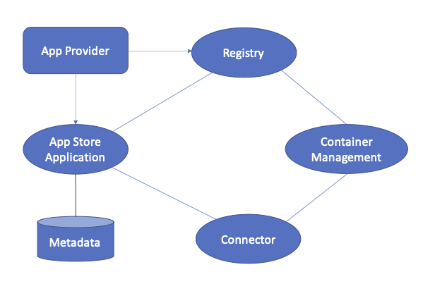

# Data Apps and App Store

An IDS Data App is an independent, functional, and re-usable software asset that is deployable, executable, and manageable on an IDS Connector.

As described in [Section 3.5.2](3_5_2_0_Connector.md) IDS Connectors can make use of IDS Data Apps for several purposes. Three types of IDS Data Apps can be distinguished, namely Data App, Adapter App, and Control App, each performing different tasks in the IDS ecosystem. Applications of all types can be downloaded and fully managed by the IDS Connector:
* Data App: Applications of type Data App are re-usable, interchangeable, and connector-independent and perform small processing tasks, e.g., transform, clean, or analyse data. In other words, applications of this type manipulate the data available in some way. To define a data flow, the inputs and outputs of the components involved (Data App and IDS Connector) as well as of the backend system must be joined together. To summarize multiple processing steps on the same data, Data Apps can be chained together on the same data route.
* Adapter App: Applications of type Adapter App are re-usable, interchangeable, and connector-independent and provide access to enterprise information systems and making them available to the underlying Connector. As the Data App type, the data flow of Adapter Apps is defined by joining together matching inputs and outputs of the components involved (Adapter App, IDS Connector, and data sink/source or external service). Accordingly, Adapter Apps are used especially when the routing framework is not inherently capable of supporting the endpoints or protocols provided by external services.
* Control App: Applications of type Control App allow to control the Connector from external systems and is used to connect backend systems, which may consist of a single or a cluster of applications and services, to an IDS ecoystem. Therefore, in contrast to the types introduced before, the Control App works on the administrative control flow and is connector-specific as it requires programming against the respective API of a Connector in a specific version for its implementation.

Furthermore, the different app types can be bundled, which allows building a data processing chain with several apps from all types chained together.

To integrate IDS Data Apps in an IDS ecosystem or to join them with other components as described above, an app can be equipped with various endpoints. The endpoints for exchanging data between apps and between apps and connectors are mainly divided into those that consume data and those that provide data. A distinction is also made between endpoints that communicate exclusively internally and those that communicate with external components: 
* INPUT: The input endpoint is considered mandatory for all app types that work with data or data streams. The data input endpoint describes an interface through which data can be transported to an app within the connector's environment.
* INPUT EXTERNAL: The input external endpoint serves as an interface to connect to external data sources or data streams outside the actual connector environment. This endpoint is particularly relevant for apps of type Adapter App.
* OUTPUT: The output endpoint is also considered mandatory for app types that transmit data or data streams to other data apps or connectors. The output endpoint describes an interface through which data can be consumed within the connector environment by apps or the connector itself.
* OUTPUT EXTERNAL: At this endpoint, communication is established beyond the boundaries of the Connector. This special form of output endpoint is primarily relevant for Adapter Apps that establish a connection to an external data source. Reading data from external data sources is made possible by this endpoint. 

Further endpoints, besides the ones listed above, are the config endpoint and the status endpoint. The config endpoint can be used to actively set or change configuration parameters during the runtime of an IDS Data App. Optional is the so-called status endpoint, which can be used to retrieve status information from an IDS Data App during runtime.

The IDS App Store is a secure platform for distributing Data Apps. It contains information about IDS Data Apps available and their metadata; features different search options (e.g. by functional or
non-functional properties, pricing model, certification status, or community ratings). An IDS App Store consists of a registry for available IDS Data Apps in this App Store. Therefore an App Store supports operations for Data App registration, publication, maintenance, and query, as well as operations for the provisioning of a Data App to a connector. These basic operations can be complemented by additional services, e.g. billing or support activities.

The basic App Store architecture is shown in [Figure 3.5.3.1](../../media/appstore-architecture.png). In addition to the App Store Application (which manages metadata of apps) and the Connector, the Registry and Container Management components are part of the architecture as well and, as a consequence, part of processes to manage apps. The Registry can be considered as a component of the App Store, as the container images of Data Apps are uploaded to the Registry. The Registry supports pulling and pushing of app images by Connectors. 
The Container Management component depicted in [Figure 3.5.3.1](../../media/appstore-architecture.png) is more related to the Connector, as it bundles the Data App with its dependencies to simplify the deployment and maintenance of apps.

 *Fig. 3.5.3.1: App Store Architecture*
