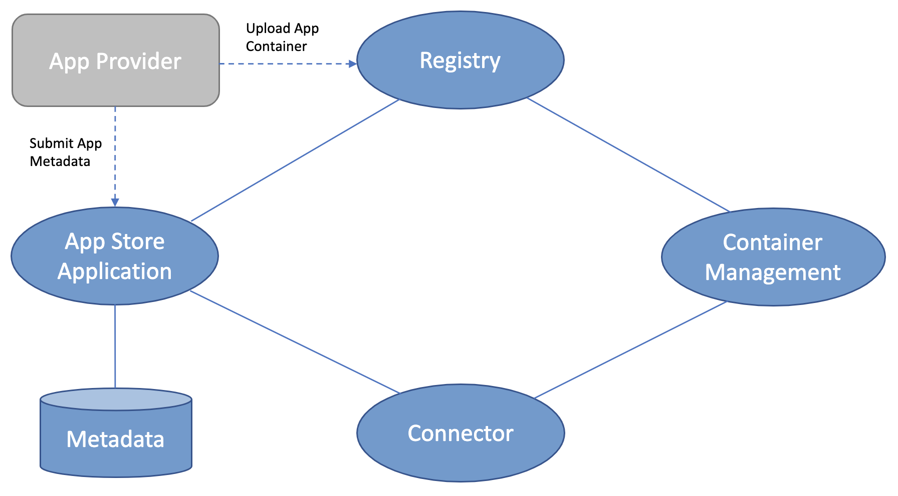

# Data Apps and App Store

An IDS Data App is an independent, functional, and re-usable software asset that is deployable, executable, and manageable on an IDS Connector.

As described in Section 3.5.1 Connectors can make use of Data Apps for several purposes. Three types of Data Apps can be distinguished:
* Self-developed Data Apps. They are used by the Data Provider’s own Connector (usually requiring no certification from the Certification Body).
* Third-party Data Apps. They are retrieved from the App Store (and which may require certification).
* Data Apps provided by the Data Consumer's Connector. They allow the Data Provider to use certain functions before data is exchanged, e.g., filtering or aggregating data (which may also require certification).

In addition, Data Apps can be mainly divided into two categories, each performing different tasks in the application ecosystem:
* System Adapters: System Adapters are Data Apps on the Data Provider side. The main tasks of a Data App belonging to this category is providing access to enterprise information systems and making them available to the underlying Connector. If necessary, Data Apps of this category transform an internal data model to a data model recommended, or considered as a standard, for a given application domain. In addition, these Data Apps can enrich data with additional metadata.
* Smart Data Apps (or Data Sink Connectors): Smart Data Apps are Data Apps on the Data Consumer side, executing any kind of data processing, transformation, or storage functionality. Roughly summarized, they manipulate the data within a Connector in some way. Normally, the data provided by, or sent to, a Smart Data App is already annotated with metadata (as described in the Information Layer section).

Furthermore, the different app types can be orchestrated, which allows building a data processing chain with several apps chained together. Orchestration can be performed by the IDS Connector itself, in whose runtime environment the Data Apps have been installed.

The IDS App Store is a secure platform for distributing Data Apps. It contains information about Data Apps available and their metadata; features different search options (e.g. by functional or
non-functional properties, pricing model, certification status, or community ratings). An IDS App Store consists of a registry for available Data Apps in this App Store. Therefore an App Store supports operations for Data App registration, publication, maintenance, and query, as well as operations for the provisioning of a Data App to a connector. These basic operations can be complemented by additional services, e.g. billing or support activities.

The basic App Store architecture is shown in Figure **//TODO**. In addition to the App Store Application (which manages metadata of apps) and the Connector, the Registry and Container Management components are part of the architecture as well and, as a consequence, part of processes to manage data apps. The Registry can be considered as a component of the App Store, as the container images of Data Apps are uploaded to the Registry. The Registry supports pulling and pushing of app images by Connectors. 
The Container Management component depicted in Figure **//TODO** is more related to the Connector, as it bundles the Data App with its dependencies to simplify the deployment and maintenance of apps.

