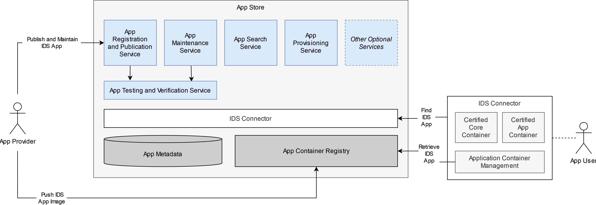

# App Store and IDS Apps

An IDS App is an independent, functional, and re-usable software asset that is deployable, executable, and manageable on an IDS Connector.

As described in [Section 3.5.2](3_5_2_0_Connector.md) IDS Connectors can make use of IDS Apps for several purposes. Three types of IDS Apps can be distinguished, namely Data App, Adapter App, and Control App, each performing different tasks in the IDS ecosystem. Applications of all types can be downloaded and fully managed by the IDS Connector:
* Data App: Applications of type Data App are re-usable, interchangeable, and connector-independent and perform small processing tasks, e.g., transform, clean, or analyse data. In other words, applications of this type manipulate the available data in some way. To define a data flow, the inputs and outputs of the components involved (Data App and IDS Connector) as well as of the backend system must be joined. To summarize multiple processing steps on the same data, Data Apps can be chained on the same data route.
* Adapter App: Applications of type Adapter App are re-usable, interchangeable, and connector-independent and provide access to enterprise information systems, making them available to the underlying Connector. As the Data App type, the data flow of Adapter Apps is defined by joining matching inputs and outputs of the involved components (Adapter App, IDS Connector, and data sink/source or external service). Accordingly, Adapter Apps are used especially when the routing framework is not inherently capable of supporting the endpoints or protocols provided by external services.
* Control App: Applications of type Control App allow to control the Connector from external systems and are used to connect backend systems, which may consist of a single or a cluster of applications and services, to an IDS ecoystem. Therefore, in contrast to the types introduced before, the Control App works on the administrative control flow and is connector-specific as it requires programming against the respective API of a Connector in a specific version for its implementation.

Furthermore, the different IDS App types can be bundled, which allows building a data processing chain with several apps from all types chained together.

To integrate IDS Apps in an IDS ecosystem or to join them with other components as described above, an IDS App can be equipped with various endpoints. The endpoints for exchanging data between apps and between apps and connectors are mainly divided into those that consume data and those that provide data. A distinction is also made between endpoints that communicate exclusively internally and those that communicate with external components: 
* INPUT: The input endpoint is considered mandatory for all IDS App types that work with data or data streams. The data input endpoint describes an interface through which data can be transported to an app within the connector's environment.
* INPUT EXTERNAL: The input external endpoint serves as an interface to connect to external data sources or data streams outside the actual connector environment. This endpoint is particularly relevant for IDS Apps of type Adapter App.
* OUTPUT: The output endpoint is also considered mandatory for IDS App types that transmit data or data streams to other apps or connectors. The output endpoint describes an interface through which data can be consumed within the connector environment by apps or the connector itself.
* OUTPUT EXTERNAL: At this endpoint, communication is established beyond the boundaries of the Connector. This special form of output endpoint is primarily relevant for Adapter Apps that establish a connection to an external data source. Reading data from external data sources is made possible by this endpoint. 

Further endpoints, besides the ones listed above, are the config endpoint and the status endpoint. The config endpoint can be used to actively set or change configuration parameters during the runtime of an IDS App. Optional is the so-called status endpoint, which can be used to retrieve status information from an IDS App during runtime.

The IDS App Store is a secure platform for distributing IDS Apps. An IDS App Store consists of a registry for available IDS Apps in this App Store. It also features the capabilty to search for IDS Apps using different search options (e.g. by functional or non-functional properties, pricing model, certification status, community ratings, etc.). Therefore, an App Store must support operations for App registration, publication, maintenance, and query, as well as operations for the provisioning of an App to a connector to App Users as depicted in Figure [3.5.3.1](#AppStoreArchitecture). These basic operations can be optionally complemented by additional services, e.g. billing or support activities.

While an App User must use an IDS Connector to find and retrieve an IDS App, App Providers can interact directly with an App Store to push an app image and publish an IDS App, in case an IDS Connector is not available. The processes of publishing, finding and using IDS Apps are documented in detail in Section [3.3.5](../3_3_Process_Layer/3_3_5_Publishing_and_using_Data_Apps.md).

#### _Fig. 3.5.3.1: App Store Architecture_

An IDS App Store also consists of an IDS Connector in order to communicate with the Connectors of App Providers and App Users within the Data Space. As a consequence, each instance of an App Store must be compliant to the Connector Certification criteria an provide the functionalities and endpoints of general Connectors together with the above-mentioned operations (e.g. provide a Self-Description, have a valid IDS Identity and use a valid DAT in its communication).
