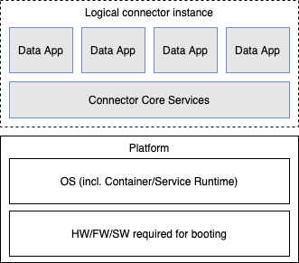
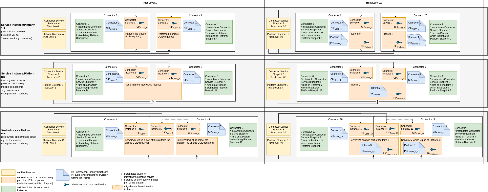
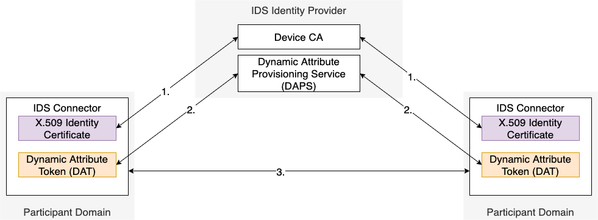

# Identity and Trust Management

The International Data Spaces allow participants a cross-company data exchange. In many cases, the participants intending to exchange data have no prior knowledge about the other company and its utilized components to properly assess the consequences of such a data exchange. Thus, the IDS offers mechanisms to gain reliable information which help to establish trust and enable participants to make sovereign and informed decisions.
Identity and trust management is rooted in the components described in ([Chapter 3.5.1](../../3_Layers_of_the_Reference_Architecture_Model/3_5_System_Layer/3_5_1_Identity_Provider.md)).

## Identities for Devices

The IDS Connector is the central device to establish trust on a technical level and to ensure a secure data exchange across domain boundaries.
In the IDS, each connector instance possesses it's own identity. Each connector instance is made up of several aspects:
* The platform the IDS Connector instance depends on. A platform consists of hardware, firmware, operating system and (container) runtime environment.
* The Connector Core Services software artefacts that provide management functionality and IDS interoperability.
* The configuration of an IDS Connector (defined data routes, configured Usage Control framework).
* The IDS Apps or other services (e.g., Clearing House services) that are bound to this connector instance.

The IDS Certification (explained in [Section 4.2](../4_2_Certification_Perspective/4_2_Certification_Perspective.md) is always conducted for a blueprint of the platform and Connector Core Services. Each such certified blueprint can be instantiated multiple times.

The IDS Connector identity serves to uniquely identify one such instance of Connector Core Services with their IDS Apps on qualified platforms. The identity concept is equally used for all technical components in the IDS.

The service instance for a connector is typically a Service including core services, some usage control framework and applications (IDS Apps).
Other components (Broker, DAPS, ...) are represented by their Service (represented by one or multiple containers) running on a comparable platform.

One component always is characterized by the combination of platform and service instances. As an example, this Connector instance is running several data apps. The identity is comprised of the platform, the Connector Core Services and the deployed Data Apps.

#### _Figure 4.1.2.1: Components of the Software Stack of an IDS Connector_

### Component Identifier

The identity of a combination of platform and service instance is bound to an identifier for the service instance.

* Each component gets a unique identified (C_UID) bound to the service instance.
* The uniqueness of this identifier is ensured by the Identity Provider.
* Each UID is mapped to a Connector Instance Key (CIK) pair which is typically used for TLS but possibly also data signing and other identity proofs.

Each Service Instance needs to be mapped to one platform it utilizes:
* Each platform blueprint gets a unique identifier during the component certification.
* For a component with Trust level 1, the concrete platform instantiation (running version of this blueprint) does NOT get a UID as well as key and certificate for this platform instance. Instead, the connector description solely references the (unique) identifier of the certified blueprint (and the operator needs to be trusted to ensure its correct instantiation).
* For components with Trust Level 2 or 3, each platform instantiation needs to be uniquely identified with a UID (P_UID). This UID is required to provide a mapping from service instance to platform.
* Each P_UID is subject of a certificate for the utilized platform key(s) (e.g. AK of a TPM) which enable verification of the platform integrity.
* One P_UID can map to Platform Instance Keys (PIK) for 1-n physical devices/protected VMs:
  * If 1 physical device serves as the component platform: 1 P_UID is mapped to 1 PIK.
  * For distributed platform setups (e.g. with kubernetes): 1 P_UID for the setup maps to n PIKs for the servers in this distributed platform.
  * If connector is run in one protected VM (e.g. SEV SNP): 1 P_UID is mapped to 1 PIK for this SEV-SNP VM.
  * If multiple protected VMs (e.g. SEV SNP) form a distributed platform setup: 1 UID for the setup maps to n PIKs for the VMs which comprise this setup.

#### _Figure 4.1.2.2: Identities for IDS Connector Services and Platforms_
(Remark: The platforms in the image may always be either physical devices or protected VMs)

### Describing Metadata
The IDS targets sovereign data exchange, which does not only comprise a secure exchange of data but also a trustworthy environment for data processing honoring the defined usage control policies. To achieve this goal, it is not sufficient to only know the identity of another IDS component, but additional information about the company operating the component and the utilized software stack is required.
This information is provided in form of the following describing artifacts:
* A **Company Description** for each company operating an IDS component which contains verified information about the company as well as information about its Operational Environment Certification (explained in [Chapter 4.2.3](../4_2_Certification_Perspective/4_2_3_Operational_Environment_Certification.md)).
* **Software Manifests** for the utilized software components which have been evaluated in the Component Certification explained in [Chapter 4.2.4](../4_2_Certification_Perspective/4_2_4_Component_Certification.md)). In addition to the awarded certification levels, the manifests contain verified measurements which can be used to validate that the described software is truly running on the device. To support re-usability of components, the description of each software stack consists of three types of Software Manifests used for describing different layers:
  * A **Root of Trust for Measurement (RTM) Manifest** for components of the boot stage,
  * an **Operating System (OS) Manifest** for utilized kernel and user space components, including the container run time enabling the execution of different isolated containers/apps, and
  * an arbitrary number of **App Manifests** per component identifying the utilized containers/apps.
Signatures are utilized to represent the passed stages of the certification process (described in [Chapter 4.2.5](../4_2_Certification_Perspective/4_2_5_Processes.md)) and allow a validation of the correctness of the describing artifacts.
In addition to these static artifacts, the connector operator may add additional attributes to the component's description or have them validated and registered at the DAPS.

### Interactions between IDS Connectors and Identity Components

To establish a trusted connection, each connector needs the identity information of the corresponding connector to perform access and usage control decisions. The interactions can be depicted as follows:

#### _Figure 4.1.2.3: Interaction between IDS Connectors and Identity Components_

1. Each IDS Connector acquires a valid identity from the IDS Device CA.
2. Each IDS Connector requests a current Dynamic Attibute Token from DAPS.
3. When establishing communication, the DAT of both IDS Connector instances is exchanged. This is also matched with the used TLS certificate.

To avoid the possibility of abusing a DAT by an attacker, these DATs must be treated as confidential information. To further protect from attacks performed with leaked DATs, each Connector has to validate the presented certificate by matching it to the connectors identifier.
Two cases must be evaluated:

1. The connector uses its identity certificate for TLS connections. In this case, the corresponding IDS connector must assure the identifier in the DAT matches the presented certificate.
2. The connector uses a separate certificate for TLS connectors (e.g., issued by a CA such as Let's Encrypt). In this case, the corresponding IDS Connector must assure the certificate fingerprint matches the one that is embedded in the DAT.

### Component (Identity) Lifecycle

| Phase | When does it happen | How is the component identity affected | What about the data? |
| --- | --- | --- | --- |
| **Provisioning** | New component becomes available when an operator provisions a new instance of the blueprint (on a new device, a new service-instance in the cluster, ...) | A component identity is issued by the Identity Provider | No data is available on a newly provisioned component, but arbitrary data can be added afterwards. |
| **Maintaining** | New versions of utilized software are distributed, configuration of the component changes | As long as the trust level of the SW stack AND the operator remains unchanged, the overall connector identity does NOT need to change. In case significant attributes of the component (e.g. trust level) change, the identity as the sum of all attributes changes but the unique identifier may be used further. | Data already stored on the connector MUST adhere to the defined UC policies so update or migration strategies need to ensure their fulfillment by deleting/removing/making data inaccessible. |
| **Out of service (Decommissioning)** | Component is sold/transferred to another operator, component is not offered/available any longer | The component identity needs to be decommissioned, certificate(s) of the component(s) is(are) revoked. | All data currently on/in the connector needs to be removed (if necessary transfer them to other connectors beforehand). |

## Identities for Participants
The IDS can have many participants interacting ranging from large enterprises and organizations to individuals. 
Means for identifying those participants are required, since they are responsible for (at least) operating (or using) an IDS component (e.g., a connector) and thus the actions taken by this component and managing provided data (quality, content, updates, decision on usage policies). Thus, each participants gets a unique identifier (O_UID). 

Based on this, an identity management for participants can either be based on identities for the organizations themselves or for the human users working for this organizations. Identities are typically bound to private-public key pairs generated for each identity and confirmed by the Identity Provider. Respective processes are required to ensure correct mapping of the key pairs and the identities to be utilized in the IDS.

## Trust Bootstrapping and Trust Chains
Identifying and authenticating an IDS connector requires an evaluation of many complementary aspects. The following table provides an overview of these aspects and the entities responsible for them.

| High-Level Aspect | Detailed Aspect | Trust Level | Entity Responsible | Validation necessary for issuing proof | Proof the IDS connector needs to validate |
| --- | --- | --- | --- | --- | --- |
| Connector ID (C_UID) belongs to communication partner | C_UID is unique | all | CA | Before issuing Connector Identity Certificate, process depends on implementation of C_UID | Connector Identity Certificate |
| | Mapping of C_UID to Connector Instance Key (CIK) | all | CA | - | Connector Identity Certificate, usage of key material by communication partner |
| | Only the connector has access to CIK | 1 | Operator | - | - |
| | | 2, 3 | CA and Hardware Manufacturer | CA verifies hardware protection for CIK (Trust chain to HW Manufacturer) | Connector Identity Certificate |
| C_UID is used by certified connector stack | - | 1 | Operator | **No validation**, operator must only request certificates for instances of certified SW stacks | - | 
| | Platform ID (P_UID) is unique | 2, 3 | CA | Before issuing connector identity certificate, process depends on implementation of P_UID | Platform Identity Certificate |
| | Mapping of P_UID to Platform Instance Key (PIK) | 2, 3 | CA | - | Platform Identity Certificate |
| | Only the identified platform has access to PIK | 2, 3 | CA and Hardware Manufacturer | CA verifies hardware protection for PIK (Trust chain to HW Manufacturer) | Platform Identity Certificate |
| | Mapping C_UID to P_UID | 2, 3 | CA | Before issuing Connector Identity Certificate, CA ensures that the CIK is protected by the PIK | Mapping to P_UID in Connector Identity Certificate |
| | Measurements for currently running software stack | 2, 3 | HW Trust Anchor, Certified Software | - | Measurements signed by PIK for platform and optionally service instance (in case of 1:1 mapping), Measurements signed by CIK for service instance (in case of multiple services on one platform) |
| | Measurements belong to certified software stack | 2, 3 | Evaluation Facility and Certification Body | Part of Certification Process | Signed SW Manifests, Provided Measurements |
| Connector with C_UID is operated by certified organization | C_UID belongs to component managed by a certified organization | all | CA | Before issuing Connector Identity Certificate, the CA validated that requesting organization has IDS Operational Environment Certification. | Connector Identity Certificate |
| | Organization ID (O_UID) is unique | all | CA, Support Organization | Before issuing Connector Identity Certificate including O_UID, CA checks uniqueness with Support Organization | - |
| | Mapping from C_UID to O_UID | all | CA | Before issuing Connector Identity Certificate, CA ensures that request for it was issued by respective organization | Connector Identity Certificate |
| | O_UID belongs to certified organization | all | Evaluation Facility and Certification Body | Part of Certification Process | Signed Company Description, O_UID in Connector Identity Certificate |
| Up-to-Date(ness of) Information | The provided certificates are still valid (not revoked). | all | CA | In case of revocation, the CA updates its revocation services (e.g. OCSP server). | Revocation status, e.g. from OCSP Server. |
| | The certification for the software stack is still valid (not revoked). | 2, 3 | DAPS | In case of revocation or update of the certification, the DAPS updates the status stored for the respective metadata. | Dynamic Attribute Token (DAT) including revocation status of SW Manifests |
| | The certification for the organization is still valid (not revoked). | all | DAPS | In case of revocation or update of the certification, the DAPS updates the status stored for the respective metadata. | Validate Dynamic Attribute Token (DAT) and check contained revocation status of Company Description |
| | Additional dynamic attributed for the IDS Connector | all | DAPS | Before adding or changing attributes for a connector in the DAPS, the DAPS provider validates the correctness of the provided information (details depend on type of attribute). | Dynamic Attribute Token (DAT) |
