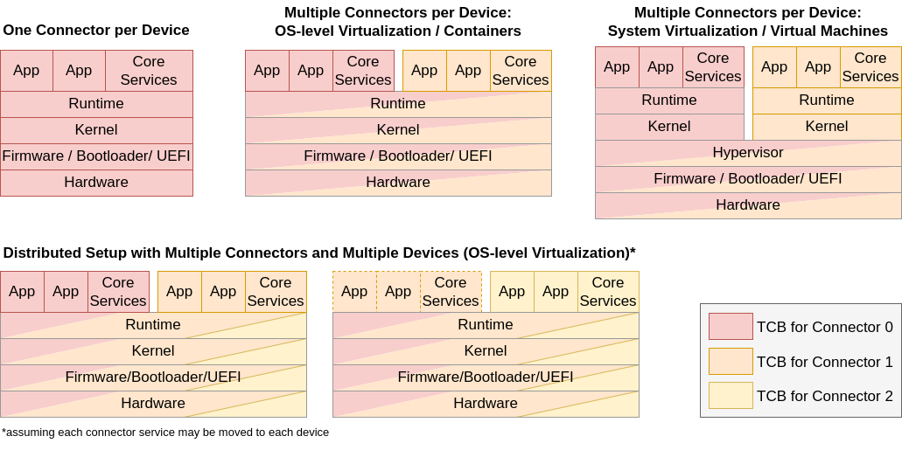

# Securing the Platform

Security of data processing in an IDS component depends on the system security of the utilized component. The hardware and software components that are critical to ensure the confidentiality and integrity of the transmitted and processed data form the Trusted Computing Base (TCB). Different deployment scenarios and their respective TCBs are described in the [first subsection](#deployment-scenarios). The [following subsection](#hardware-security-features) provides some background on hardware security features that might be used for securing the platform. Finally, the [last subsection](#platform-security-requirements) provides an overview of essential security requirements and how to achieve them.

## Deployment Scenarios
In general, there are three different possibilities for the combinations of platform and connector service instances:
* A 1:1 mapping with a connector being a single device consisting of one platform instance and one connector service instance
* A 1:n mapping with multiple connectors on one physical device, i.e., a system with one platform instance and multiple connector service instances
* A n:m mapping with multiple devices offering a distributed deployment for multiple connector service instances (e.g. with Kubernetes)

The figure below shows the three options with their respective trusted computing bases:

#### _Fig. 4.1.3.1: Deployment Scenarios_

The TCB consists of the following components:
* All **hardware** components with access to unencrypted app data.
* **Firmware / bootloader / UEFI** representing all software components used to bootstrap the system and initialize the hardware before starting the kernel.
* Optionally a **hypervisor** which may be used to better isolate multiple connectors on a device by providing a Virtual Machine (VM) for each of them. The impact on the TCB is illustrated for the 1:n mapping in a comparison to a solution with OS-level virtualization, i.e., containers.
* The **kernel** connects user space software to the hardware of the device.
* A (container) **runtime** responsible for starting the execution of applications on the system.
* The **connector core services** taking care of essential connector functionalities as explained in the [System Layer](../../3_Layers_of_the_Reference_Architecture_Model/3_5_System_Layer/3_5_2_IDS_Connector.md).
* An arbitrary number of **apps** as introduced in the [System Layer](../../3_Layers_of_the_Reference_Architecture_Model/3_5_System_Layer/3_5_3_App_Store_and_Data_Apps.md).

Additionally, the TCB may include **external components** in the surrounding infrastructure of a connector which are used for security-relevant tasks, e.g. an authorization server.

It is important to note that from a component security perspective there is no specific category for the usage of cloud solutions in comparison to an on-premise deployment. In both cases, the TCB includes all components that are required to ensure the confidentiality and integrity of the transmitted and processed data and needs to fulfill all requirements defined in the certification criteria catalog. The only differences lie in the responsibility for the different layers of the software stack and ensuring their conformity.

## Hardware Security Features

In the following, we provide a brief overview on three hardware security features that might help fulfilling the requirements introduced in the [subsection below](#platform-security-requirements). For complete fulfillment of certification requirements, a combination of the mentioned techniques might need to be applied.

### Hardware Security Module (HSM)
A Hardware Security Module (HSM) is a physical device containing one or more secure cryptoprocessor. It typically provides secure key generation, storage and management and supports using those keys for performing encryption or digital signing. Additionally, most HSMs provide tamper protection, ranging from a notification of detected tampering attempts to deleting the keys upon tamper detection. A HSM can either be directly integrated or attached to the hardware of one device or deployed as a network device which is shared by multiple clients in the network. The components necessary to manage and access the HSM belong to the TCB of the device using the HSM, even if they are deployed on other devices in the network (e.g. in case of a HSM as a network device).

### Trusted Platform Module (TPM)
Trusted Platform Module (TPM) is a specification for secure cryptoprocessors with the newest version being the [TPM 2.0 Specification](https://trustedcomputinggroup.org/resource/tpm-library-specification/) from the Trusted Computing Group. The
TPM API can be implemented in a Secure Element, in the Platform-Firmware, inside a Trusted Execution Environment (TEE), or in form of a pure Software TPM.
A TPM can provide a root of trust for measurement (RTM), reporting and storage based on the Endorsement Key (EK) which was securely provisioned by the TPM manufacturer. It can generate, securely store and mange keys similarly to a HSM but is typically more strongly integrated into one host system only securing the keys for this device. Additionally, a TPM can be used to bind keys to the integrity of the utilized software stack and to securely store measurements of software components. If the TPM measurements include all components of the TCB they can be used as proof of the system's integrity for remote attestation.

### Confidential Computing
Confidential Computing approaches have been introduced with the goal to reduce the size of the TCB in the light of increasingly complex software stacks. They remove processes and components from the TCB by setting up hardware-supported isolated runtime environments, i.e., Trusted Execution Environments (TEE). The CPU utilized in the device must provide the necessary hardware features to support this approach. The hardware cryptographically protects confidentiality and integrity protection for process memory from higher-privileged access. Depending on the utilized CPU, there are different confidential computing approaches offered by the major hardware manufacturers:
* AMD offers a VM-based solution called Secure Encrypted Virtualization ([SEV](https://www.amd.com/en/processors/amd-secure-encrypted-virtualization) with its newest version being [SEV-SNP](https://www.amd.com/system/files/TechDocs/56860.pdf) (Secure Nested Paging).
* After starting with the process-based Software Guard Extensions ([SGX](https://software.intel.com/content/www/us/en/develop/topics/software-guard-extensions.html)), Intel is now developing a VM-based solution called [Trust Domain Extensions ([TDX](https://software.intel.com/content/www/us/en/develop/articles/intel-trust-domain-extensions.html)).
 * Likewise, Arm is working on their own VM-based Confidential Computing Architecture ([CCA](https://www.arm.com/why-
arm/architecture/security-features/arm-confidential-compute-architecture)).

To prove the correct setup of a TEE, each of the mentioned approaches offers some kind of remote attestation with proof of the integrity of the initial software components required. However, currently available implementations do not offer an attestation for the entire software stack, i.e., the TCB.

## Platform Security Requirements
TODO: Platform security features and requirements
* Secure boot / measured boot
* Remote integrity verification (remote attestation)
    * Measurements, Measurement lists, RTM / OS Manifest
* Component isolation (e.g., container based isolation)
* Key handling / provisioning
* Integrity protected audit logging
* Protecting data at rest / in transit
* Achieving protection from malicious administrators
