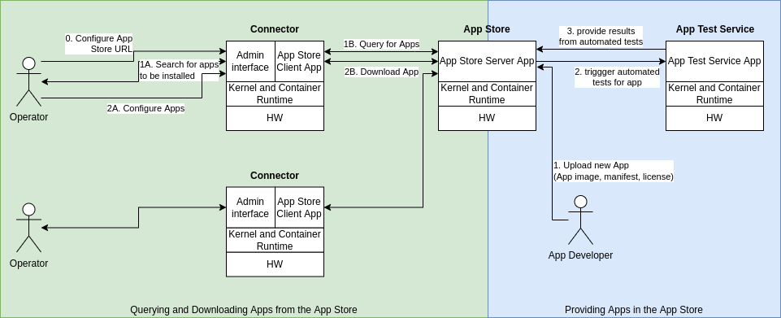
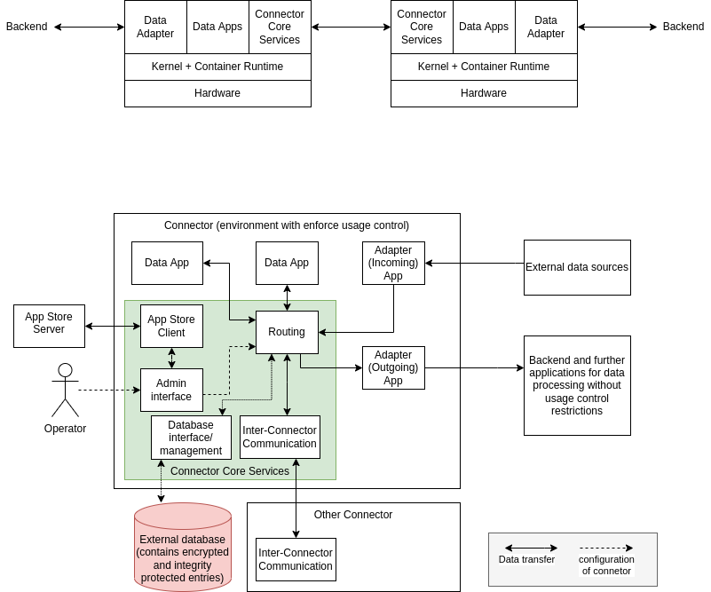

Issue for this section: https://github.com/International-Data-Spaces-Association/IDS-RAM_4_0/issues/72

# App Store and Distribution of Apps

## Apps in the IDS
Apps necessary for processing data, isolated from each other,
What are apps used for?
-> convert data between formats
-> compute results from input data
-> persistentes Speichern von Daten: different storing options possible for connectors -> either storage within the connector with attached UC restrictions or external - only in encrypted version without access to plain data -> Database is part of core connector services, data app does not store data persistently but uses this Database

possible use cases:
1. NDA mit PDFs in Datenbank -> UC abhängig von compliance der Nutzer der Daten (nur erzwingbar, dass Daten aus DB gelöscht werden - nicht verhinderbar, dass Nutzer die Daten rauszieht/abschreib/fotografiert, ... -> über rechtlichen Rahmen zu machen)
2. Input-Daten fallen nicht einfach raus, nur Ergebnisse einer Auswertung (z.B. Videostream vom Parkplatz kommt rein -> Auswertung, wie viele Parkplätze frei sind kommen raus; Statusinformationen aus Maschinen in den Connector raus, dort monitoring und predictive maintenance vorhersagen -> nur die Warnung für Austauschen von Teilen kommt raus)

## App Store
* App = Container image (executable on Linux kernel, independent (brings all dependencies)) -> from developer
* Metadata (Description) in App manifest including measurements and signatures used for integrity protection -> from developer, possibly from evaluator
* App License - similar to usage control policies for other types of data -> from developer
  * Pay once and use on own connectors -> no policy to be attached to app
  * Usage on a specific connector instance
  * Usage for a certain amount of time (e.g. usage on own conectors for a year)
  * Processing of amount x of data (Anzahl Datenpakete, Menge der Daten in Größe)
  * Free version of apps

App Store offers the following interfaces:
* one for uploading apps:
  * input: app, manifest (pre-evaluated apps contain the respective information already), license
  * App store triggers test service (automated test suite):
    * more details?
    * test service adds signature, if tests are successfully passed
  * after successful response from app store, the apps are added to the app store database
* one for searching apps in the app store (GUI and search engines from FIT)
* one for downloading apps
  * input: identifier for the app to be downloaded
  * app store takes care of money transaction
  * provides app parts for download

## Apps on a connector

Securing the app in the connector:
container run-time responsible for ensuring the following aspects:
* Integrity and authenticity of apps -> verified before start of app
* Validation of license aspects (e.g. usage for time frame, ...)

Routing responsible for controlling data flows between apps
-> essential question: which data flows are allowed/how to decide which flows are allowed
-> first approach: data provider receives an  overview of the data flows in the connector and what happens with their data in case of a transfer -> then they can decide whether they want to share or not

Open point: which interfaces do the apps require (store this data, give me this data, transfer this information to app XY)
