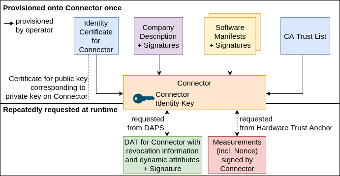
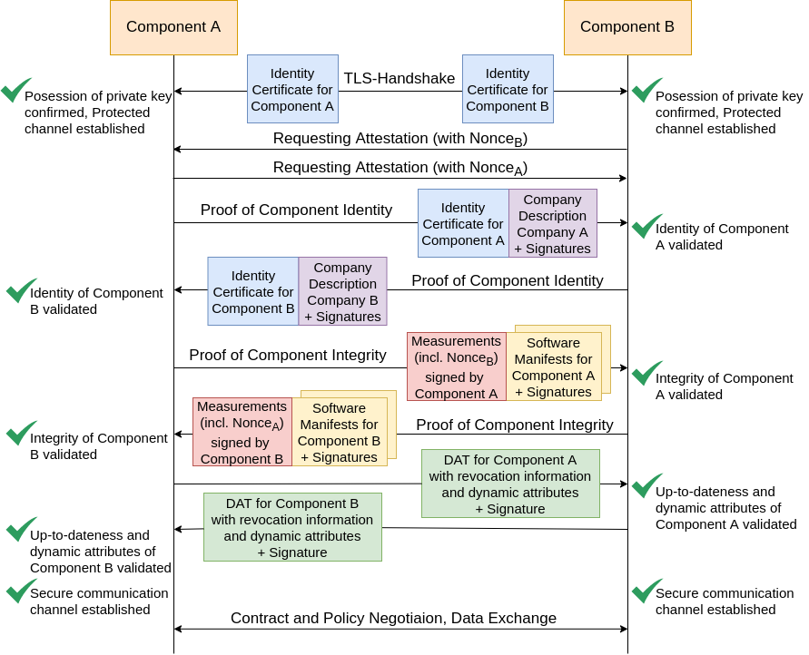

Issue for this section: https://github.com/International-Data-Spaces-Association/IDS-RAM_4_0/issues/73

# Securing Interaction between IDS Components

Target: Establishment of a secure communication channel between IDS components
identification, authentication, authorization for components and confidentiality and integrity protection for communication
This requires the following information:
* device identity certificate
* proving ownership of the respective private key
* information about the responsible company (operator)
* integrity proof of software stack: measurements and software manifests
* Up-to-dateness of transferred information and additional dynamic information -> DAPS

## Preparation for Communication/Required Information
Provisioning all required information onto the device

Periodically, request current information from DAPS

## Establishment of a Secure Communication Channel
TLS Handshake
Remote Attestation Report übertragen und überprüfen
  * Exchange of software manifests
  * Verification of software manifests
  DAT übertragen und prüfen

## Data Transfer using this Communication Channel

Communication over Communication Channel

Using a separate channel for data exchange -> Risks and Consequences

## Dynamic Trust Monitoring
* Periodic integrity verification of components (remote attestation, protocol version checking, other black box testing)
* Monitoring client on component (feeding central monitoring service)
