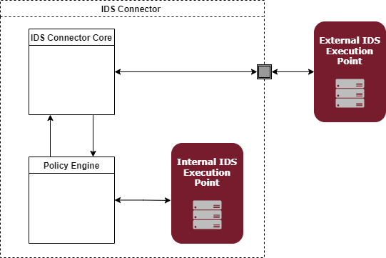

### **DATA USAGE CONTROL**

#### **INTRODUCTION**

In information security, Access Control restricts access to resources. Authorization is the process of granting permission to resources. There are several models of Access Control, such as Discretionary Access Control (DAC), Mandatory Access Control (MAC), Role-Based Access Control (RBAC), Attribute-Based Access Control (ABAC), etc. RBAC and ABAC are the most frequently used models.

The [XACML](http://docs.oasis-open.org/xacml/3.0/xacml-3.0-core-spec-os-en.html) (eXtensible Access Control Markup Language) standard is used to introduce commonly used terms in the field of Access Control. XACML is a policy language to express ABAC rules. The main building blocks of the language are subject, action, resource, and environment:

» The subject describes who is accessing a data asset (e.g., a user).

» The action describes what the subject wants to do with the data asset (e.g., read, write).

» The resource describes the data asset.

» The environment specifies the context of the action (e.g., time, location).

[Figure 4.1.6.1](http://docs.oasis-open.org/xacml/3.0/xacml-3.0-core-spec-os-en_files/image002.gif) illustrates the XACML data flow diagram and the main actors or components to implement it: the Policy Enforcement Point (PEP), the Policy Decision Point (PDP), the Policy Information Point (PIP), and the Policy Administration Point (PAP).

In general, attributes can describe anything or anyone. Nevertheless, they can be divided into four major categories:

» Subject attributes, describing the user by e.g. their age, role, or clearance;

» Action attributes, describing the intended action (e.g. read, write, or delete);

» Resource (or object) attributes, describing the resource itself (e.g. object type, location, or classification);

» Context (or environment) attributes, addressing time, location, or other dynamic aspects.

In the IDS, Access Control is a resource-centric regulation of access requests from subjects (i.e., IDS Participants) to resources (i.e., Data Services). Data Owners define Attribute-Based Access Control policies for their endpoints. In addition, they define the attribute values a subject must attest in order to grant access to the resource. These attributes may include:

» Specific identity of Connector(s) (only access requests from one or more specific Connectors will be granted);

» Connector attributes (only access requests from a Connector that possesses specific attributes will be granted);

» Security profile requirements (only access requests from a Connector that meets specific security requirements will be granted; e.g., having a TPM >= 1.2 and doing application isolation).

_Figure 4.1.6.1: XACML data flow diagram [Source: eXtensible Access Control Markup Language (XACML) Version 3.0 ]_

The actual Access Control decision has to be made within the Connector and can be implemented using technologies such as XACML or JAAS, depending on the implementation of the Connector. The IDS Security Architecture does not dictate a specific Access Control enforcement language or implementation.

Alongside with data _Access_ Control, regulating access to specific digital resources (e.g., a service or a file), the IDS Security Architecture also supports data _Usage_ Control. In general, the overall goal is to enforce data usage restrictions on the Data Consumer side after access to data has been granted.

As shown in [Figure 4.1.6.2](media/UC-Definition.drawio.png), Usage Control is an extension of Access Control. It is about the specification and enforcement of restrictions regulating what may be done with a data asset, and what not. Thus, Usage Control is concerned with requirements that pertain to data processing (obligations) rather than data access (provisions). Usage Control is relevant in the context of intellectual property protection, regulatory compliance, and digital rights management.

_Figure 4.1.6.2: Data usage control – an extension of data access control_

Data Usage Control in the IDS basically works by attaching data usage policy information to data being exchanged and continuously controlling the way data is processed, aggregated, or forwarded to other endpoints. This data-centric perspective allows Data Providers to continuously control _data flows_, rather than _accesses to services_. At configuration time, data usage policies support developers and administrators in setting up correct data flows.

At runtime, Data Usage Control enforcement prevents IDS Connectors from handling data in an undesired way (for example, by forwarding personal data to public endpoints). Thus, Data Usage Control is both a tool for system integrators to ensure they are not building an architecture that violates security requirements, and an audit mechanism providing evidence of compliant data usage.

The following examples illustrate security requirements that cannot be achieved by Access Control, but require data-centric Usage Control:

» **SECRECY:** Classified data must not be forwarded to nodes which do not have the respective clearance.

» **INTEGRITY:** Critical data must not be modified by untrusted nodes, as otherwise its integrity cannot be guaranteed anymore.

» **TIME TO LIVE:** Data must be deleted from storage after a certain period of time.

» **ANONYMIZATION BY DATA AGGREGATION:** Personal data may be used only in an aggregated form by untrusted parties. To do so, a sufficient number of distinct data records must be aggregated in order to prevent deanonymization of individual records.

» **ANONYMIZATION BY DATA SUBSTITUTION**: Data allowing personal identification (e.g., faces in video files) must be replaced by an adequate substitute (e.g., pixelized) in order to guarantee that individuals cannot be deanonymized.

» **SEPARATION OF DUTY**: Two datasets from competitive entities (e.g., two automotive OEMs) must never be aggregated or processed by the same service.

» **USAGE SCOPE:** Data may only serve as input for data pipes within the Connector; it must never leave the Connector and be sent to an external endpoint.

It is important to note that the purpose of Data Usage Control is to allow the specification of such constraints and enforcing them in the respective system. A precondition of Data Usage Control is that the enforcement mechanism itself is trusted; i.e., Data Usage Control itself does not establish trust in an endpoint, but rather builds upon an existing trust relationship and facilitates enforcement of legal or technical requirements, such as Service Level Agreements (SLAs) or data privacy regulations. Thus, users must be aware that Data Usage Control will only provide certain enforcement guarantees if applied on highly trusted platforms, such as Trusted Connectors in the International Data Spaces  [Section 3.2](../../3_Layers_of_the_Reference_Architecture_Model/3_2_Functional_Layer))

#### **ORGANIZATIONAL RULES AND LEGAL CONTRACTS**

Data Usage Control can be implemented by means of a machine-readable contract, which is expected to be fulfilled by a party. It is a way to track and trace data as it is used within different systems and to collect evidence of the violation of agreed usage constraints. With that in mind, solutions range from organizational rules or legal contracts to completely technical ways of enforcing usage restrictions. For example, an organizational rule (e.g. a company policy) could state that employees must not use removable storage devices, such as USB sticks. Similarly, a technical form of enforcement, such as group policies specified by the Windows operating system, can prevent employees from using removable storage devices. In some scenarios, organizational rules, legal contracts, and technical rules can be used interchangeably. In other scenarios, the three forms can be used to complement each other. In the long run, it can be expected that organizational rules and legal contracts will increasingly be replaced by technical forms of enforcement (as illustrated in [Figure 4.1.6.3](media/Technical_vs_Organizational.drawio.png)).

_Figure 4.1.6.3: Technical enforcement vs. organizational/legal enforcement_

#### **ROLES INVOLVED IN USAGE CONTROL**

Usage Control is a cross-sectional concept and technology, which involves several IDS roles.

##### **BROKER**

The IDS Broker manages Connector self-descriptions that can contain usage policies. Therefore the Broker must be able to support usage policies. In addition the Connector self-description itself may be subject of usage policies.

##### **CONNECTOR**

The Connector is the main technical component for implementing Usage Control. Hence, Usage Control enhanced Connectors, such as the Trusted Connector, contain relevant components to perform Usage Control enforcement as Data Consumer (PEPs, such as the Apache Camel Interceptor; PDPs, PMPs). However, PMPs and PDPs do not need to be part of the Connector. In addition, Connectors as Data Providers should provide the technology-dependent policies to the data they provide – for all kinds of systems and enforcement technologies that are part of the ecosystem.

##### **CLEARING HOUSE**

By means of Data Provenance Tracking (as described in the next section), it is possible to track the usage of data and the enforcement of usage restrictions. The Clearing House is able to use this data later on.

##### **APP STORE**

Data Apps can take advantage of Usage Control technology. The IDS App Store needs to be able to provide information as to whether a Data App implements such technology.

##### **APP PROVIDER**

For Data Apps to take advantage of Usage Control technology, App Providers need to implement certain components, such as control points (i.e., PEPs), into their application.

#### **IDS USAGE CONTROL LANGUAGE**

The IDS Information Model is a modular meta-model (ontology) describing the capabilities of IDS infrastructure components, such as the Connector or the Data Endpoints. Descriptions of data provided by Data Endpoints are published at dedicated Broker registries, allowing potential Data Consumers to search for and identify data that is relevant (semantics) and applicable (quality) for their particular purpose, and to assess in advance data’s affordability (price) and usability (restrictions).

The IDS Usage Control Language refers to an extension of the Open Digital Rights Language ([ODRL](https://www.w3.org/community/odrl/)), a W3C standard. The Information Model’s Usage Control module uses this language to provide machine-readable specifications of Usage Control policies. These specifications define actions that a party is prohibited or permitted to operate with regard to a given data asset. In addition, they codify any potentially involved duties. Despite a simple core model, which is depicted in [Figure 4.1.6.4](https://www.w3.org/TR/odrl-model/00Model.png), ODRL policies are a formal way to declaratively express Usage Control policies at a specification level. This way, the Information Model provides a technology-agnostic, consistent representation of policies across the International Data Spaces.

_Figure 4.1.6.4: ODRL Information Model_

In order to implement and enforce usage policies at a specification level within individual target environments, it is necessary to map organizational and technical measures to the individual target environments. While organizational measures are out of scope here, technical measures involve a variety of additional information sources (PIPs) and tight integration with the host environment (PEPs). Here, the Information Model enhances ODRL constructs via predefined extension “hooks” to support mapping onto lower-level, implementation-oriented policy languages (e.g., MYDATA Control Technologies XML).

For example, the ODRL Constraint class expresses logical conditions that govern the applicability of a Rule. Here, an Operator _(eq)_ relates the Left Operand (a predicate like _Geospatial Named Area_) to a Right Operand (dynamic or predefined value). On the one side, the IDS Usage Control Language extends the group of [predefined predicates](http://www.w3.org/TR/odrl-vocab/#term-LeftOperand) in order to support decision-making in particular scenarios of the IDS, such as [data residency;](http://www.omg.org/data-residency/) on the other side, it defines a configuration overlay (b) to tie the abstract predicates (a) to an operable programming logic supplied by the respective target environment (c), as illustrated by [Figure 4.1.6.5](media/mapping-of-policy-languages.drawio.png).

_Figure 4.1.6.5: Examples of mapping among policy language levels_

#### **IDS USAGE CONTROL POLICIES AND POLICY CLASSES**

IDS Policy Classes are atomic policy templates that refer to specific restrictions on data usage. They are specified in IDS Usage Control Language and define the relevant operands, operators, values and data types for addressing such restrictions. Listing these predefined templates not only supports the stakeholders to know how to specify specific usage restrictions using IDS Usage Control Language, but also let them trace the usage control coverage of their systems. This means that they will know in advance which restrictions may be specified and they can plan the enforcement of these restrictions.

As an example, the time-restricted policy class is about restricting the usage of the data to a specific time interval while the corresponding condition only accepts the values that are defined in [xsd:dateTimeStamp](https://www.w3.org/TR/xmlschema11-2/#dateTimeStamp) data type or another policy class refers to a template that defines a duty to [Delete](https://www.w3.org/TR/odrl-vocab/#term-delete) the data after it is used.

These Policy Classes can be instantiated and combined to form an identified IDS Usage Control Policy. For example, a Data Provider can specify a policy as follows: a Data Consumer shall use my data not later than the end of December 2024 and only when the location is Germany. Also, the data usage information shall be logged and all the copies of the data shall be deleted not later than a delay period of one month.

Overall, an IDS Contract wraps a usage policy with additional information about the involved parties (i.e. the Data Provider and the Data Consumer) and the contract metadata (e.g. issued date). After a successful Contract Negotiation process, the involved parties agree on a set of usage restrictions (i.e. usage policy) as part of their Contract Agreement. Thus, they must assure that these usage restrictions are enforced into their systems (i.e. Connectors). The [Usage Control in IDS](https://internationaldataspaces.org/data-sovereignty-updated-position-paper-on-data-usage-control-in-the-ids/) provides the possibilities to support the IDS Participants to specify and negotiate their usage policies as well as technically enforcing them via various technologies (e.g. [MYDATA Control Technologies](https://www.mydata-control.de/), LUCON, etc.)

#### **MANAGEMENT**

A Policy Management Point (PMP) is responsible for the management of usage policies. Hence, the component is concerned with the policy’s lifecycle. This includes instantiation, deployment, and revocation of usage restrictions, as well as conflict detection and resolution.

There are two ways to make usage restriction information available:

1. Usage restriction policy information can be attached to the data that is about to be exchanged. This type of policy is called [sticky policy](https://www.computer.org/csdl/magazine/co/2011/09/mco2011090060/13rRUwI5Ubh). Following this approach, data is encrypted before it is sent to a Data Consumer, and it can only be decrypted if the Data Consumer fully and explicitly accepts the usage restrictions specified.

2. A usage restriction policy can be stored independently of the data it relates to (for instance, in a central component, such as a PMP/PRP). In this case, the management component has the responsibility to exchange usage restriction information between different systems.

The management of usage policies becomes especially important when data is to be exchanged across system boundaries. Every time data crosses system boundaries, the target system must be prepared for the protection of incoming data (i.e. it has to deploy the corresponding policy).

#### **USAGE CONTROL IN A CONNECTOR**

Usage Control only makes sense in an ecosystem where a certain level of trust can be established and maintained for all participants. To enable the establishment of trusted relationships, the central technological components used for data processing and data exchange need to be trustworthy. The IDS Connector is the central component for data exchange and data processing in the International Data Spaces, and thus a central component that needs to be trusted.

The IDS Connector focuses on security and delivers a trusted platform, incorporating crucial building blocks:

» identity & trust management for authenticating communicating parties (e.g., other Connectors) and shaping trusted relationships between partners;

» a trusted platform as a baseline for secure data processing;

» trustworthy communication based on authenticated and encrypted connections; and

» Access & Usage Control.

Instances of the Trusted Connector enable remote integrity verification, so the integrity of the deployed software stack can be guaranteed before granting access to data.

The Trusted Connector guarantees a controlled execution environment for data services and supports the creation of trusted relationships. A general constraint is one that remains for all deployed IT systems: As long as physical or logical access is granted to administrators, protection against data theft by malicious partners is almost impossible to prevent. The International Data Spaces is seen as a network of partners that are provided with the technical means to fulfill their obligations and support in deciding what partners to trust and to define reasonable access conditions.

#### **APACHE CAMEL INTERCEPTOR (EXAMPLE)**

An IDS Connector may use Apache Camel to coordinate the data flow between different systems and applications. From a technical point of view, the developer does this by using pipelining, which is a dominant paradigm of Apache Camel for connecting different nodes in a route definition. The basic idea of a pipeline is that Apache Camel uses the output of one node as input to the next node. Every node in such a route is a processor, except for the initial endpoint (as shown in [Figure 4.1.6.6](https://user-images.githubusercontent.com/69632955/150939403-107db526-d0a6-47f4-85d3-30a2b29e4f9b.png)).

_Figure 4.1.6.6: Apache Camel pipeline (example)_

In order to control the usage of data, one approach can be to intercept the data flow between the services and applications. [Figure 4.1.6.7](https://user-images.githubusercontent.com/69632955/150939429-92add160-5c72-42fa-8b07-6716921caebf.png) shows as example of how developers can do this. Apache Camel offers the possibility to integrate interceptors that it executes every time before and after a processor is working.

As the International Data Spaces provides an Information Model (see [Section 3.1](../../3_Layers_of_the_Reference_Architecture_Model/3_1_Business_Layer/)), additional metadata enhances the data transferred via the route, thereby enabling better Usage Control enforcement. The Connector attaches the metadata to the data package, as explained in [Section 3.4](../../3_Layers_of_the_Reference_Architecture_Model/3_4_Information_Layer/). In addition, a PIP is able to resolve more metadata during the decision-making process if necessary.

_Figure 4.1.6.7: Intercepting Apache Camel data flows_

This paradigm also works across company borders, as data always flows through the IDS Connector and the Apache Camel interceptor, respectively (as shown in [Figure 4.1.6.8](https://user-images.githubusercontent.com/69632955/150939461-58fc264c-db41-4d40-bad1-e6e73f08d620.png)). When reaching the receiving Connector, the respective policy to protect the data is automatically instantiated.

Depending on the policies available, this way of enforcement is not enough to cover all possible use cases and full Usage Control.

_Figure 4.1.6.8: Data flow across company borders_

#### **CONTEXT INFORMATION AND OBLIGATION FULLFILLMENT**

Context information is the information such as time, location, states of systems, etc, that is required for the evaluation of a usage policy. In IDS, one can basically distinguish 2 types of information;  the information that is obtained directly from the Connector and the information that is obtained from a global source (see [Figure 4.1.6.9](media/Context-information-and-execution-point-PIP.drawio.png)). The information that can be obtained from the Connector itself, such as a system state, is referred to as local context information. On the other hand, the information that contains, for example, the state of a payment or information from the IDS ParIS is referred to as global context information. The IDS Usage Control language provides ways to address and use these context infomation. For example, They shall be provided by an IDS Policy Information Point (IDS PIP). A Usage Control technology can then use these context information for enforcement by connecting the PIPs.

_Figure 4.1.6.9: IDS Information Point_

Moreover, an IDS Contract can contain obligations that have to be fulfilled. For example, logging in the Clearing House or deleting the stored data. Here, also, there is a difference between a local (inside the Connector) and an external (outside the connector) execution points (see [Figure 4.1.6.10](media/Context-information-and-execution-point-PXP.drawio.png)). While deleting data stored in the Connector is a local execution, logging to an external destination is an example of an external execution. The components with interfaces for executing such duties are called Policy Execution Points (PXPs). These IDS PXPs can be connected to the enforcement framework and used accordingly.

_Figure 4.1.6.10: IDS Execution Point_

#### **DATA PROVENANCE TRACKING**

Data provenance tracking is closely related, but also complementary to distributed Data Usage Control. It has its origins in the domain of scientific computing, where it was introduced to trace the lineage of data. Data Provenance Tracking thereby allows finding out when, how and by whom data was modified, and which other data influenced the process of creating new data items.

This kind of traceability is similar to the data protection requirements a data controller is confronted with, so as to be able to fulfill its data subjects’ right to access. It is also closely related to the question of proving compliance with contracts, agreements, or legal regulations. And data provenance tracking can be used to facilitate clearing in decentralized data ecosystems, since it is capable of aggregating information concerning data exchange transactions and data usage.

However, while distributed Data Usage Control is concerned with the enforcement of rights and duties when exchanging data across system boundaries, the focus of Data Provenance Tracking is on transparency and accountability. In other words: While a Policy Enforcement Point (PEP) serving for distributed Data Usage Control in most cases needs to be able to proactively intercept data usage actions within the control flow (i.e. preventive enforcement), a PEP for data provenance tracking only needs to passively observe, interpret and log data exchange transactions and data usage for retrospective examination (in terms of Usage Control, this kind of enforcement is denoted as “detective enforcement”). Despite this fact, a data provenance tracking infrastructure can be built upon the same PEPs as distributed Data Usage Control. Furthermore, Data Provenance Tracking does not require a policy specification language, but rather a specification of how observed actions are to be interpreted in terms of data flow or data usage (i.e., a so-called data flow semantics specification). By this, data provenance tracking maintains a data flow model that keeps track of the particular representations of data items. This kind of information can also be leveraged for Data Usage Control enforcement; i.e., the data flow model is implemented as a Policy Information Point (PIP).

##### **OPERATING PRINCIPLE**

The operating principle of data provenance tracking is very similar to the operating principle of distributed Data Usage Control. Data Provenance Tracking relies on passive monitoring technology (e.g., PEPs), which deliver events indicating data usage or data flows for being logged. For this, a PEP needs to convey a semantic description of the data usage or data flows its events indicate. The Data Provenance Tracking infrastructure provides a data flow tracking component, which understands such semantics specifications. The PEP also needs to forward events together with metadata (including a unique identifier of the data’s content), so that logged transactions can be attributed to data content when data provenance is aggregated or queried.

##### **ARCHITECTURE**

The PEP resides within the message routing component of the Connector (or Data App). It is registered at the data flow tracking component via a registry component (i.e., a local Policy Management Point, PMP). The same applies for the data flow tracking component. Thereby a PEP can query the local PMP for the communication interface of the local data flow tracking component, which is then used to deploy semantics specifications for its observed events and to forward actual events during operation.

Data provenance information is queried at a Privacy Dashboard, which is accessible via a Clearing House. The Privacy Dashboard returns a provenance graph for the unique identifier of data content. There are two options for storing data provenance information:

» Centralized architecture (see [Figure 4.1.6.11](https://user-images.githubusercontent.com/69632955/150939507-4e3e3678-f129-4995-9b0b-967ad25f96ac.png)): A Provenance Storage Point (ProSP) is attached to the Clearing House. After data usage or a data flow has been observed by the data flow tracking component inside the Connector, the transaction is logged at this ProSP.

» Distributed architecture (see [Figure 4.1.6.12](https://user-images.githubusercontent.com/69632955/150939530-5668702a-8c29-4061-9162-28716e144d99.png)): Each Connector is equipped with a ProSP, which is directly connected to the data flow tracking component. The Clearing House accommodates only a stateless Provenance Collection Point (ProCP), which aggregates provenance information coming in from the distributed ProSPs whenever a query occurs at the Privacy Dashboard.

_Figure 4.1.6.11: Architecture with centralized component for provenance information storage_

_Figure 4.1.6.12: Architecture with distributed component for provenance information storage_

##### **COMMUNICATION**

The local data flow tracking component inside the Connector has to be able to communicate with the centralized data provenance infrastructure (i.e., ProSP or ProCP). For this, a so-called Root-PMP is attached to the Clearing House. Here, the central components register their communication interfaces, and so do the local PMPs of the Connectors. Using these interfaces, provenance information is passed on to the central ProSP/ProCP.

Analogous to this hierarchical communication infrastructure, the provenance information of each unit of data content is a tree, a so-called provenance graph. It is either maintained at a central ProSP or at the distributed ProSPs located inside the Connectors. In the latter case, a centralized ProCP at the Clearing House aggregates the various sub-trees for a unique data content identifier from distributed ProSPs (i.e. it consolidates the provenance information by merging the subtrees).

##### **INTEGRATION WITH DISTRIBUTED USAGE CONTROL**

In complex Usage Control scenarios, such as establishing data sovereignty for managing globally distributed supply chains, data is passed on from one Data Consumer to another. Depending on the usage policy in place, data may be forwarded in its original form, or it may be somehow processed, aggregated, or anonymized before being forwarded. This indicates the relevance of establishing transparency concerning data flows and data usage in compliance with usage policies, business contracts, or legal regulations. For this purpose, distributed Data Usage Control and Data Provenance Tracking complement each other. As explained before, the PEPs used for Usage Control (detective enforcement) can also serve as a basis for Data Provenance Tracking, whereas in turn data provenance information can be fed back into Usage Control enforcement (i.e., a PDP can query for all locations of representations of some given data content protected by a usage policy).

Further synergies can be exploited by employing the same communication infrastructure for distributed Data Usage Control and Data Provenance Tracking. The hierarchical PMP structure (as described in the previous section) can also enable Usage Control components to interact across different IDS Connectors (e.g., for shipping policies to other Connectors, deploying and revoking policies, etc.).

#### **DATA PROVENANCE TRACKING ADDRESSED BY THE DIFFERENT LAYERS**

##### **BUSINESS LAYER**

Data Provenance Tracking primarily supports the work of the Clearing House. It provides the means to establish a centralized audit log aggregating tracking information concerning data exchange transactions and data usage.

##### **FUNCTIONAL LAYER**

Data Provenance Tracking does not directly affect the core functionality of the IDS, since it is typically implemented on top of a Usage control infrastructure, or based on passive monitoring technology. However, data provenance tracking may enhance the functionality of the IDS by offering functions for clearing and accounting, provided tracking is sufficiently accurate (e.g., in terms of delivering concrete numbers of data users or a concrete duration of data use). Data Apps might also be considered as content/data the usage of which can be tracked by data provenance technology.

##### **PROCESS LAYER**

Data Provenance Tracking is integrated in the “Exchange Data” process (or, to be more precise, in the “Query Data” sub-process). Data Provenance Tracking components in the Connector of the Data Provider as well as in the Connector of the Data Consumer signal to the data provenance storage component at the Clearing House that data has been successfully sent or received, respectively. This signaling is implemented based on events intercepted by PEPs for distributed Data Usage Control.

##### **INFORMATION LAYER**

Data Provenance Tracking can be orchestrated for different purposes. Regarding the IDS, the most important goals are establishing transparency and being able to prove compliance to contracts, agreements, or legal regulations. Reliability of content is a secondary goal of data provenance tracking in the IDS. While making the lineage of data traceable is the original purpose of Data Provenance Tracking, this requires ei- ther specific, data provenance enabled Data Apps or the use of dedicated PEPs for these Data Apps.

##### **SYSTEM LAYER**

Reliability of data provenance information strongly depends on trustworthy Connectors and Data Apps (including their PEPs). It is recommended to integrate Data Provenance Tracking into Trusted Connectors and to certify Data Apps that are enabled for data provenance tracking and Data Usage Control.
