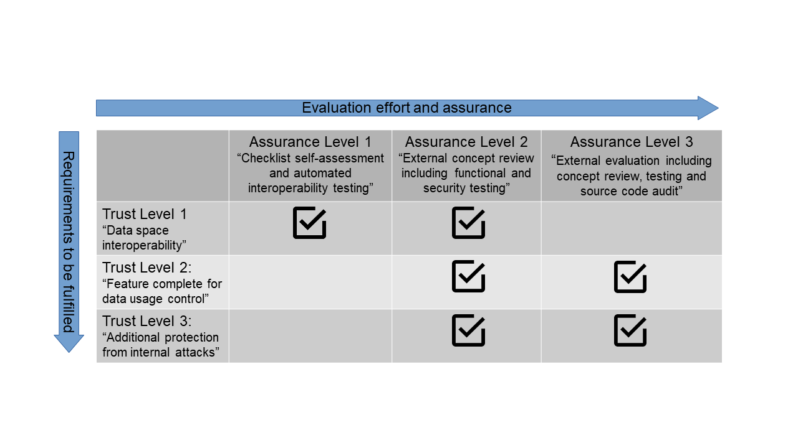

### Component Certification ###

Trustful cross-company information exchange requires secure soft- and hardware components. All IDS components have to meet a list of certification criteria to prove the provision of the required functionality, interoperability and level of security. The evaluation of these certification criteria is conducted in the IDS Core Component Certification.

Within the next two subsections, three different levels of assurance and trust for the certification of components are defined.

#### Component Assurance Levels: ####

The depth and rigor of a component evaluation consists of the following three assurance levels,
independent on the type of component that is being certified (e.g. Connector, Broker, etc.):

* Assurance Level 1: Checklist self-assessment and automated interoperability testing
* Assurance Level 2: External concept review including functional and security testing
* Assurance Level 3: External evaluation including concept review, testing and source code audit

#### Connector Trust Levels ####

The criteria that make up each of the three trust levels for a Connector are defined in such a way that they are specific enough to ensure interoperability with the functional requirements of an IDS Connector, yet general enough, to allow the use of a Connector in different deployment scenarios without having to define different criteria catalogues for each separate use case.

The following three trust levels are defined for the certification of a Connector:

* Trust Level 1: Data space interoperability
* Trust Level 2: Feature complete for data usage control
* Trust Level 3: Additional protection from internal attacks

The following figure illustrates all possible combinations of assurance and trust level, that an applicant can choose from.  
This matrix approach allows the component developer to select a combination of assurance and trust level for their component that best correspond with the intended use cases. On the one hand, this ensures a low entry barrier specifically suitable for SMEs. On the other hand, a scalable certification to meet high information security requirements becomes possible. The combinations not marked with a tick, e.g. Assurance Level 1 and Trust Level 3 can not be selected, due to incompatible purposes.

#### Figure 4.2.4.1: Overview on Certification Levels for Component Certification

An in-depth description of the Component Certification and its Assurance and Trust Levels can be found in the [Certification Scheme](./CertificationScheme). The Criteria Catalogue for Components can be requested on the [IDSA homepage](https://internationaldataspaces.org/publications/white-papers/).

#### Certification of other components ####

As the Broker, App Store, Clearing House, ParIS and Vocabulary Provider components are at their core also a Connector, the general certification process and assurance levels apply to them as well, in addition to component specific functional profiles. As an example for these profiles, the criteria catalogue "Components-Broker" can be requested on the [IDSA Homepage](https://internationaldataspaces.org/publications/white-papers/).
