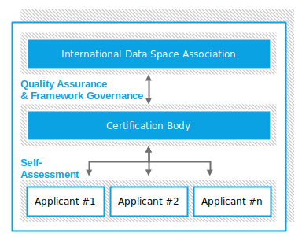
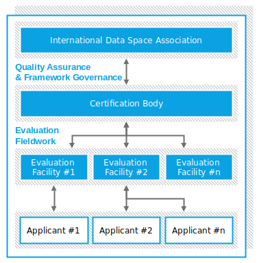

# Certification Processes

Participants and core components within the IDS ecosystem shall fulfill common requirements to ensure the security of data being processed in the IDS. Therefore, the certification of operational environments (as explained in [Section 4.2.3](../4_2_3_Operational_Environment_Certification.md) and core components (as explained in [Section 4.2.4](../4_2_4_Component_Certification.md) is mandatory. Involved partners are the Applicant, Evaluation Facility and the Certification Body which were introduced in [Section 4.2.2](../4_2_2_Roles.md).

## Approval of Evaluation Facilities
[TODO: Add chapter on approval of evaluation facilities ]

## Certification Process for Operational Environments and Core Components

The certification follows the same process for all certification profiles in Operational Environment and Component Certification. It consists of the following three phases:

1.  Application Phase: The main goal of this stage is the successful
    start of the IDS evaluation and certification process.

2.  Evaluation Phase: The main goal of this stage is the evaluation of
    an applicant or core component based on the defined evaluation
    criteria.

3.  Certification Phase: The main goal of this stage is the examination
    of the evaluation report by the certification body, which issues a
    certificate if the result of the evaluation process is positive.

However, the details for each phase differ slightly between the Assurance Levels as described below and illustrated in the figures.
For Assurance Level 1, the Applicant must apply directly to the Certification Body to trigger the start of the certification process. Once the Certification Body accepts the application, the Applicant is responsible for the Evaluation Phase by conducting a self-assessment and providing the results to the Certification Body. In the Certification Phase, the Certification Body reviews the self-assessment and issues the certificate, if the self-assessment meets the defined requirements.

#### _Fig. 4.2.5.1: Certification Process for Assurance Level 1_

Assurance Level 2 and 3 require an independent Evaluation Facility to conduct the evaluation of the component or operational environment. The Applicant must contract an Evaluation Facility which was approved as described in the first section of this chapter. Together, Applicant and Evaluation Facility finalize the application for certification with the Certification Body. Afterwards, the Evaluation Facility is responsible for carrying out the evaluation according to the IDS certification schema. The Evaluation Facility documents their progress and findings in an evaluation report which is passed on to the Certification Body at the end of the Evaluation Phase. In the Certification Phase, the Certification Body examines the evaluation report and issues a certificate, if the evaluation was conducted properly and led to a positive evaluation result.

#### _Fig. 4.2.5.2: Certification Process for Assurance Level 2 and 3_

After a successfully completed evaluation process, the Certification Body awards an International Data Spaces certificate to the Applicant.
This certificate has a limited validity period. If changes become necessary during this period, a Change Certification Process can be followed to get the proposed changes evaluated with reduced effort. 
The validity of the certification can be renewed after a re-assessment of the component or operational environment with regards to changes in the IDS certification schema and current state-of-the-art solutions.
More details on those processes are provided in the [Certification Scheme](./CertificationScheme) and the IDSA Rule Book.
