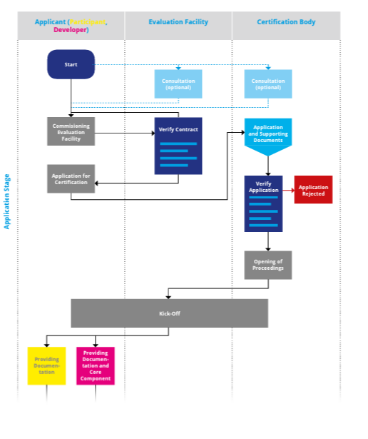
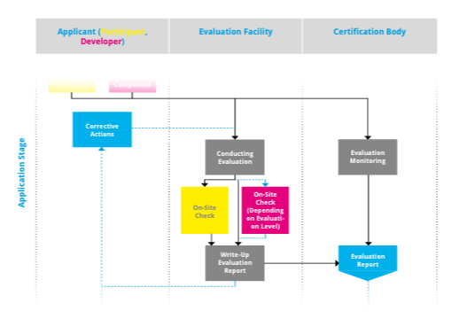
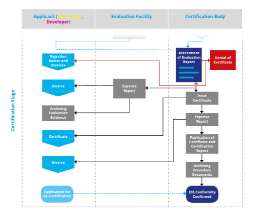

**PART 4 --** HOW-TO: IDS CERTIFICATION PROCESS

Participants and core components within the IDS ecosystem shall
provide sufficiently high degree of security regarding the integrity
and confidentiality of the data being processed in the IDS. Therefore,
a certification of participants and core components is mandatory.
Involved partners are the applicant, evaluation facility and the
certification body. The certification process is divided into the
following three phases:

## Application Stage

The main goal of this stage is the successful start of the IDS
certification process.

-   The certification process for any applicant starts with the
   applicant triggering the certification process.

-   Before this, an optional consultation can take place between the
   applicant and the evaluation facility or the applicant and the
   certification body. Possible topics are for example: Presentation
   of test competence and test procedure of the evaluation facility or
   advice on IDS certification process and certification criteria
   from the certification body. Especially for new participants or
   manufacturers this consultation is highly recommended.

-   The applicant must contact an approved evaluation facility to
   carry out the evaluation according to the IDS certification schema.
   The choice of the evaluation facility lies with the applicant.

-   The applicant must apply for certification to trigger the start of
   the certification process.

-   The applicant must provide the necessary evidence for the
   certification body to confirm the application. This includes, for
   example, the following documents: company profile, list of cur-
   rent certificates, detailed information of the pre- sent changes in
   case of recertification.

-   This confirmation by the certification body may result in a
   rejection of the application. In this case, the certification
   process ends at this point and there is no review by the evaluation
   facility or the issue of a certificate.

-   If the application is accepted, the evaluation procedure will be
   opened and there will be a Kick-Off with all involved partners
   (applicant, evaluation facility, certification body).

For the next phase (evaluation stage), the applicant must provide the
necessary documents and, in case of the certification of a core
component certification, also the component with the necessary
associated documentation, to the evaluation facility and the
certification body.

## Evaluation Stage

The main goal of this stage is the evaluation of a participant or IDS
core component based on the defined certification criteria. If
necessary, corrective actions need to be per- formed by the applicant
to achieve a successful certification. The parties mainly involved
at this stage are the applicant and evaluation facility; it includes
the following steps:

-   The evaluation facility is responsible for carrying out the detailed
   technical and/or organizational evaluation work during the
   certification. The basis for the evaluation is either the
   certification criteria catalog for the participant certification or
   the criteria catalog for the component. This includes the execution
   of all necessary tests and on-site checks, with the details
   depending on the chosen certification level.

-   The evaluation facility documents the detailed results in an
   evaluation report. The recipients of this report are the applicant
   and the certification body.

-   If deviations have been identified, corrective actions will be
   defined. Implementing these corrective actions is the responsibility
   of the applicant. Afterwards, a re-examination is necessary. A
   renewed on-site check is only required for serious defects, i.e.
   in cases where the rectification can only be checked on-site.

-   The evaluation is monitored by the certification body to ensure the
   correct implementation and execution of the IDS certification
   scheme. This can include the accompaniment of the evaluation
   facility during an on-site check.

The result of this stage is the evaluation report, created by the
evaluation facility. The report serves the certification body in the
next stage as a basis for the decision-making for the approval of the
certificate.

## Certification Stage

The main topics of this stage are the examination of the evaluation
report by the certification body as well as the processes for issuing
the certificate if the result is positive. The parties applicant and
certification body are mainly involved at this stage; it includes the
following steps:

-   The certification body receives the evaluation report from the
   evaluation facility and is responsible for the final decision about
   the award or denial of the certificate. If corrective actions and
   re-examination are required, updated evaluation reports will be
   provided.

-   The decision may be that no certificate can be issued. In this case,
   the procedure is terminated and the applicant receives a rejection
   notice.

-   If the decision is positive, the applicant will be confirmed as
   being IDS compliant. The certification body issues the certificate,
   triggers the generation of a X.509 certificate and publishes the
   certificate and the certification report online.

-   The certification body archives the procedural documents.

-   The applicant is responsible for archiving the evidence
   documentation as used during the evaluation.

-   Independent of the final decision by the certification body
   (acceptance or rejection), an invoice will be send to the applicant
   by the evaluation facility and the certification body.

*
