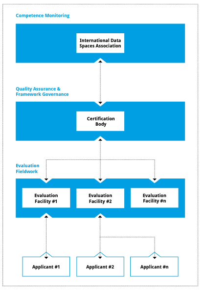
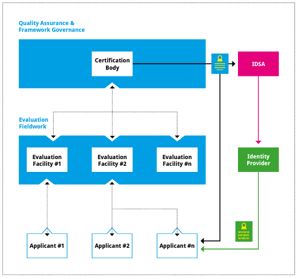

# Roles and Responsibilities in IDS Certification

[TODO: revise]

Participants and core components shall provide a sufficiently high degree of security regarding the integrity, confidentiality and availability of information exchanged in the Industrial Data Space.
Therefore, an evaluation and certification of the core components as well as of the technical and organizational security measures is mandatory for participating in the Industrial Data Space.

This requirement for compliance necessitates the definition of a framework in order to ensure a consistent and comparable evaluation and certification process amongst all Industrial Data Space participants and core components. Hence, a certification scheme has been defined following best practices from other internationally accredited certifications.
All certification-related roles described in this paper are specific to the Industrial Data Space, i.e. terms such as "Certification Body" should not be misunderstood to refer to an existing organization already granting certificates. As part of the scheme implementation in 2018, the roles defined here will be assigned to actual organizations.

Figure 1: International Data Spaces Certification - Roles &
Responsibilities

## International Data Spaces Association

The Industrial Data Space initially originated as a German research initiative. Nevertheless, the initiative driven forward by the International Data Spaces Association (IDSA) always had a wider scope in mind, by addressing more and more international members and component developers, as the initiative keeps growing. As such, the initial development of operation of the Industrial Data Space certification scheme will mainly be led by German IDSA members. However, for a future internationalization of the IDS certification, a two-phase process has been designed:

-   Phase 1 - Increasing number of international members and developers:

To ensure an economically sound and from the applicant\'s point of view, sufficiently accessible certification, the evaluation step of a certification will be conducted by an evaluation facility located in the applicant\'s country of residence. The certification step, carried out by the Certification Body, together with the approval of international evaluation facilities, however will remain located solely within a single entity. This aims to ensure that the overall framework governance for the certification scheme stays manageable.

-   Phase 2 - Increasing overall number of members and developers:

At this stage, individual certification bodies in the member countries will be commissioned in order to avoid a bottleneck situation, arising from a single certification body. As such, both the evaluation and the certification will be conducted by organizations located in the applicant's country of residence. Once this happens, mutual control processes must be established to ensure that the evaluation and certification processes are equivalent in all member nations. This will be a prerequisite for mutually recognizing the IDS certificates issued by the other nations. These costly measures will be justified,
once a substantial market position for the Industrial Data Space in a number of nations has been reached.

The International Data Spaces Association appoints the IDS Certification Body.

Its responsibilities in the context of the certification scheme include:

-   Defining the requirements for the Certification Body and verification of the required technical competencies.

-   Monitoring of the Certification Body to ensure a consistent level of quality for the certification of Industrial Data Space participants and core components.

-   Monitoring of the current regulatory and legal requirements to evaluate and react to possible influences to the certification scheme.

-   Provisioning of recommendations to the Certification Body based on the results of its monito- ring activities.

-   Continuous improvement of the defined certification scheme including the incorporation of the feedback provided by the Certification Body.

The IDSA is not actively involved in a participant or core component certification and the approval of Evaluation Facilities for performing Industrial Data Space evaluations.

## Certification Body

The IDS Certification Body is appointed by the International Data Spaces Association and among other things regularly aligns with the IDSA to manage the certification process, defines the standardized evaluation procedures and supervises the actions of the Evaluation Facilities. Currently, the IDSA Head Office acts as the Certification Body.

Its responsibilities include:

-   Formulating and defining the certification scheme in cooperation with the International Data Spaces Association, including the evaluation procedures, operational environment and core component certification approaches as well as their underlying criteria catalogues.

-   To provide and enable the functionality of the checklist approach. (Connector Certification, Trust Level 1, Assureance Level 1).
-   - For the checklist-approach certification no Evaluation Facility is needed. The Certification Body provides a portal, where applicants can conduct a self-assessment of their connector by answering a questionnaire.
-   - The answers will be evaluated by the Certification Body directly.  It will inform the applicant about the outcome directly and issue the certificate if the answers have been according to the IDS Certification Scheme. 

-   Approval of the Evaluation Facilites. 
-   - For the Assurance Level 2, Evaluation Facilites are needed. They evaluate the components in detail and make sure that they act according to the IDS Certification Scheme. 
-   - Before they start evaluating, the Certification Body ensures, that the evaluation facility's tools and tests are valid. This is beeing done within the approval process. During dedicated workshops the Certification Body examinates the skills of the evaluators. 

-   Monitoring the performance of the Evaluation Facilites.
-   - To ensure highest quality of the certification process the Certification Body participates in the evaluations on a selective basis.
-   - The Certification Body also reminds the Evaluation Facility to get re-approved after two years if no evaluation has been conducted during that period.
-   - Whenever new guidelines are developed and published by the association, the Certification Body informs the Evaluation Facilities. 
-   -   Decision about approval or exclusion of Evaluation Facilities for/from executing IDS evaluations (based on ongoing monitoring and [CRIT-EF]).

- Issuing the certificates to the applicants. 
- - Reviewing and commenting on the evaluation reports received from Evaluation Facilities.
-   - Making final decision about the award or denial of a certificate and publishing the awarded certificates.
-   - Keeping track of the certification processes currently in progress and communicating them transparently at the IDSA website.
-   The Certification Body only grants the certificate (called evaluation certificate subsequently) only if both the Evaluation Facility and the experts of the Certification Body have come to the conclusion that all preconditions are fulfilled. The certification body sends the certificate directly to the applicant, at the same time informing the Evaluation Facility of its decision. 

-   Guiding applicants through the certification process.
-   - The Certification provides and maintans the list of approved Evaluation Facilites on the IDSA website.
-   - By contacting supportoffice@internationaldataspaces.org applicants can reach out for support on the whole certification process. 

-   Ongoing monitoring of certification-relevant external developments (e.g. new attack patterns which might circumvent certified security measures).

-   Analyzing existing "base" certificates (e.g. for organizations or for software and hardware security components) to determine their validity and sufficiency, and deciding about their acceptance within the Industrial Data Space certification scheme.

-   Ensuring continuous adherence to the IDS certification scheme following up on changes und updates received from the Certification Body and the IDS Association.

-   Providing input based on the practical quality assurance experiences to future updates of the IDS certification scheme to the International Data Spaces Association.

## Evaluation Facility

There are two types of Evaluation Facilites: One for IDS components and one for the operational environment. An organization usually performs only one type, but it is possible to have both functions. As written in the previouse section an approval process needs to be conducted to become an official IDS Evaluation Facility. Further, the Organization is beeing approved to perform evaluations for specific assurance levels of the IDS certification. This means, that an Evaluation Facility that is approved to conduct evaluations for instance for assurance level 2 is only allowed to evaluate components or operational environment for the assurance level 2. 
Once an Evaluation Facility is approved it can be contracted by an Applicant and is as such responsible for carrying out the detailed technical and/or organizational evaluation work during the certification process for either the IDS component or the operational environment in its assurance level scope. After the process, the Evaluation Facility issues an evaluation report listing details regarding the performed evaluation actions as well as information regarding the confirmed security level.
The depth and scope of the performed evaluation actions depend on the desired level of security. These security levels are specified in more detail in Part 2 and 3 of this document.

The responsibilities of the Evaluation Facility include:

-   Obtaining approval by the Certification Body to perform evaluations, based on an approval process with criteria defining personnel competencies and organizational requirements (see section above).

-   Applying the criteria specified in the IDS certification scheme according to generally accepted standards and best practices (including the execution of any necessary tests and on-site checks).

-   Organizes and conducts the evaluations independently and communicates with the applicant directly. The Evaluation Facility is therefore responsible for the evaluation whereby the Certification Body has the function of a supervisior. 

-   Documenting the results in an evaluation report.

-   Providing the evaluation report to the Certification Body.

The term Evaluation Facility is used throughout the document to refer both to authorized auditors for management system evaluations (i.e., participant certifications), as well as approved evaluators for product evaluations (i.e., core component certifications). Hence, multiple approved Evaluation Facilities will exist in the Industrial Data Space certification scheme, but in each evaluation only one Evaluation Facility will be involved.

The flexibility of the certification approaches defined in Part 2 and 3 of this document allows for a wide range of evaluation experts to participate in the Industrial Data Space certification scheme, such as software penetration testers, common criteria specialists, ISO 27001 auditors and accounting firms. As such, it is fully expected that all certification levels defined in this document and therefore the needs of startup companies and SMEs as well as those of large corporations will be sufficiently addressed (PLEASE CHECK).

## Applicant

The Applicant plays an active part in the certification process. As such, the responsibilities of the respective organization include:

-   Contract an approved (by the Certification Body) Evaluation Facility to carry out the evaluation according to the Industrial Data Space certification scheme.

-   Formally apply for certification (with the Certification Body) in order to trigger the start of the certification process.

-   Provide the necessary resources in terms of financing and personnel.

-   Communicate swiftly with and provide all necessary information and evidence to the Evaluation Facility and the Certification Body.

-   React adequately to findings occurring during the course of the evaluation.

All Applicants need to actively submit an application to start the certification process and have the duties as listed above. This applies to both organizations that develop software components intended to be deployed within the Industrial Data Space (i.e., prospective software providers) and to organizations that intend to become participants in the Industrial Data Space. During the certification process, the primary focus of the evaluation will be either on the product or on the organization itself.

## Issuance of Certificates

Figure 2: International Data Spaces Certification -- Issuance of Certificates

After a successfully completed evaluation, the Certification Body awards an Industrial Data Space evaluation certificate to the applicant. These certificates will have a limited validity period.
In order to renew a certificate before it expires, a re-certification is required, taking into account any relevant external developments that have happened in the meantime. Similarly, re-certification is required if changes are made to the target of certification; in case of minor changes, "lightweight", low-cost re-certification may be sufficient. The definition of major and minor changes will follow the definition used within widely accepted certification standards such as ISO 27001.

For authentication and authorization, each IDS component must have a valid X.509 certificate, in order to verify the identity of other participants. These technical certificates digitally represent the evaluation certificate and enable automated trust checks between partners prior to data transfer within the Industrial Data Space. Upon a successful certification of an organization, such a technical certificate is issued to the organization to confirm certain attributes like organizational name, certification status, etc. This technical certificate can be used to trigger processes such as applying for X.509 connector certificates.
