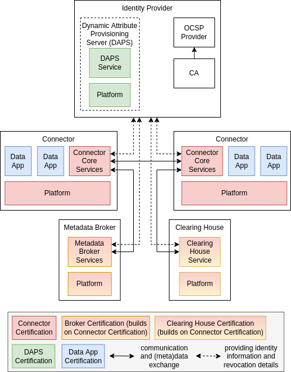
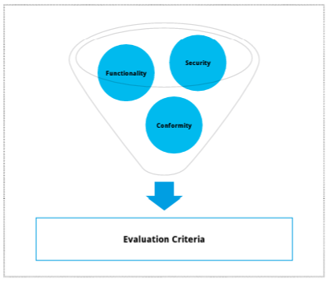

# Core Component Certification

[*TODO: Update chapter with new naming;*

*TODO: Integrate the following details regarding the different levels:*

**Assurance Levels**
* Assurance Level 1: Checklist self-assessment and automated interoperability testing
	* This level is targeted at developers looking for a low entrance barrier into the IDS.
	* The effort and costs in this level are very low for the applicant due to the self-assessment approach.
	* The interoperability is verified via statements made by the developer in a checklist and an automated test suite without any involvement of an external evaluation facility.
* Assurance Level 2: External concept review including functional and security testing
	* Starting in level 2, external evaluation facilities are tasked with the evaluation, to ensure an independent evaluation result.
	* Level 2 is the right balance between an independent review and the corresponding costs.
	* The external concept review includes the examination of documentation as well as the testing the Connector, to ensure the correct implementation of the functional and security requirements.
* Assurance Level 3: External evaluation including concept review, testing and source code audit
	* For use cases that require a high evaluation guarantee, such as the exchange of very sensitive data, higher efforts and costs will be required to ensure the customers needs in regard to security assurances are met.
	* As such, level 3 includes an in-depth source code review as well as a review of the development process (including an audit of the development site) in addition to the evaluation performed for level 2.

**Trust Levels**
* Trust Level 1: Data space interoperability
	* Basic level security profile to participate in a data space
    * Minimal agreed cybersecurity requirements to ensure the trustworthiness of the ecosystem as a whole
	* Verified interoperability with IDS-components and compliance to the basic rules of a data space
* Trust Level 2: Feature complete for data usage control
	* Provision of a common foundation for trusted data exchange including the enforcement of Usage Policies in a trusted environment
	* Remote Attestation as a way to prove the integrity of a software stack and ensure that the certified software stack is truly deployed
	* Additional cybersecurity requirements are verified
* Trust Level 3: Additional protection from internal attacks
	* Addition of advanced cybersecurity measures that are not commonly required
	* Support of protection against malicious administrators (internal attacks)
	* Provision of an additional level of trust and verification for the data provider as well as the data consumer

*TODO: Remove section on "Piloting of Certification Criteria"*]

## Intro
[*TODO: revise*]

To secure the intended cross-industrial and cross-company information
exchange, the Industrial Data Space core components must provide the
required functionality and an appropriate level of security. As such,
the core component certification is interoperability- and
security-focused, while aiming to strengthen the development and
maintenance process of these components.

Similar to the participant certification, a matrix certification
approach as shown in Figure 5 was defined for the core components of
the Industrial Data Space. This ensures on the one hand a low entry
barrier specifically suitable for SMEs and on the other hand a
scalable certification to meet high information security
requirements.

| | **Checklist Approach** | **Concept Review** | **High Assurance Evaluation** |
| --- | --- | --- | --- |
|  **Base Security Profile** | :heavy_check_mark: | :heavy_check_mark: | - |
|  **Trust Security Profile** | - | :heavy_check_mark: | :heavy_check_mark: |
|  **Trust+ Security Profile** | - | :heavy_check_mark: | :heavy_check_mark: |

Figure 5: Certification Approach for core components of the Industrial
Data Space

## Assurance Levels
[*TODO: update to assurance level 1-3; include Verweis auf Test Specifications -> Nadja*]

The depth and rigor of an evaluation consists of the following three
assurance levels as defined by the Industrial Data Space certification
scheme:

#### Checklist Approach

The core component must fulfill security features (security
requirements, security properties, security functions) as defined by
the corresponding checklist. The vendor of the component validates the
claims made about the implementation. Additionally, an automated test
suite will be used to verify the component's security features.

#### Concept Review

Instead of the checklist approach, an in-depth re- view by an
Industrial Data Space evaluation facility is necessary. The review
includes an evaluation of the provided concept as well as practical
functional and security tests.

#### High Assurance Evaluation

For the third level, in addition to the functional and security tests,
the vendor must provide the source code of all security relevant
components and an in- depth source code review will be performed by an
evaluation facility. Furthermore, the development process will be
evaluated, including an audit of the development site.

## Trust Levels and Profiles for Components
[*TODO: pot. image to show the different certification types -> Monika*]

### Connectors
[*TODO: update auf Trust Level 1-3*]

Whenever two components establish a communication channel, it's up
to them to decide which information they will send to the
communication partner. Therefore, the identity and certification level
(for both the participant and the component) must be provided by each
component in the form of a digital certificate containing this
information. As with the participant certification, this approach
enables the data owner and data consumer to specify the security
profile required for the core components used during data exchange.

For this purpose, the Industrial Data Space certification scheme
defines three security profiles for the core components defined in the
section Component Overview of this paper.

#### Base Security Profile

This profile includes basic security requirements: limited isolation
of software components, secure communication including encryption and
integrity protection, mutual authentication between components, as
well as basic access control and logging. However, neither the
protection of security related data (key material, certificates) nor
trust verification are required. Persistent data is not encrypted and
integrity protection for containers is not provided. This security
profile is therefore meant for communication inside of a single
security domain.

#### Trust Security Profile

This profile includes strict isolation of software components
(apps/services), secure storage of crypto- graphic keys in an isolated
environment, secure communication including encryption, authentication and integrity protection, access and resource control, usage
control and trusted update mechanisms. All data stored on persistent
media or trans- mitted via networks must be encrypted.

#### Trust+ Security Profile

This profile requires hardware based trust anchors (in the form of a
TPM or a hardware-backed isolation environment) and supports remote
integrity verification (i.e., remote attestation). All key material
is stored in dedicated hardware isolated areas.

#### Connector
[*TODO: merge with above*]
Being the point of access to the Industrial Data Space, the Connector
provides a controlled environment for processing and exchanging
data, ensuring secure transfer of data from the data provider to the
data consumer. As such, the necessary trust in the correct and
complete implementation of the functionality required by the IDS
Reference Architecture Model and the Connector specification can only
be ensured by independent evaluation and certification from an
approved evaluation facility and the certification body of the
Industrial Data Space.

#### Connector-based Components (Broker, App Store, ...)
[*TODO: explain how those build on the connector certification levels*]

A Broker service does not have access to primary data, but only to
metadata provided by data providers, which is generally considered
less sensitive. Likewise, Broker services do not assign or enforce
access rights, but merely support data exchange. Nevertheless,
integrity and availability of metadata (i.e., correct and secure
storing and handling of meta- data) is of high importance for the
Industrial Data Space. Compatibility with the required functionality
as defined by the certification body is therefore evaluated and
certified.

#### Data Apps and Services
[*TODO: revise*]
Data Apps and Services have direct contact with primary data, which
means that a compromised Data App or Service may compromise the integrity of data. However, confidentiality and availability of data is
ensured by the measures defined in the Security Architecture of the
Industrial Data Space, which strongly limit the potential damage
caused by

Data Apps and Services. Also, Apps and Services will typically use the
security features provided by the Connector. Therefore, not every Data
App or Service to be made available in the Industrial Data Space
requires a medium or high assurance level certification. However,
the automated test suite mentioned above for the basic security
level will be integrated in the upload process of each Industrial
Data Space App Store.

#### DAPS

#### Certificate Authority
[*TODO: keine zertifizierung für Komponenten, aber Op.Env und Ca-specific certification*]

##  Certification Criteria Catalogue
[*TODO: update -> Nadja*]

The catalogue of certification criteria for the IDS core components
[CRIT-C] was defined as part of the Fraunhofer research project
»Industrial Data Space« and fine-tuned with the members of the WG Certification. The catalogue is split into three thematic sections, i.e.
IDS-specific requirements, functional requirements taken from the
industry standard ISA/ IEC 62443-4-2 [62443-4-2] and best practice
requirements for secure software development.

Figure 6: Criteria Synergy

Each criteria section targets a set of evaluation goals:

-   The IDS-specific requirements aim to evaluate the Core
   Component's conformity to the IDS Reference Architecture Model,
   both in regard to functionality (e.g. support of the IDS information
   model) as well as security (e.g. conformance to the IDS security
   architecture).

-   The requirements taken from ISA/IEC 62443-4-2 target the implemented
   functionality and security measures in relation to industry-wide
   accepted requirements for industrial automation and control
   systems, e.g. the capability to obscure feedback of authentication
   information during the authentication process.

-   To round off the catalogue, the best practice requirements for
   secure software development aim to evaluate the security of the
   processes during the development of the component, e.g. design
   documentation, physical security measures and test processes.

To reduce the financial entry barrier not only for Industrial Data
Space participants but also for the developers of core components, the
component certification approach is designed to use existing certification schemes whenever reasonable. Where such certification
schemes do not exist or aren't widely recognized, e.g., for
Industrial Data Space-specific aspects, criteria defined within the
Industrial Data Space certification scheme will be employed.

The functional and security requirements of the core components to be
evaluated will be defined based on the IDS Reference Architecture
Model, specific component specifications like the Connector Specification as well as widely recognized requirement catalogues like
ISA/IEC 62443-4-2 (e.g. for functional requirements such as data
confidentiality and system integrity).

The evaluation at the various assurance levels can also be supported
and facilitated by requiring appropriate measures used throughout the
lifecycle of the component as defined in ISA/IEC 62443-4-2, such as
using the approach for thorough elicitation of the Security
Requirements, enforcing those Security Requirements at the
Architecture level (e.g., using Security-by-Design) and tracing them
to the

Secure Implementation level, supported by relevant Guidance
Documents, Verification & Validation approaches, as well as a Secure
Defect Management & Secure Update Management.³
³ US Cert: Build Security In: Modeling Tools, 2013

#### Hardware

For certain security profiles as defined in the IDS Reference
Architecture Model, additional hardware security components are
required to achieve an appropriate level of protection for access to
sensitive data. In addition to the core software components of the
Industrial Data Space, these hardware components must therefore also
be considered in the context of certification. In the interest of
trust- worthiness, and to avoid double certification, the use of
third-party certified hardware components will be required (e.g.,
Trusted Platform Modules certified in accordance with the Protection
Profiles BSI- CC-PP-0030-2008 or ANSSI-CC-PP-2015/07). Certification activities of the Industrial Data Space regarding these
components will be limited to checking the validity of existing base
certificates.

#### IDS Reference Testbed

The IDS Reference Testbed can serve to improve efficiency in preparing certification, specifically at the component level. The certification of the IDS-components is executed using the IDS Reference Testbed, the same testbed which is publicly available for or-ganizations to test their implementations. This ensures that the technical certification of the IDS components is transparent and that most issues can be resolved by the companies before the actual certification process. Therefore reducing costs and efforts. 
Finally, existing (open-source) implementation of the IDS components can be integrated into the testbed to further help the companies to get familiar with the IDS requirements. In certain cases, companies might use one of the available implementations as basis for their solution. 
