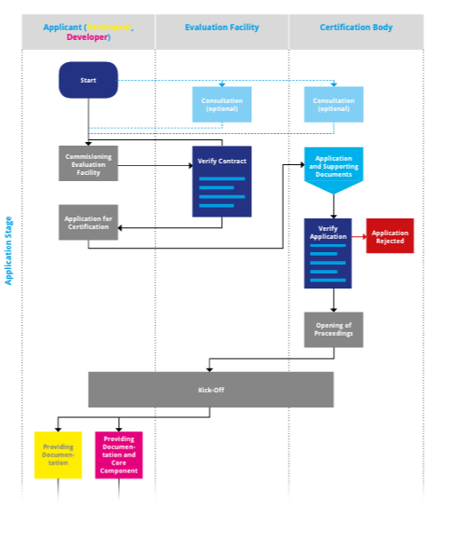
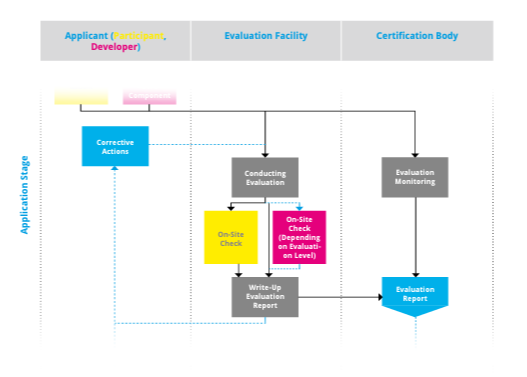
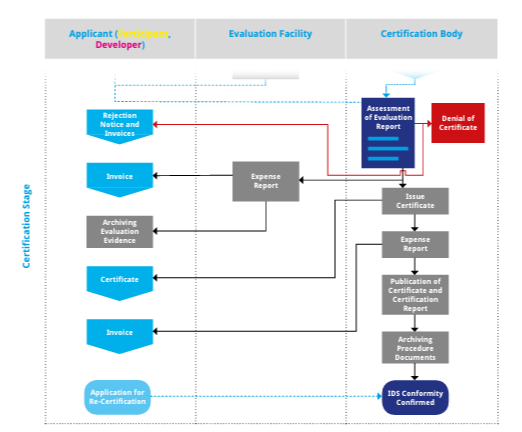

# 5. Processes for IDS Certification

Participants and core components within the IDS ecosystem shall
provide sufficiently high degree of security regarding the integrity
and confidentiality of the data being processed in the IDS. Therefore,
a certification of operational environments and core components is mandatory.
Involved partners are the Applicant, Evaluation Facility and the
Certification Body as described in [Section 2](./Certification_Roles_and_Responsibilities.md).
The [Rules of Procedure](../RulesOfProcedure) specify framework conditions and processes to be followed within the IDS Certification Scheme.
The main processes with respect to certification in the IDS are:
* the [approval of evaluation facilities](../4_2_5_Processes.md#approval-of-evaluation-facilities) which is defined in detail in the [Approval Scheme](../ApprovalScheme) and
* the [certification process itself](../4_2_5_Processes.md#certification-process-for-operational-environments-and-core-components) which is described further in the sections below.

## Certification Process
The Certification Process consists of the three stages described below.

## Application Stage

The main goal of this stage is the successful start of the IDS certification process.

-   The certification process for any applicant starts with the applicant triggering the certification process.

-   Before this, an optional consultation can take place between the
   applicant and the evaluation facility or the applicant and the
   certification body. Possible topics are for example: Presentation
   of test competence and test procedure of the evaluation facility or
   advice on IDS certification process and certification criteria
   from the certification body. Especially for new participants or
   manufacturers this consultation is highly recommended.

-   For Assurance Level 2 and 3, the applicant must contract an approved evaluation facility to
   carry out the evaluation according to the IDS certification schema.
   The choice of the evaluation facility lies with the applicant.
   For Assurance Level 1, the applicant can directly continue with the application at the Certification Body.

-   The applicant must apply for certification to trigger the start of
   the certification process.

-   The applicant must provide the necessary evidence for the
   certification body to confirm the application. This includes, for
   example, the following documents: company profile, list of current certificates,
   detailed information of the present changes in
   case of change or renewed certification.

-   This confirmation by the certification body may result in a
   rejection of the application. In this case, the certification
   process ends at this point and there is no review by the evaluation
   facility or the issue of a certificate.

-   If the application is accepted, the evaluation procedure will be
   opened and there will be a Kick-Off with all involved partners
   (applicant, evaluation facility, certification body).

For the next phase (evaluation stage), the applicant must provide the
necessary documents and, in case of the certification of a core
component certification, also the component with the necessary
associated documentation, to the evaluation facility and the
certification body.

## Evaluation Stage

The main goal of this stage is the evaluation of a participant or IDS
core component based on the defined certification criteria. If
necessary, corrective actions need to be performed by the applicant
to achieve a successful certification. For Assurance Level 1, the evaluation
is conducted as a self-assessment for [components](./Core_Component_Certification.md#assurance-level-1-checklist-self-assessment-and-automated-interoperability-testing)
or [operational environments](./Core_Component_Certification.md#assurance-level-1-self-assessment)
from the applicant's side who provides the results
of this assessment to the certification body for review.
For Assurance Level 2 and 3, the evaluation stage mainly involves the applicant and
evaluation facility and includes the following steps:

-   The evaluation facility is responsible for carrying out the detailed
   technical and/or organizational evaluation work during the
   certification. The basis for the evaluation is either the
   certification criteria catalog for the Operational Environment Certification or
   the criteria catalog for the Component Certification. The evaluation follows
   the defined approaches for the Assurance Levels 2 and 3 for [components](./Core_Component_Certification.md#assurance-level-2-external-concept-review-including-functional-and-security-testing)
   or [operational environments](./Core_Component_Certification.md#assurance-level-2-external evaluation-of-corporate-policies-and-processes). This includes the execution
   of all necessary tests and on-site checks, with the details
   depending on the chosen Trust Level.

-   The evaluation facility documents the detailed results in an
   evaluation report. The recipients of this report are the applicant
   and the certification body.

-   If deviations have been identified, corrective actions will be
   defined. Implementing these corrective actions is the responsibility
   of the applicant. Afterwards, a re-examination is necessary. A
   renewed on-site check is only required for serious defects, i.e.
   in cases where the rectification can only be checked on-site.

-   The evaluation is monitored by the certification body to ensure the
   correct implementation and execution of the IDS certification
   scheme. This can include the accompaniment of the evaluation
   facility during an on-site check and supporting the evaluation facility
   with decisions on the focus of the evaluations and arising questions..

The result of this stage is the evaluation report, created by the
evaluation facility. The report serves the certification body in the
next stage as a basis for the decision-making for the approval of the
certificate.

## Certification Stage

The main topics of this stage are the examination of the provided self-assessment documentation
(for Assurance Level 1) or evaluation report (for Assurance Level 2 and 3)
by the certification body as well as the processes for issuing
the certificate if the result is positive. The parties mainly involved in this stage
are the applicant and certification body. The stage includes the
following steps:

-   The certification body receives the evaluation report from the
   evaluation facility (for Assurance Level 2 and 3) or the self-assessment documents (for Assurance Level 1)
   and is responsible for the (final) decision about
   the award or denial of the certificate. If corrective actions and
   re-examination are required, updated evaluation reports will be
   provided.

-   The decision may be that no certificate can be issued. In this case,
   the procedure is terminated and the applicant receives a rejection
   notice.

-   If the decision is positive, the applicant will be confirmed as
   being IDS compliant. The certification body issues the certificate in a paper and a machine-readable version
   and publishes the certificate and the certification report online.

-   The certification body archives the procedural documents.

-   The applicant is responsible for archiving the evidence
   documentation as used during the evaluation.

-   Independent of the final decision by the certification body
   (acceptance or rejection), an invoice will be send to the applicant
   by the evaluation facility and/or the certification body.

*
