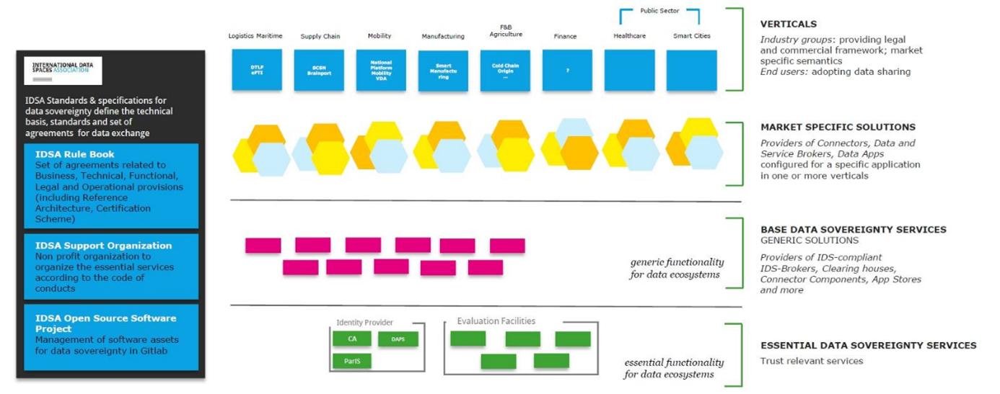
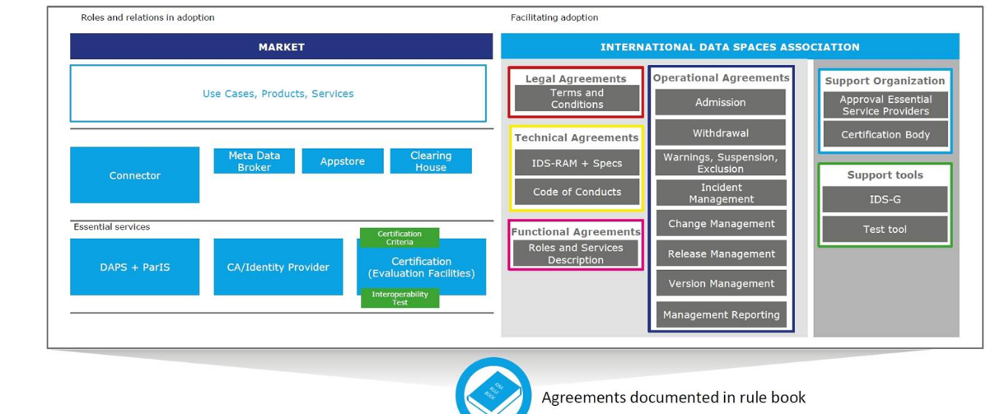

### IDSA Rulebook ###

It is all about data. If you are going to build or use data driven ecosystems
or data driven business models, you should strongly consider data sovereignty[^1]
– and therefore the [IDSA rulebook](https://internationaldataspaces.org/download/19008/).

This Rulebook addresses:

1. peer to peer data sharing

2. data marketplaces

3. Data sharing ecosystems

4. Data driven platforms

5. Data driven business models

#### Goals and scope of the IDSA Rulebook ####

The overall goal is to make more data available to more organizations and ecosystems being aware,
that data availability and exchange become a critical success factor for national and international
economies. The key idea is to attach data sovereignty to data to enable even the exchange of
sensible data, which often is some of the most valuable. For this reason, the International
Data Spaces Association (IDSA) has defined a data sharing scheme including the Reference
Architecture Model and a set of agreements to be used for creating and operating virtual
data spaces. The IDS Scheme is based on commonly accepted data governance models facilitating
secure exchange and easy linkage of data within business ecosystems.

The IDS Scheme ensures data sovereignty for data owners making data available for being exchanged
or shared. It thereby constitutes the basis for developing and offering smart services and for
establishing innovative business processes.

##### Figure4.3.9: Overview IDS enabled ecosystems

The IDS initiative aims at defining the technical base and set of agreements for secure and trusted
data spaces, in which companies of any size and from any industry can manage their data assets in a
sovereign fashion. It addresses companies and other organizations from across Europe and beyond.
IDSA already counts over one-hundred member organizations from twenty countries. The interplay of
all these companies. Members, guest and data sovereignty suppliers and appliers, will fulfil the
common value proposition of generating business value from data.

#### The Purpose and Scope of the Rulebook ####

Rules of the game: The purpose of this Rulebook is, to describe clearly what rules and guidance
all participants have to follow to achieve the goal of the common interplay in upcoming data
economies. This governance framework including the functional, technical, operational, and legal
agreements. They are binding for all roles and their interaction in the dedicated environment:

1. The IDSA Support Organization: Responsible e.g. for maintaining the Rulebook and for
supporting its application. The IDSA Support Organization as an enabler for the orchestration
of the processes and as general governance instance a foundation for the realization of
internal structures and interfaces to other parties

2. The essential service providers: Responsible e.g. for providing the essential services
needed by all participant. They build the source of common agreements.

3. All users of IDSA data sovereignty getting guidance on how to proceed within this framework
for the realization of use cases on the foundation of a trustworthy infrastructure and governance

4. The interaction of all is structured and guided within this Rulebook.

##### Figure 4.3.10.1: Overview Rulebook scope and goals

#### Scope / Non Scope in detail ####

The IDSA Rulebook defines structures and processes for the implementation of the
IDS-Reference Architecture Model in real-world scenarios. This includes the
realization of the essential service as well as the definition of processes for
the relevant processes, e.g. admission and withdrawal of participants.

Cross Industry Approach: This approach on data sovereignty is not industry specific,
it is applicable in all economic sectors. Therefore, sector specific rules are not
described in the Rulebook. In consequence, all rules and guidelines could be applied
in all economic sectors and – more over – across these sectors to establish data
exchange among different industries. IDS is a horizontal approach. On its foundation
data sovereignty call build in and across all industries.

The scope of this document in detail covers:

1. Functional agreements: Guidance on functionality of common services as well as definition,
processes and services of dedicated roles

2. Technical agreements: Everything need to know to implement or use a technical
artefact of the IDSA world

3. Operational agreements: Everything need to know to run and collaborate (technically) within
data sovereignty services

4. Legal agreements: Critical success factor is the legal environment, so it is in close focus,
what legal environment is valid, what legal boundaries are out there, what is to be committed
and from what commitments and laws the dedicated data exchange can benefit

5. Commercial assumptions: This Rulebook defines not a commercial business model, but it is
enabling several ones. Commercial Agreements are not part of the Rulebook, but we make some
commercial assumptions à Essential services (low profit), base services (enabling functionality)
cash cow services on top of that. à Commercial agreements will be done separately.

6. Liaisons agreements: The data sovereignty community based on IDS naturally collaborates with
other ecosystems like ENX or certifications in automotive, Plattform Industrie 4.0, GAIA-X etc.
Liaisons agreements are about guiding principles guard railing for these collaborations. IDSA
provides processes and measures to actively contribute to liaisons and to provide value for
the IDSA Liaison partners.

#### How to use IDS? Competitive Advantage with Data Sovereignty ####

Using IDS, IDS based frameworks, services and offerings means, to make use of trusted data
sovereignty for your business or your own offerings. So, using IDS in detail is depending on
the role, you are going to play in the dedicated data driven continuum.

Overall, there are some rules and guidelines in common:

1. Life cycle is defined: There is a common definition on life cycle agreements for IDS based assets,
e.g. the IDS standards and services. See attachment “Operational Agreements, Life Cycle”

2. Processes: There are some common definitions of necessary processes e.g. for development,
certification, onboarding, operation and usage. See attachment “Operational Agreements. Processes”

Typical roles anticipated in an IDS based data driven continuum are described in more detail. Included
are Data Provider and Data Owner, Data Consumer, Data user, Metadata Broker, Software-, Service- and
App-Provider, Appstore Provider, and basic roles like ID Provider, Certification Provider, Clearing
House and Vocabulary Provider.

In summary, using IDS and make use of data sovereignty as competitive advantage for the own business
is quite easy, because everything is well prepared. The guiding website <https://www.internationaldataspaces.org>
provides all information.

#### Guiding principles ####

Guiding principles were leading the team in structuring the complete IDS ecosystem, it´s roles and this Rulebook.

- Do not reinvent the wheel

- Integrate into existing systems,

- Integrate or use existing standards,

- Be industry agnostic, but applicable in all verticals as horizontal standard

- Be easy usable and applicable by individual companies and initiatives/ecosystems

- Overall: Create a new global open standard for data sovereignty:

Open standard generally implies: 1) free to use for everyone (although in some sectors this is interpreted in different ways ...),
2) an open process through which everyone can participate, 3) transparent decision making (preferably by
consensus or otherwise through a pre-defined structure).

[^1]: https://github.com/International-Data-Spaces-Association/IDS-G/tree/master/glossary#data-sovereignty
