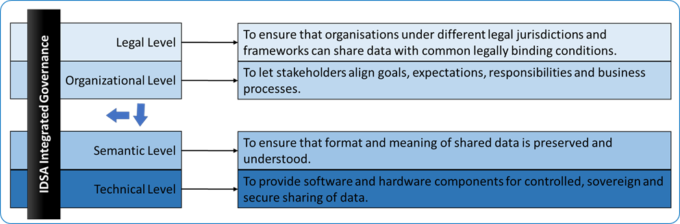

### Data Spaces Instances ###

Data spaces are emerging in various sectors, each with their own community of stakeholders, domain-specific use-cases and governance models. The IDSA will not only play a major role in the development (of the reference implementation for) for data spaces instances, but also for the interoperability between data space instances. As such, the role of IDSA is key for realizing the European data strategy, which can shortly be phrased as ‘Towards a Federation of Interoperable Data Spaces’.

Consequently, the IDSA will consider (the governance of) its development and deployment initiatives in the broader context of both:

1. striving for interoperability within data spaces instances (also known as to as ‘federations’ or ‘intra data space interoperability’) which is defined as interoperability between the data space authority, processing and data sharing building blocks within a single data space instance. This implies that the IDSA should ensure that the implementation components of the IDS architecture are developed in coherence and provide a gradual migration and growth path.
2. preparing for interoperability between multiple data spaces instances (also known as ‘federation of federations’ or ‘inter data space interoperability’), to pave the way towards the federation of interoperable data spaces as pursued by the European data strategy.

The governance of both intra and inter data space interoperability focuses on the set of commonly agreed principles and architectures, covering more than merely the technical aspects. A framework for addressing all aspects to be governed is provided by the new European Interoperability Framework (EIF) as developed by the European Commission. The EIF distinguishes four interoperability levels (legal, organizational, semantic, technical) under an overarching integrated governance approach (Fig [4.3.9.1](#interoperability-levels-as-distinguished-in-the-new-european-interoperability-framework.png)):

*Figure 4.3.9.1: Interoperability levels as distinguished in the New European Interoperability Framework.*

For both intra and inter data space interoperability the IDSA has defined its approach on the governance for development and deployment on the various aspects for each of the interoperability levels in the IDSA Whitepaper ‘Governance for Data Spaces Instances’[^2]. It clarifies the roles and responsibilities. In certain cases, the data space instance itself will fill in domain-specific details, while in other cases, the IDSA can propose inter data space standards. 

It is to be noted that in previous releases of the IDSA RAM, the focus has been on the development of intra data space interoperability. In the meantime, the inter data space interoperability has been gaining major interest[^1], as exemplified by the work of the Data Sharing Coalition on the Data Sharing Canvas[^3] and within the EU Project Trusts[^4]. With such initiatives, the IDSA will keep close alignment.

[^1]: European Union (2017). “New European Interoperability Framework (EIF) – Promoting seamless services and data flows for European public administrations”. URL: https://ec.europa.eu/isa2/sites/isa/files/eif_brochure_final.pdf.

[^2]: IDSA Whitepaper. ‘Governance for Data Spaces Instances’. 2021. What is the status of this? Is it made publicly available? As addendum for the RAMv4 or the Rule book?

[^3]: Data Sharing Coalition (2021). ‘Data Sharing Canvas - A stepping stone towards cross-domain data sharing at scale’. URL: https://datasharingcoalition.eu/app/uploads/2021/04/data-sharing-canvas-30-04-2021.pdf.

[^4]: EU TRUSTS project. ‘Trusted Secure Data Sharing Spaces’. URL: https://www.trusts-data.eu/.
