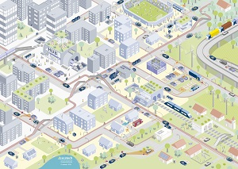

# Contributing Projects #

These projects contributed to the IDS Reference Architecture Model.

** Thank you! **

## Industrial Data Space ##

[Industrial Data Space](www.fraunhofer.de/en/research/lighthouse-projects-fraunhofer-initiatives/industrial-data-space.html)

## Industrial Data Space + ##

[Industrial Data Space](www.fraunhofer.de/en/research/lighthouse-projects-fraunhofer-initiatives/industrial-data-space.html)

## Industrial Data Space 3 ##

[Industrial Data Space](www.fraunhofer.de/en/research/lighthouse-projects-fraunhofer-initiatives/industrial-data-space.html)

## BOOST 4.0 ##

[BOOST 4.0](www.boost40.eu)

## AMable ##

[AMable](www.amable.eu)

## MIDIH ##

[Manufacturing Industry Digital Innovation Hubs](www.midih.eu)

## Research Center Data Spaces ##

[Research Center Data Spaces](www.cit.fraunhofer.de)

## DEMAND ##

[DEMAND](www.demand-projekt.de)

## MUSKETEER ##

[MUSKETEER](https://musketeer.eu/)

## AI4EU ##

[AI4EU](https://www.ai4europe.eu/)

## Dataspace Mobility ##

[Dataspace Mobility](https://mobility-dataspace.eu/)

## Qua4lity ##

[Qua4lity](https://qu4lity-project.eu/)

## MARKET 4.0 ##

[MARKET 4.0](http://market40.eu/)

## OpenDEI ##

[OpenDEI](https://www.opendei.eu/)

## EUR3KA ##

[EUR3KA](https://www.eur3ka.eu/)

## DIH^2 ##

[DIH^2](http://www.dih-squared.eu/)

## AI Marketplace

[AI Marketplace](https://www.ki-marktplatz.com/)

## SPEAKER ##

[SPEAKER](https://speaker-project.info/)

## EuHubs4Data

[EuHubs4Data](https://euhubs4data.eu/)

## Level-Up ##

[Level-Up](http://www.levelup-project.eu/)

## TRUSTS ##

[TRUSTS](https://www.trusts-data.eu/)

## FlexiGoBots

[FlexiGroBots](https://flexigrobots-h2020.eu/)

## BD4NRG

[BD4NRG](https://www.bd4nrg.eu/)

## Dat4Zero ##

[Dat4Zero](https://dat4zero.eu/)